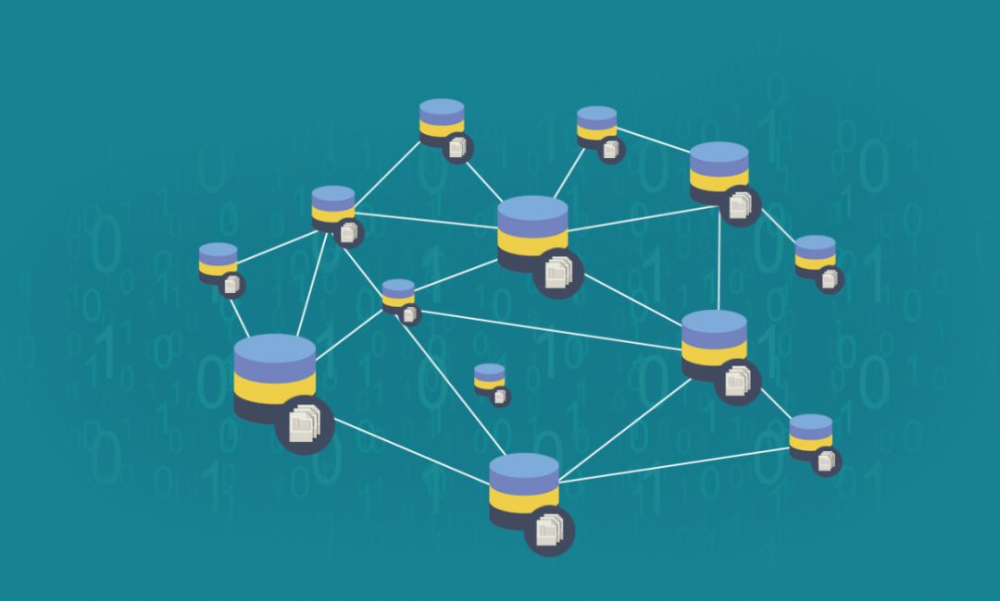

# 10步教你组建高效远程分布式团队

<copyright :meta="$frontmatter.meta" />

很多人都怀疑分布式的团队是否真的行得通？过去，公司经常声称让所有人都在同一屋檐下是创新的唯一方法。如今，事情发生了变化。像Basecamp、Gitlab和Automattic这样的创新企业已经成长为成熟的公司，并在雇佣全分布式员工的同时赚取了数百万美元的利润。Automattic是WordPress.com、Longreads、Simplenote、Gravatar、Polldaddy和其他流行工具背后的公司，**它的员工可以在任何地方工作，公司近500名员工的团队分布在50个国家。这个完全分布式的团队构建并维护了WordPress，该平台可为27％的Internet提供支持。像这样的公司通常都会在竞争中胜出。而且，他们将继续挖走那些拒绝采用分布式雇佣模式的公司的员工。**

在Doximity，我们建立了全球最大的美国临床医生专业网络，目前拥有超过一百万名经过验证的成员，这是史无前例的——所有这一切也是由一个广泛分布的远程团队完成的。

多元化的团队是更好的团队。但是，建立一支多元化的团队并非易事。在Doximity，我们很早就决定要培养一种包容的文化。我们希望与那些能带来独特视角、帮助我们以不同方式思考的人一起工作，而做到这一点，最佳方法之一是组建一支远程分布式的团队。

Doximity只有一个实体办公室。然而，我们的人才不受地域的限制。

拥有一个分布式团队不仅使我们能够和具有不同经验的人建立联系，还可以让我们访问庞大的候选人库。在过去6年中，我们的工程团队从3人扩大到超过65人，其中许多人都是远程工作。其间，我们发布了近12种成功的内部和外部产品，同时使员工留存率保持在90％以上。

我们早期遇到的一个棘手问题是：我们如何将核心价值观传达给远程的同事？事实证明，向远程员工灌输公司文化并不比向本地员工宣灌更困难。我们的做法并不复杂：

- 首先，规定新员工入职的第一周必须来总部办公室工作。
- 此外，我们每个季度都会和整个团队聚会，进行工作会议和团队建设活动。

对于远程员工而言，这意味着有很多机会可以“熏染”公司文化。根据我们的经验，无论你的员工身在何处，共享的价值无处不在。公司文化要做到“润物细无声”，才能潜移默化地起作用。

**如何组建远程团队?**

你可能对建立远程团队很感兴趣，但是如何开始呢?

## 仔细斟酌招聘计划

多年来，我们选择了一些雇佣远程员工的基本规则。当我们面试总部以外的职位时，我们会关注一些基本的特征——**自我管理的能力是最重要的，紧随其后的是精确流畅的沟通能力、自尊及尊重他人。**
  
远程工作确实需要一些时间来习惯。**雇用具有远程工作经验的人可以大大简化流程**。每当我们面试第一次考虑远程职位的应聘者时，我们都要着重讨论流程并传达其他远程员工在流程中遇到的陷阱。

我们为此交过“学费”。曾经，我们聘请了一位以前从未远程工作过的软件工程师。他低估了对安静办公空间和可靠网络的需求。这似乎是常识，但他并不了解。工作几周后，他觉得一个偏远的环境不适合他。这给了我们教训，我们在面试中会强调和确认这些细节。

## 与队友建立人脉关系

尽快建立人脉关系非常重要。我们从视频面试开始这一过程，这使我们能够尽早与候选人见面。大量研究表明了社会关系的价值。这就是为什么我们要求新员工入职的第一周必须来总部工作的原因。他们可以结识总部的团队，一起吃午饭，最重要的是，与他们的导师建立个人联系。我们鼓励远程员工在对各自团队有意义的时间间隔内访问（总部）办公室。另外，每个季度我们会和团队一起呆几天，分享经验教训，并做出下个季度的计划。这些活动让我们有时间进行面对面的团队交流，从滑雪到骑马，我们一起度过了非常愉快的时光，加强了团队成员之间的互动。

## 平等对待队友

多年来，我们已经听闻了不少组建分布式团队失败的尝试。这些几乎可以完全归因于未能意识到，**一旦拥有一名远程员工，就需要将每个人都视为远程员工。**

几年前，我与一位工程师单独交流时，他告诉我，并行化的团队有时候会将始于线上讨论的问题转为线下，然后在线下完成解决方案，而在此过程中远程员工容易被无意中排除在外了。所以，要特别注意平等地对待每一个团队成员。

**要做到这一点，你首先要确保异步通信的流畅，同时要确保交流的连续性不受位置的影响**。即使几年过去了，我们仍然时不时地会遇到类似的情况来提醒我们有必要强化“平等”的理念。

## 虚拟饮水机

异步通信使我们能够过滤干扰。但是，它也过滤掉了个性和自发性，这是我们交流和理解他人的关键。因此，我们鼓励围绕人们感兴趣的主题创建“虚拟饮水机”（在办公室里，饮水机=休闲区=八卦中心=工作之外话题的交流场所）。其中大多数由对该主题感兴趣的人管理，主题从滑雪到游戏再到音乐不一而足。这些渠道中的对话通常与业务无关，提供休闲的讨论方式可以使员工在工作之余发展个人关系。这些聊天室为他们提供了一个舒适的交流场所，就像在办公室的饮水机旁一样。

## 关注交付团队

如果我们看不到工程师，怎么知道他们的工作效率？答案很简单。**雇用自我管理能力强的人，组建以产品为中心的团队，并控制团队规模**。每个主要产品都有一个专门的交付团队——由拥有产品交付所需的必要技能的人员组成，一般为6-10人，他们紧密合作以构建和交付解决方案。团队中的每个人都负责产品整体质量中的一部分，这种设置允许分布的组员对他们正在构建的东西有清晰的定义和所有权，这提高了效率，并且很好地适应了团队的分布式特性。

## 利用正确的技术

一二十年前，由于技术限制，采用分布式团队工作是不切实际的。今天，视频会议、屏幕共享和大量应用的异步通信手段帮助我们实现了这种灵活的工作方式。每家公司最终都将采用最适合自己的方法，而且每个过程都需要一些试验。在Doximity，我们测试了大约六种解决方案，最终选择了一套我们认为最有效的技术。

## 视频会议

我们在旧金山的办公室有12个会议室，每个会议室都配有ChromeBox、会议系统和大型壁挂电视。ChromeBox直接集成了Google日历，这让参加会议变得轻而易举。每个邀请都会自动包含一个视频会议链接，不需要额外的步骤。

ChromeBox还可以在会议期间共享屏幕、双向视频，并使用全向麦克风让所有与会者都能清楚地听到双向声音。我们之前尝试过其他系统，即Skype和HighFive，这两个系统都需要额外的软件，而且不能平滑集成Google日历。

## 异步通信

Slack是我们的首选工具，但是有许多等效的替代方法，例如HipChat和Stride，两者都是Atlassian开发的。甚至Facebook也在尝试用它的“ Workplace ”跻身异步通信领域。我们选择了Slack，因为它提供了将工作整合到一个平台所需的集成。这些集成包括来自DevOps stack的警报、日历提醒和自动化的自动应答。

最重要的是，开放的开发平台允许我们构建定制的集成来简化我们的工作流程。自定义集成的一个很好的例子是我们的“午餐机器人”。每隔一个周五，该机器人将允许员工选择加入一个由公司赞助、随机分配的五人午餐小组。这是一种有趣的方式，可以促进那些通常不会经常联系的员工之间的对话。

## 屏幕共享

在实现分布式通信方面，技术上最重要的改进之一当然是屏幕共享。无论我们是在帮助同事解决配置问题，在一段困难的代码上进行结对工作，还是共享演示文稿，快速共享屏幕都会使整个过程更加愉快。Slack内置了语音通话和屏幕共享功能；它甚至允许任何一方为另一方控制屏幕。

## 语音通话

异步文本聊天是有效的，但并不总是最有效的交谈方式。我们测试了几种在线语音呼叫工具，并再次选择了Slack，因为它已经是工作流程中不可或缺的一部分。Slack让我们能够从短信到电话，到屏幕共享，再无缝对接到视频。**撇开工具不谈，重要的是要尽早意识到什么时候短信交流比语音交流更有效。**

建立全面的分布式文化肯定需要一个学习的过程，但是值得为之付出努力。你必须确保雇用的人员在不受监督的情况下表现良好，这意味着即使没有人看，也要做正确的事。远程工作的员工必须有较强的沟通能力，并对他们的工作主动负责，热情而自信。

我们不断收集反馈以改进流程，这非常有帮助，可以提高员工的幸福感、生产力和忠诚度。花一些时间来调整公司的入职培训和指导方法，最重要的是，营造一个氛围，使异步通信能够促进你想要创建的多元化、分布式环境。作为领导者，增强组织内的信任、协作和创造力是你的职责所在。

## 关于作者

Bruno Miranda是Doximity的工程副总裁，管理其软件工程部门。

注：本文编译自[InfoQ](https://www.infoq.com/articles/10-lessons-distributed-team/)。