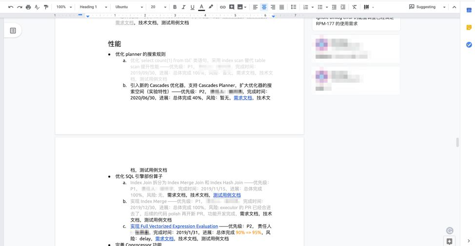
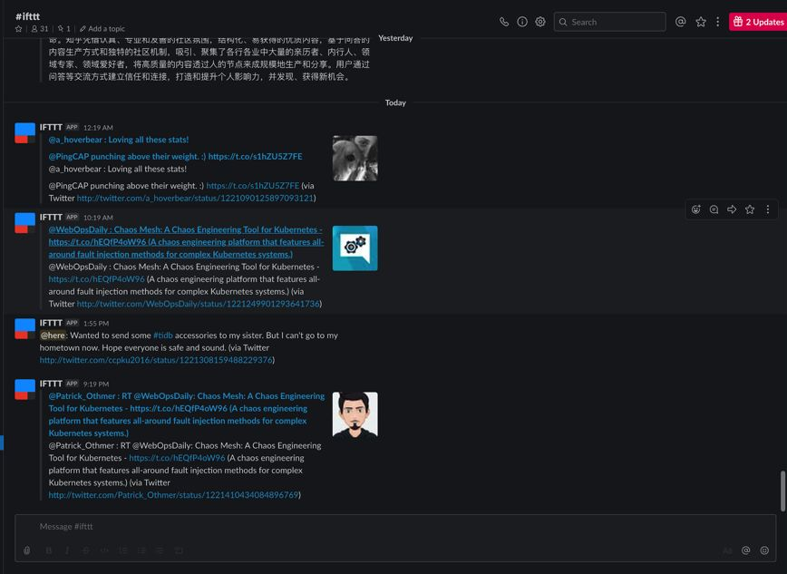
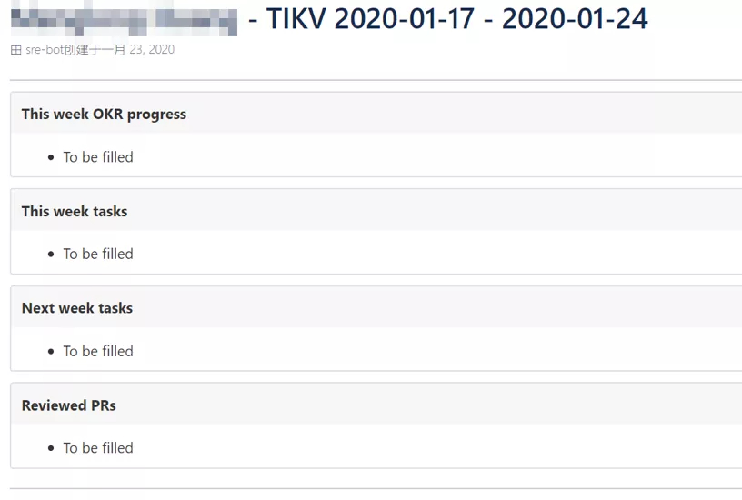
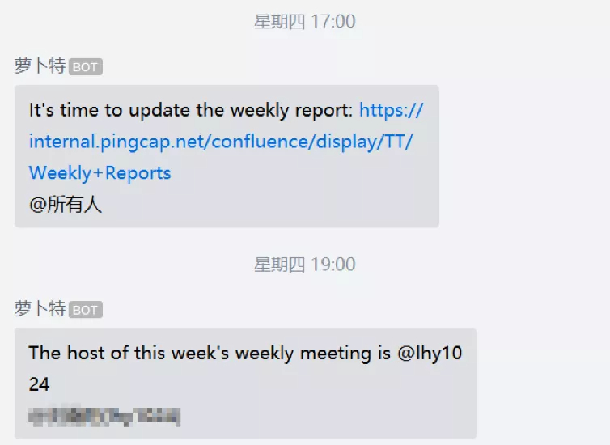
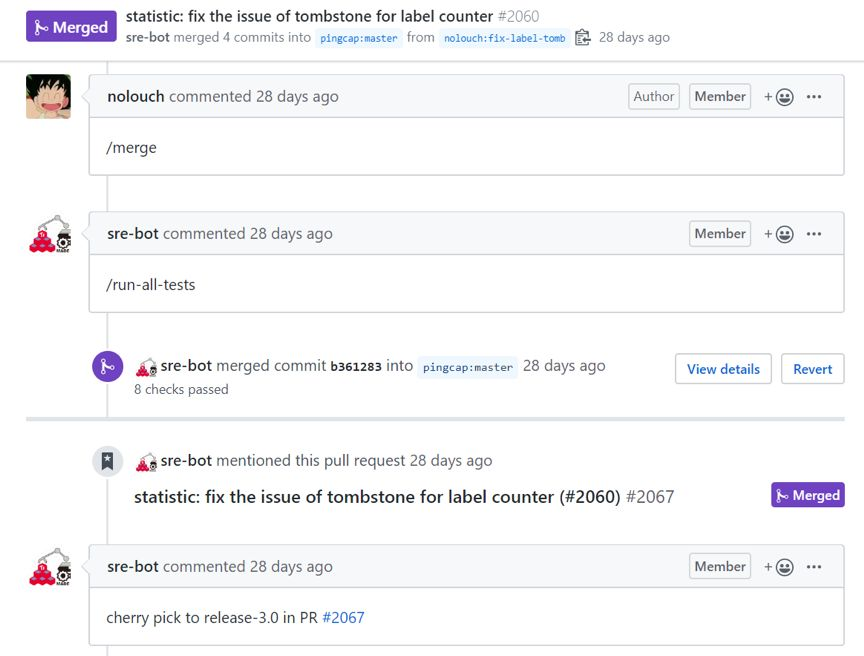

# PingCAP 的 5 年远程办公实践

作者：黄东旭
来源：[PingCAP](https://mp.weixin.qq.com/s/alygC64BnIKbuuxBBZAOxA)

## 前言

2020 年的春节注定是一个不平凡的春节，全国都在抗击新型冠状病毒肺炎。除了不出门，勤洗手，戴口罩之类的常规操作，我们就在想，在这个大背景下，我们还能够做哪些事情？考虑到春节假期临近结束，返程的旅途中可能会加大传染的概率，延长隔离时间、远程在家办公也许是普通群众能给国家在这场战役中做的最大贡献。然而在我们国家，暂且不论别的行业，**至少我们所在的高科技行业还没有普及远程办公的文化，所以我们在此将 PingCAP 实践了近五年的工程师远程办公经验介绍给大家。本文将尽量少描述理念，而更多的从实践方面讲述我们的落地经验，以期在这样的一个特殊的时刻帮助更多的朋友和公司尽快行动起来，为国家为社会贡献一份我们微薄的力量**。

我们已经通过实践证明，在这个时代，至少对于类似软件工程这样的主要以脑力和创意为主的工作，已经有足够的方法论和基础设施，让远程工作的效率不比传统模式差，有时候甚至能有更好的产出（相信已经有同学想起了早上拥挤的交通对心情和思维的副作用）。下面我们聊聊一些具体落地的经验。

## 01 远程办公的管理哲学

远程办公在国外并不是一件新鲜的事情。在硅谷，尤其是新一代的科技公司几乎都有远程工作的基因，这背后有很多原因在这篇文章中就不展开了，如果感兴趣的朋友可以看看来自 37 Signals 的 David Heinemeier Hansson 的《Remote》一书。**对于我们来说，PingCAP 从公司建立之初就开始践行这个文化，主要出于这几点原因：一方面包括我在内的几位联合创始人都是工程师出身，本身对于效率比较有追求，自由的工作形式能够提高我们的工作效率，同时我们痛恨低效形式主义；另一方面，对于一个初创的公司来说，我们不希望人才因为地域的限制而不能加入我们**。

一个很好的例子是我们的首席架构师 siddontang，也是我们招聘的第一位员工，因为家庭原因不希望来北京，过去的几年一直都在珠海的家里远程工作（这篇 blog 详细描述了他的亲身经历：https://github.com/siddontang/blog/blob/master/2016/my-remote-work.md）。另外一个非常重要的原因是我们的员工是全球分布，基于开源的开发模式，所以一开始就注入了远程工作的基因。

软件工程是一项以脑力为主要资源开展的工作，在如今高度发达的互联网技术支撑下，其实是天然适合远程工作的，但是我们为什么大多数时候觉得远程工作不如集中工作效率高？**除了远程带来的沟通协作障碍外，我们认为其实最根本的差异还是在管理哲学上，是倾向于传统监管的管理思维还是自驱的管理思维，在 PingCAP，我们在企业文化上一直倡导的是后者**。为此，我们需要建立一个强大的愿景驱动力，并落实在我们的各种细节中，同时尽可能为同事们营造自由、开放、分享的工作氛围。

幸运的是，这也和我们从事的开源领域的工作方向完美契合。举个例子，在 PingCAP 我们从来不进行任何形式的打卡，每周五我们都有例行但是议题不限的员工 TGIF 分享 ，任何一位同事都有机会站在台上分享自己的工作成果和心得，甚至我们发给大家的周边产品都是在设计、选材上一遍一遍的精挑细选，且限量供应，以期让每一个小伙伴感受到温暖和尊重。这一切的工作看似和我们的远程办公没有直接关系，但是实际上让我们一点一点地变成了一个脱离形式、高于形式而存在的强大的远程组织。

## 02 目标和计划管理

**如果问一个问题，对于工程师团队来说，什么时候需要沟通最多？我想是制定计划和目标的时候**。

**软件工程远程办公我们首先要解决的是我们要建立远程可操作的更加清晰、高效的目标和计划管理。从宏观层面说，在 PingCAP 我们依赖的是 OKR 这个工具进行公司以及团队的目标管理，OKR 是硅谷以及国内的很多互联网公司越来越流行的目标管理工具**。经过探索，我们认为 OKR 是一个比较适合远程工作团队的目标管理工具，因为 OKR 相比 KPI 来说，首先更加强调由团队成员共同制定团队目标，这样带来的好处是易于让整个团队就目标和关键结果达成共识，始终保持团队的目标导向一致。其次能够让团队成员更加明白做手头上的事情对于团队以及对于公司的意义，这一点对于远程团队尤为重要，极大的有利于促进部门与部门、人与人的协作，让团队更加具有整体性，最后，OKR 还有一个很重要的特点：透明，在我们的实践中，每个团队都可以看到别的团队的 OKRs，大家在制定完各自团队的 OKR 后，还需要在公司级别宣布，确保大家都能了解。

**从微观层面说，例如一个具体的项目计划制定和执行跟踪，也需要一样的透明。我们的实践是项目的负责人为每一个大的项目建立一个全局的项目「地图」**，力求做到即使是半路加入的同学，看到这个地图后，就能够清楚的知道现在是什么情况，需要的资源的链接在哪，负责人是谁，风险点在哪。这个对于远程工程团队的管理者来说更是至关重要。下面是一个例子：

*当我们把我们的目标和计划能够清晰、高效、透明的在整个公司内部制定、发布和管理起来，远程办公已经具备了初步的可操作性*。

## 03 工欲善其事，必先利其器

既然我们这里更多的是讨论实操，我们接下来重点讲一讲软件工程远程办公环境我们所使用的工具。企业文化、目标管理我们需要相对长时间的工作去逐渐建立，工具的引入则相对快速见效，也就是俗话说的，工欲善其事，必先利其器，使用良好的工具会让事情事半功倍。

PingCAP 的主要产品 TiDB 是一个开源的数据库，我们研发的主要工作流都是构建在 Github 上面，完全对社区公开。所以我们的工具链也是以 Github 为中心，串联其它的工具，下面是完整的工具列表（这些工具很多都有国内的替代工具，如果公司不像 PingCAP 这种员工全球分布的，可以根据实际需求选择）：

- GitHub：代码托管，公开的 RFC，社区 Issue 反馈，产品发布，Code Review 等。
- Zoom：在线会议。
- Slack：即时通讯，机器人消息中枢。
- 微信、企业微信：即时通讯（没错，我们两个都用，但以企业微信为主）。
- 在线文档：文档协作，幻灯片，表格。
- 邮件，日历。
- Confluence：内部的文档，包括已成型的设计文档（如内部的 RFC 文档），Wiki 等。
- Jira：Bug 和 Milestone 跟踪。
- Trello：看板，记录一些重要客户和事件的备忘。
- Jenkins：持续集成，daily build。

这里通过一个小例子介绍一下我们研发的工作流：

1. 假设我们需要做一个新功能，从构思开始，可能第一个会使用的工具是在线文档，负责的同事会草拟一个文档，将大致的想法在其中描述，然后通过 Share 的功能，分享给相关的同事，大多数时候这些设计文档都会 share 到所有的工程师都会在的邮件组里，任何人都可以上去评论或者编辑。
2. 文档经过沟通讨论定稿之后（沟通环节我会在下面一节重点介绍），会同步到 Confluence 和 GitHub 中（如果可以公开的话，英文版会发到 GitHub 上）。
3. 接着该项目将被拆分成多个子项目，通过 JIRA 分配到具体的人，完成后直接提交到 GitHub 上，项目的该模块的 Reviewer（也包括 Maintainer）会参与 Code Review，收集到两个 LGTM（Looks good to me） 并通过各种持续集成工具的测试后，最终合并到主干。

修 Bug 的流程也类似，值得一提的是我们开发了一个 bot，用于同步 GitHub 中来自社区的 Issue 到内部的 JIRA 中。

**优秀工程师的创造力是无穷的，尤其在远程工作的背景下，我们非常鼓励工程师通过自制工具来提升工作的效率**。除了上面提到的 Issue 机器人，我们的[Chaos](http://mp.weixin.qq.com/s?__biz=MzI3NDIxNTQyOQ==&mid=2247490620&idx=1&sn=622f5247e5f771961ccebacc28e32ef2&chksm=eb163b56dc61b240951396602b37168bbca69bd52219914d6c6fe3deb800e1e36242a215e04c&scene=21#wechat_redirect)测试（最近已经开源, https://github.com/pingcap/chaos-mesh），CI/CD，甚至包括社交网络上简单的动态舆情监测，都有自动化的工具在做。还有小伙伴们通过自动化的手段优化自己工作中的一些流程，举几个好玩的例子：disksing 同学使用 App Script 自动生成自己的周报（http://disksing.com/review-recorder/）；siddontang 同学自己写了个小工具 github-cli（https://github.com/siddontang/github-cli）来高效的追踪关注的 Github 项目的动态；我用 Python 写了一个小脚本，每日收集 Trello 上指定 Board 内的卡片的更新，并给我汇总发邮件……这样的例子数不胜数，有时候真是很佩服大家想象力和动手能力，我们非常坚定地鼓励大家做这些事情。

**介绍了这么多好玩的东西，其实我想表达的是：对于远程工作来说，能交给机器做的，尽量不要人来做，自动化是至关重要的。尤其对于线上的协作来说，多一个人的参与就意味着多一份沟通成本。我对于工程师团队选择开发相关的效率工具，有几个建议**：

1. 选择有开放 API 的工具，方便写 bot，形成协同效应。
2. 切忌讳过多过杂，选择几个好用的，将其用透。
3. 使用 Slack 之类的 IM 作为各种工具的 Message Hub，尽可能做到在一个地方就能一目了然事情的状态。

另外就像上面提到的，由于我们也有一些海外的同事、客户以及海外社区沟通的需求，所以主要选用的工具基本都是国际上比较通用的，如果你们公司的业务都在国内的话，这些工具基本都可以找到国内的或者私有部署的替代方案，例如 ONES，Tower，Gitlab 等。

## 04 对远程友好的沟通和协作机制

如果说上面聊的工具只是基础的话，那么远程工作最大的挑战就是沟通了。对于一个成熟的团队来说良好的沟通一定是必不可少的，甚至沟通的品质决定了做事情的品质。**并不是说因为远程工作因为条件约束，就少沟通甚至不沟通了，相反的，在这种环境下我们的沟通可能会更多更细致，只是形式并不仅仅限于面对面的会议这种形式而已**。

在聊我们的沟通实践之前，我想先聊聊沟通的意义，首先我认为沟通最重要的意义在于：信息拉平。对于一个远程的团队来说，用大白话来说也就是：大家需要互相都知道自己该干嘛，团队正在干嘛以及该干嘛。这件事情在很多公司是通过大大小小的会议，或者甚至吼一嗓子完成的。**但是在一个远程的团队中，沟通这件事情需要做得更加的透明**。

即使是远程，大部分时候会议仍然是最高效的信息拉平方式，类似 Zoom 这样的视频会议工具已经提供了很好的平台，而且智能手机和移动互联网的普及也让会议的参与变得更加的便捷。这里多提一句，PingCAP 是 Zoom 的重度用户（也是企业客户），Zoom 的用户体验真的非常棒，我们即使是全公司级别的会议，也都是通过 Zoom 完成的（昨天刚得知一个令人振奋的消息，也给 Zoom 做个友情广告，目前国内用户访问 zoom.com.cn 可以免费不限时长使用，直到疫情得到有效控制之日）。

在 PingCAP 从形式上来说，因为会议基本都会有远程的同学参与，所以默认都是线上会议。

从内容上来说，大概有两种会议，一种是例会，一种是具体业务的沟通会。相信和别的公司也没什么不一样，我这里聊聊我们觉得比较好的一些实践：

在 PingCAP 各个团队（包括虚拟团队）大大小小一定都会有例会，通常以周为单位，有些比较重要且紧急的项目会以天为单位，会议的时间和长度也不一定。周会是一个很好的机会能让团队成员互相了解大家在干嘛，对于 Manager 也能很好的知道方向有没有歪，进度是否正常。

另外一点，分享一些关于会议的实践：

1. **对于类似例会这种偏信息拉平的会议，Manager 最好不要直接在这类会议上做决策**。因为很多信息可能是刚接收到马上做决策不一定是经过深刻的思考，另一方面信息可能不全面，还需要进一步的跨团队沟通。
2. **善用 Calendar**。我建议研发团队内部将 Calendar 可以别人可见（这点上财务，商务，高管团队需要酌情考虑），通过订阅和你相关的同事的 Calendar 是一个也是一个很好的信息拉平渠道。
3. **会议前发 Agenda，会议后形成 Meeting notes 发给参会的人，并记录在 Wiki 中**。
4. **尽量少开大会长会**。Amazon 的「两个 Pizza 原则」也同样适应于开会（这点说起来简单，其实做起来很困难，尤其在跨团队协作上，我们也在努力）。

这里说几个我们亲身经历的坑。因为远程的关系，在 PingCAP 我们一直以来要求尽可能的使用文档进行沟通，我们确实在早期很严格的践行了，但是那个时候我们重度依赖在线文档，于是陷入了一个问题：协同功能很棒， 但是索引功能很弱。于是很多时候就出现了，可能记录某件事情的文档找不到了，或者有多个文档（很多甚至只是讨论稿）在描述同一个事情。

为了解决这个问题，我们后来引入了 Confluence，用做团队 Wiki，主要起到信息索引和搜索的功能，我们非常依赖 Confluence，并且玩出了很多花样，这里我只举几个最佳实践的例子：

1. 给每个团队创建团队的 Page（类似前面提到的「地图」的概念）索引一切和这个团队相关的内容，让新人能够一目了然。例如下面是来自 TiKV 团队的例子：

2. 团队周报和个人周报，每个团队的周报会一层层的汇总和归纳，在每周的高管例会前发出。所有的周报都在 Confluence 里被索引。
3. Logbook，这个是我们比较有意思的东西，对于一些带有探索性质的工作，例如一些小实验，性能测试，一些特殊场景的优化等等。我们也会详细的记录下来，形成一个个实验 logbook，这些 logbooks 可以通过关键字被 Confluence 的检索到，一是作为未来实现或者输出成文章的素材，二是防止将来做重复的工作。

在内部协作全面引入 Confluence 后，我们的文档信息碎片的问题得到了比较大的缓解，唯一美中不足的是 Confluence 的移动端做得实在不尽如人意，希望 Atlassian 团队未来能改进。 

另一个坑来自于 IM 工具的选择。这个可能也不是坑，更多的是由于微信平台本身不是为了办公场景设计的带来的问题。由于我们多数的国内客户都倾向于使用微信作为沟通的渠道，作为一个 toB 企业，我们必须去适应这个现实（比如我手机上有几千个微信群），这个问题导致了我们 IM 沟通的碎片化，而远程工作的环境会进一步放大这个问题。可能同一件事情，有些同学看着微信，有些同学看着 Slack，这就导致了消息不对称。再者微信是一个封闭系统，没有 Open API，很难通过技术的手段同步到一个平台。另一个问题是，微信这种用法，工作和生活很难分开，有时候很令人苦恼。这个问题通过引入企业微信得到了一定的缓解，但是因为企业微信又是一个新的 IM，也是一个封闭系统，信息碎片化的问题和海外同事使用习惯上的问题仍然存在。在这个方面，我们仍然在探索。

## 05 远程办公环境下的自我管理

远程办公还有一个很重要的方面是个人的心理建设和自我管理。这点因人而异，其实很多人不太适合长期 work from home，例如我远程工作的时候一定要从家走出来，去个咖啡厅或者 WeWork 之类的地方才能进入工作状态，但是我们的首席架构师就可以五年如一日将他家的书房当成办公室。人无疑是最重要的一环，不过在这篇文章中，我并不想展开太多，有机会再详细聊聊，这篇文章我希望尽量关注比较普适的方法。

**在远程环境下，需要工作者能够克服孤独感，并且由于没有同事在身边，需要比较强大的自律精神克服倦怠感**。在这点上，我推荐使用一些个人时间管理工具，例如番茄钟，日历等工具。但是和公司选用工具一样，切忌贪多，选择一个用透最好。另外在生活中也保持一个规律的作息习惯也会很有帮助，这点在上面引用的 siddontang 那篇博客（https://github.com/siddontang/blog/blob/master/2016/my-remote-work.md）中有很好的阐述。

**另外一点比较重要的是，很多工程师可能是一个比较内向的性格，遇到困难的时候，尤其是在远程的环境下，容易钻牛角尖**。这种情况下，一定切记要主动的求助和沟通，甚至可能需要比面对面的环境下更加频繁的沟通。

**对于管理者来说，要做到这点，需要将任务拆解得足够细，在前期沟通需要反复确认是否和远程工作的同学达成一致，这个环节需要非常的重视**。

## 06 Online and Offline（线上与线下）

PingCAP 并不是一个彻底的每个人都远程办公的公司，我们仍然在各个大城市有我们的办公室（北京、上海、广州、深圳、成都、杭州、硅谷）。就像上一节说的，远程工作看起来很美，但是可能也并不适合每一个人。人是社会化动物，很多时候我们仍然需要从线上走到线下，和同事一起吃顿饭，聊个天。因为这点，我们的解法是： **PingCAP 使用远程的工作方式和文化，但是仍然保留着各地的办公室，所以我们有一个不成文的惯例，当每个城市的员工超过 4 个人的时候，就可以找个办公室了**。

在各地 Office 的运营上，也是比较有 PingCAP 的特色的。很多传统公司的各地子公司通常是定位特殊的办事处，例如销售，测试，研发等。但是由于我们的远程办公文化，**我们各地的 Office 其实更像是一个虚拟的组织，也就是说可能同一个团队的同学会隶属于不同的 Office，或者反过来，每一个分公司都可能会有不同职能、不同团队的同学**。

这样是有好处的：

1. 作为一个 toB 公司，我们国内的客户也主要分布在几个主要城市，在客户当地有分公司能更方便的开展客户支持和市场活动。
2. 在同一个城市的办公室内有不同部门的同事，有助与构建更多样化且健康的文化，也能更顺畅的进行跨团队合作。

办公室的 Manager 更偏向于当地办公室具体事务和活动的管理和组织，另外每个 Office 都会有一个行政来处理日常的事务。所以，通常我们的 Team building 会有几种：

1. 当地 Office 自己会有 TB 的经费，可以自己组织活动。
2. 每当团队出差到同一个地方的时候，组织团队的 TB（当然，我们大多数是程序员，基本就是吃吃吃）。

这里提到了出差，顺便介绍一下，我们建议远程研发团队的 Managers 大概一个月需要尽量和团队的大多数成员 Face to Face 的见一次面，这些行程通常可以和客户拜访安排在一起。**线下的沟通可以让线上的交流更加顺畅**。

> 总得来说，远程办公并非十全十美，像我们这样的科技公司具备天然的文化和规制土壤，但仍然有很多地方有继续改进的空间，欢迎大家给我们多提建议。很高兴在国内远程办公文化尚未普及之时，能够用这么长的篇幅为大家分享一点落地经验。在这个特殊时期，我们在家不动的同时劳动创造价值，也算是为社会做了点微小的贡献 。