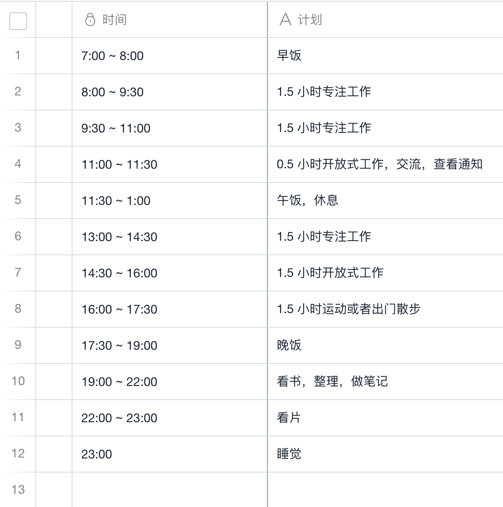
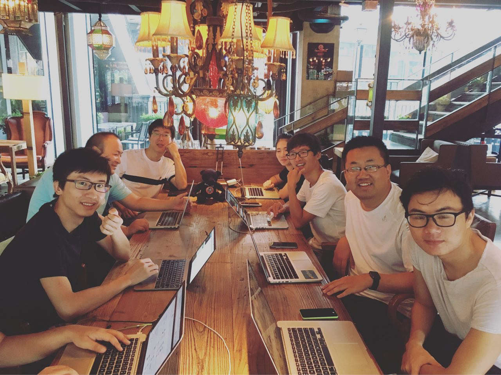
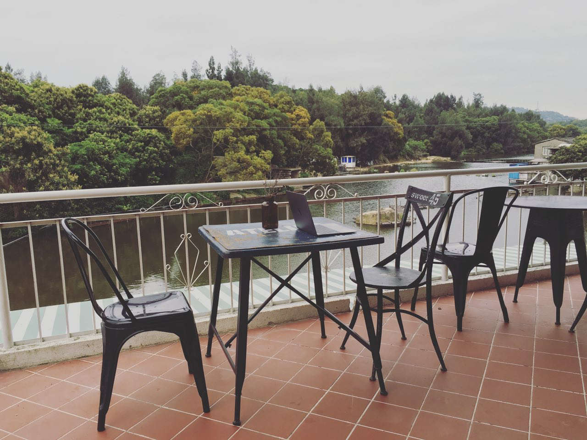

# 远程工作的八个感受

<copyright :meta="$frontmatter.meta" />

今天看到一篇翻译过来的文章[《五年的远程工作带给我的酸甜苦辣》](https://zhuanlan.zhihu.com/p/20775692)，作者列了八个具体的点，聊了他远程工作五年的感受。我自己已经远程一年半了，从最初加入 [DeepDevelop](http://deepdevelop.com/) 团队做了半年 iOS 开发者，到后来我们做自己的产品 [Treation](https://treation.com/invite/123f765d5e14798355761?utm_source=zi&utm_content=%E8%BF%9C%E7%A8%8B%E5%B7%A5%E4%BD%9C%E7%9A%84%E5%85%AB%E4%B8%AA%E6%84%9F%E5%8F%97)，从做员工到做 CEO，一直在个人远程和整个远程团队远程这件事情里探索。我就把这篇文章里作者提到的八个点拎出来谈谈我的感受。

## 1、制定一份“正常工作”的时间表
远程工作确实容易陷入一天都在工作的现象，至少有一段时间我自己是这样的（不过我是喜欢工作）。但对更多的人来说这样就没有享受到远程的好处了，最近我们 Treation 团队也在让大家制定这样一份 “正常工作” 的时间表，我们希望每个人每天有 4.5 小时是专注工作的，这 4.5 小时不接受任何打扰是连续完整的，同时这样一份时间表里面也需要有运动时间，充电时间。

下面图片里是我现在的时间表，专注工作的时候我会关掉全部的 IM，也不会去看邮件，这时候就花大片的时间去思考问题，保持专注会让你效率很高，尝试了几周之后，我们团队里的同事都觉得这样非常好。

运动时间可以健身或者出去散个步，不过杭州的天气最近让人没有欲望出门。有工作表的好处就是，在非工作时间，比如看片时间，我就能安心的看了，之前经常看电影的时候心里会惦记着是不是有工作还能再搞搞，现在完全不会了。工作表定了之后也不需要很死板，这样坚持起来我觉得是很累的，偶尔调整一下也没有什么问题，总之是保持连续的状态就好。

我的时间表

## 2、需要规划的不仅仅是工作时间
这个上面已经讲到了，除了工作你还有生活、学习，经常听很多人说每天加班到很晚，回家倒头就睡，根本没时间去提升自己或者陪家人，远程的时候虽然又多出来很多时间（主要是通勤），如果你不好好规划，时间流失起来也是不知不觉的，所以要规划好除工作以外的其他时间。对于我来说，我不喜欢娱乐活动，看个《西部世界》已经很满足了，我每天都安排了时间去看书和看片，看书整理我目前觉得很有价值，重点是后面的整理。之前看了很多东西，走马观花，整理这个环节多出来，很多东西会理解的更好，算是吸收的过程吧。现在信息和资讯太发达了，能吸收进更多的才有价值。

上面是同事 VeryCB 的时间表

## 3、“面对面”是新潮流
每个个体不太一样，有的人喜欢安静，有的人喜欢热闹。我属于都可以，反正坐下来就能进入工作的状态，不管是在家里还是在咖啡馆。情感上有的人是需要陪伴的，这样的人我觉得本身是不太适合远程的，长时间下来你会觉得孤独，偶尔的视频或者在线聊天是解决不了的。

不过在我们团队，我们确实制造了很多面对面的机会，我们每隔 6 周就把大家聚集到一个城市，一起写代码，一起讨论产品之后的计划，一起玩耍。很多远程工作的团队可能没有这个环节，同事们可能都没有见过面，我们整个团队去年这个时候在清迈呆了一个月，大家感情确实增进了不少，我们现在觉得这样的碰面是有价值的。

Treation 团队在南京

Treation 团队在成都

## 4、税费保险那些事儿
很多没有远程过的人最担心的应该是这个问题了，但是这其实不是问题。现在有大把的创业公司在做这种服务，不管你是有公司还是你是个人都能够得到很好的解决，只需要出点服务费就好了，团队可以试试[知人](http://zhirenhr.com/)这个产品，他们就是做这件事情的。

## 5、旅行？没那么简单（反对）
这个不是很赞同作者的观点，至少我觉得太简单了，或者说在我们团队是太简单了，先看图吧。

上面是我们团队成员今年去过的地方，我们的 iOS 程序媛从杭州去了大理之后就舍不得回来了。旅行的时候可能会在路上花掉很多时间，我个人的经验是，高铁其实挺适合工作的，4G 开着也不怕没网，飞机上相对不方便，把晚上看书的时间调整上来就行了，至于白天，我会选择起的很早（5 点）开始工作，到中午差不多就干完活了，下午和晚上都是你的自由时间。

在厦门山茶花民宿

某个 Airbnb 租的房子

## 6、住在另一个国家不会让你更开心
这个点没有太多好说的，只出过国一次，在清迈住过一个月，每天阳光灿烂，挺开心的。可能和清迈是比较成熟的东南亚旅游城市有关系，说中文就能到处走了，当地的人也非常友善，物价又低，希望以后冬天都去那里度过。

## 7、出门去！
正如作者说的有时候是因为懒所以不出门，有的人也有可能本来就很宅不喜欢出门。远程工作的人几天都宅在家里不出去我是见过很多的，我自己也经常这样，我觉得这里面没什么好或者不好的，只要你在家里快乐就好。

## 8、投资自己
每个人都应该投资自己！把钱花在健康上，花在提升效率上，花在提升自己技能上。特别是健康这个，你终于有时间去健身了，别舍不得办个健身卡，请个私教，健身后整个人感觉特别好，我这种很瘦的体质一个月都长了五斤肉，而且你可以错峰去健身房，我们杭州几个同事每周去三次专门挑别人工作时间去，整个健身房都是你的。

对我们程序员来说提升效率太重要了，顶配的电脑，稳定的网络，不知道能给你节约多少时间。请忽略上面的 Macbook，那是出门的时候用的，顶配 5K iMac 所有程序员都值得拥有。

上面八个点都是对应最开始那篇文章的，要是用一个词来总结这一年半的感受，那就是 “自由” 了。

对以上话题感兴趣的或者对我感兴趣的可以加微信沟通：tomliu1

对 Treation 感兴趣的可以通过我的邀请链接注册：[https://treation.com/invite/123f765d5e14798355761](https://treation.com/invite/123f765d5e14798355761?utm_source=zi&utm_content=%E8%BF%9C%E7%A8%8B%E5%B7%A5%E4%BD%9C%E7%9A%84%E5%85%AB%E4%B8%AA%E6%84%9F%E5%8F%97)