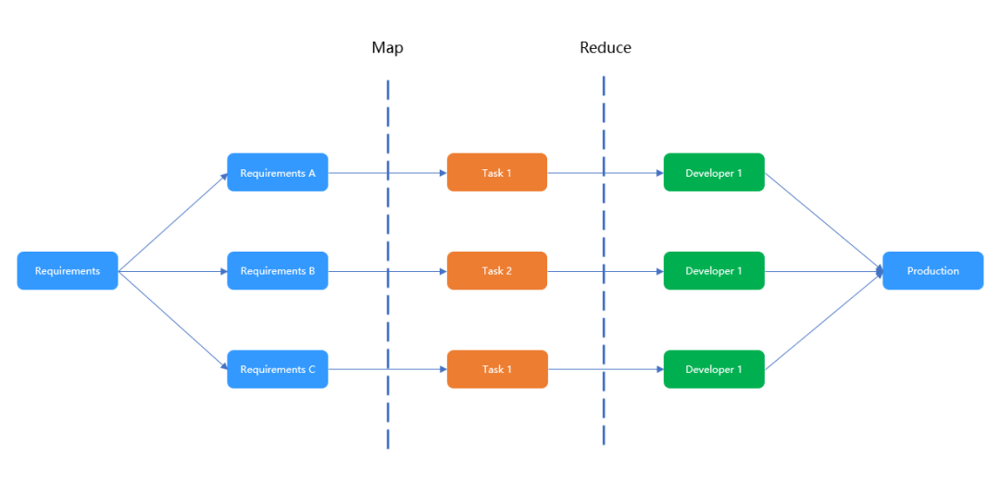

# 远程办公的自我修养和团队管理

<copyright :meta="$frontmatter.meta" />

## 远程办公的自我修养： 自律

理想走进现实，2020年开始，我终于从事了真正意义上的远程工作。在这个过程中，逐渐发现问题、解决问题，经过了两个月的磨合期，渐渐走上正轨，也有了自己的一些心得体会。

从我个人的经历来说，自律是非常重要的，但是真正写到这里，却不知道如何去表达，因为写不好就是一碗心灵毒鸡汤。但是仍要提及的是，**其实自律最好的动力源自于爱好**，个人还是蛮喜欢利用代码去构建一些功能的感觉，所以自然也就喜欢在有事儿、没事儿的时候写写代码。

但是在远程办公在家的初期，仍然也会有一些懈怠的情况，毕竟家庭的氛围确实很难让人沉浸到工作当中去。所以在这段时间里，[上一期我分享的那张作息时间表](./true-meaning-of-telework/)给了我很多的约束。**也许一张表格不能够完全约束你，但至少让你在突然进入到远程办公模式时更为从容一些，也能让人更快地适应远程办公的节奏。**

其实除了这一张表格之外，个人实际上还利用业余时间做了一个自己的生活管理系统，把这个管理应用作为操作系统的一个Service，至少可以**让自己能在正确的时间做该做的事儿。**

## 远程办公的团队管理：“联邦式” 

总体来说，远程办公最值得谈论的话题就是团队建设问题。其实“远程办公”这一概念天生就存在一个潜在的矛盾，即松散团队人员个体，同时又要加强个体之间的沟通联系。但毕竟远程办公不是一个全新的概念了，所以其实已经由许多小的团队做了探路人，并取得了一定的成功。

但是相应的大团队使用远程办公的先例却不多见，对应的团队建设和管理经验都源自一些探路者的分享，分析和推测。其中看到一种有趣的方法是一个类比模型——分布式。这种从技术架构角度类比处理问题还是很有可取之处的，因为模型的角度讲，更为有利于问题的分析和全局的推演。那么我们不妨沿着这个思路，敞开脑洞，用抽象的模型语言来处理这个问题。其实，所谓的“分布式”的团队管理更像是一个MapReduce模型，从客户需求把问题拆解开去，然后将原子性的需求转变为对应的子任务，并交由对应的开发者去完成对应的研发/开发工作，示意图如下：

值得注意的是，在任务拆分之后，我们应该格外注意那些“没有什么价值”的任务，因为这类任务本身对项目没什么贡献，但是在这种远程状态里，这类任务反会影响开发者的执行效率。

然而这个类比不够恰当的是同步对于状态的同步更强，也就是说对于每一个开发者都强烈地知道项目的进展情况，虽然这种状态有利于项目开发，但是在现实中大团队的远程办公实操起来却着实困难。对于大体量的项目开发，虽然敏捷的管理要求每个人对于项目的需求都能够完全把握，但实际上实现是很困难的，更不要说即使现场办公也很难保证每个人完全把握项目需求，而在远程办公的沟通模式中，由于交流成本的提高，这样的代价无疑是十分昂贵的。

那么更为松散的一种类比，是我之前介绍Google物联网设备机器学习的一种算法模式，即“联邦式”。这种模式没有强烈的状态同步需要，但是需要一个对应职能的工作去对任务分发，同步和整合这些工作有所把握，也即是一种Center的存在。Center会有一个固定的任务时钟，等间隔的归纳评估任务开发状态，并及时做出相应的调整，从而降低开发者与开发者之间的沟通成本，所以从推演上来说，这种联邦式的团队管理，不失为一种有效的远程办公团队建设和管理手段。

无论如何，对于远程办公模式下，大体量项目研发和开发团队的建设和管理仍旧是一个开放性的问题，很难在一时间解决，只有不断地探索和尝试，或可取得一定的成功。