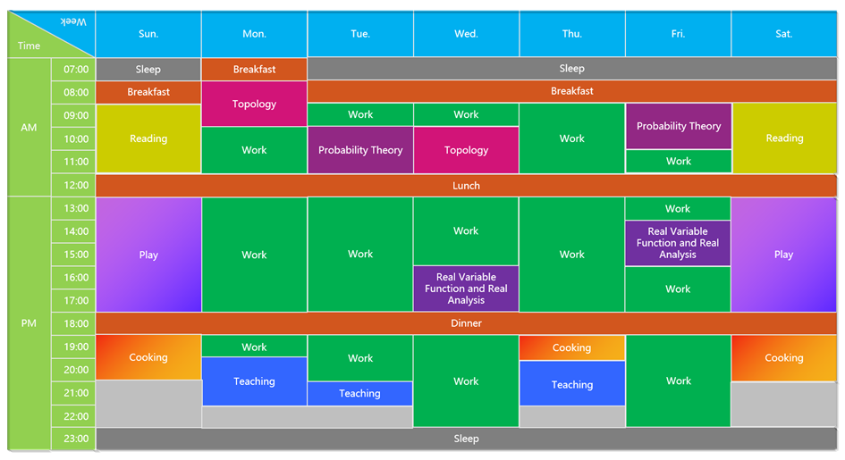

# 当理想走进现实——我终于开始了真正意义上的远程办公

<copyright :meta="$frontmatter.meta" />

第一次听到“远程办公”的概念，大概是2009年刚上大学的时候。当时听说克雷数学研究所（Clay Mathematics Institute）的研究生可以选择世界上的任何地方从事其研究工作，于是“远程工作”带着满满的浪漫主义色彩进入我的职业规划。然而，从校园走出来之后，才渐渐意识到现实的骨感。

直到加入盛安德，才重燃我对远程办公的热情。然而在真正实施“远程办公”的方法之后，也逐渐发现了各种各样的问题，以及产生了各种各样的应对办法。不过这个布满荆棘的过程，也是我个人成长的过程，我从最初的科研走到传统工业，再直至踏入互联网行业，让我始终坚持的一个理念就是

> 任何好的解决方案，
>
> 都是在解决最棘手的问题时诞生的。

所以在不断尝试和实施“远程办公”的同时，也不断地在与其他公司的管理者、技术团队进行观察和交流，从而及时深入了解远程办公的理念，同时也去规避一些不必要的风险。于是，对远程办公产生了一些感想。

## 我终于开始了 真正意义上的远程办公

先简单介绍一下个人目前的远程工作状态吧。实际上在之前的工作中，我所在的盛安德沈阳交付中心，执行的是一种on-site与telecommuting之间的一个过渡状态：我们的客户都是海外公司，一切会议、讨论乃至产品交付，都需要通过远程办公形式完成，但是我们的大部分工程师每天要到当前城市的办公室完成工作，不忙的情况下，也会参加一些其他项目组的需求分析和技术方案会议。当然，后者也是盛安德的一种价值和企业文化取向，目的是**从每个人的技术方案中总结出一套最优化方案，以此表示对客户的负责，同时也能让每一个工程师体现参与的价值。**

之所以会形成这种on-site与telecommuting的中间态，主要是因为在倡导远程办公社区的同时，又要考虑到国内市场的现状(国内市场对于远程办公虽然提倡了若干年，但实现程度依旧不高)。

直至2020年年初，由于疫情在国内蔓延（当然是当时了，如今国内的疫情已经得到了有效控制，感谢英勇的医务工作者，感谢每一个为疫情控制做出贡献的人，也感谢一起募捐的小伙伴们），出于对员工安全的考虑，我们才从之前的过渡状态转入到了真正意义上的远程办公(telecommuting)。正如上文说过的理念：“任何好的解决方案，都是在解决最棘手的问题的时候诞生的”，所以这次“疫情”无疑是为国内的“远程办公”普及提供了一次机会，一定程度上讲，也算是因祸得福了，虽然这代价是如此沉重。

虽然是首次真正意义上的“远程办公”，但是毕竟有前期过渡状态时期的工作铺排，所以个人觉得这个转变并没有给项目组和个人带来许多负担。

总结起来主要有三个原因：

首先，项目自身就是**on-site与telecommuting的一个过渡状态**，而且内容铺排上来说，更倾向于telecommuting形式。

其次，我所在的项目体量很小，只有一个PM和我在内的两名工程师，工作内容铺排非常容易把控。而且这个项目虽然体量很小，但是会涉及许多高并发，缓存IO，机器学习和模糊匹配等等多种开放性的技术问题，所以让我们与客户有了长达一年多的磨合过程，**与客户的默契程度**是相当不错的。

再者，2019年下半年，为了公司内部累积技术框架和一些半成品项目（这个想法真的是偶然为之，没想到为后文埋了伏笔），我在公司内网部署了一台服务器，可提供项目管理，代码管理，Maven/NPM/Gradle等私有镜像仓库，以及持续集成和自动化部署等服务，所以在执行远程办公之后，**利用网络隧穿技术和公有云构建了一套混合云**，为接下来的远程办公的技术问题奠定了基础。

## 我的秘密武器：一张神奇的表格

说了这么多，其实还没说到目前远程办公的真实状态，由于盛安德原本执行的就是**弹性工作制**，所以一般在不是很繁忙的状态下，我是按照下表来规划我日常生活的。

不得不说，**远程办公不仅仅解决了交通一大恼人的问题，同时为生活添色不少**。对于一名大龄单身狗来说，虽然爱情不顺心，但至少可以用一些快乐时光填补寂寞也是极好的。

当然，在得到的同时，也会失去一些，比如说，我非常喜欢利用碎片时间（等地铁，等公交，坐公交，上厕所）去学习一点东西，比如一个公式，一个算法，推演一些新颖的模式或架构在项目中的应用等等。这也是一种学习方法，虽然我不是学霸，但毕竟是个理科生，所以很多时候能够以点及面地去学习，而把大把整块的时间用于Game和Happy上。

但是**远程办公会让人腾出许多整块的时间，那么如何利用这些时间并持续做下去就成了一个困扰**。庆幸的是，可以利用时间去蹭大学时恩师的网课，填补自己在数学和算法方面的知识空白。同时利用其余时间可以做一些有意义的事儿，比如疫情期间义务给初高中学生补课，不仅能够实现自己更多的价值，也可以让自己保持学习的状态，看到奋斗中的学生，仿佛看到当年的自己。

在远程办公的初期，利用一张表格来规范自己的生活是比较有必要的，让人更容易接受远程办公的方式而不至于惰怠，而这种**惰怠恰恰是阻碍远程办公普及的一个重要原因**。

