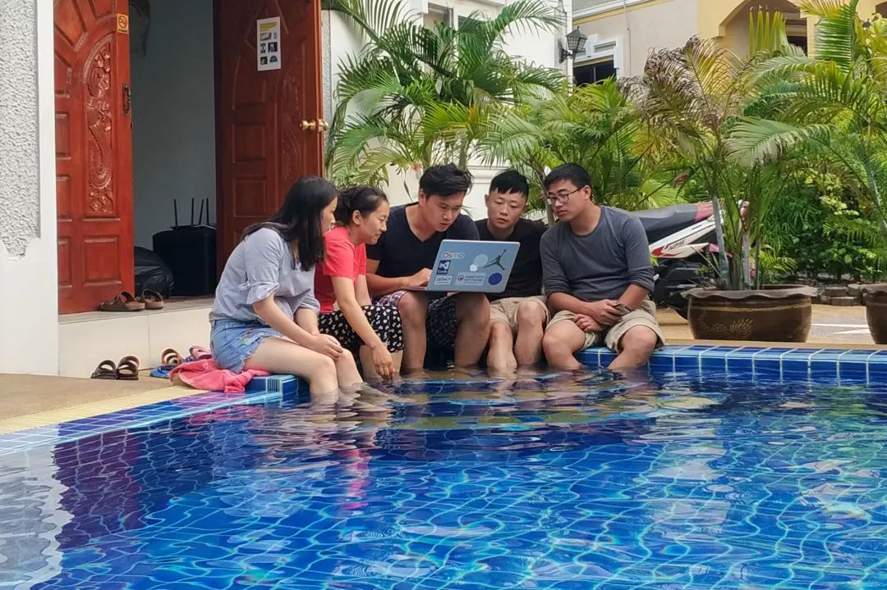

# 远程工作，一种将工作融入生活的方式

<copyright :meta="$frontmatter.meta" />

远程工程师（Remote engineer）能够自己设定时间表，能够在任何地点工作。**远程工作是一种将工作融入生活的方式，而不是把生活建立在工作的基础上。**

远程工作的好处很多：我们可以拥有更多的自由，可以长时间专注于工作本身，而不是“上班”——这在办公室很难做到。有些人还认为这是一种更好的平衡工作与生活的方式，或者是让人在最高效的时间工作——使生产力发挥最大值的工作方式。

当然，远程工作也有可能被浪漫化和理想化。一些认为自己会喜欢在家工作的人，最后发现这行不通，原因是缺乏社交，分心太多，或者因为家庭成员打扰他们，希望他们更多地照顾家；甚至因为没有“时间界限”而超时工作。有时，我们追求的自主权并没有完全体现出来，因为客户或雇主仍然期望采用传统的管理模式或时间表，甚至更糟糕——期望你24小时“待命”。

尽管实现远程工作还有很长的路要走，好在方向是确定的。在欧美国家，远程工作已经成为趋势。对我们而言，实现远程工作需要建立一个完整的环境，企业、客户、业务、管理模式和工程师自身都需要做出调整。

管理模式和工程师自身的改变是核心，当一家企业考虑改变内部运营管理模式（远程办公），最终目的都是增强业务竞争力，为客户提供更高价值的产品/服务。两者往往相辅相成，从内部改起往往更容易实施，内部的改变必然带来业务/产品或服务的改变和升级；服务的升级又为内部变革提供动力。

“Micro-management”这个词，在中文里没有对应的翻译，很多地方直译为“微管理”，变成一个中性词汇，这个词在英文里有负面含义，主要是由于它表明工作场所缺乏或不需要自由与创新。（微管理是一种管理风格，指管理者可以密切观察或控制或提醒其下属或员工的工作。）

微管理在我们工作中经常会遇到，从企业的角度，意识到微管理的危害，是开启远程工作的第一步，逐步从微管理转变成充分信任并授权给员工。这不是轻松的改变：当一个关键问题出现，并形成明确的解决方案，一个待完成的工作任务组时，管理层就会放弃了信任和授权。

工程师自身的调整，主要是建立独立工作意识和自我管理能力，这两点其实是同一件事。独立工作意识是指独立于上级（指挥），不是独立于团队（合作）。所以，**独立工作自然会倾向于自我管理，远程工作团队也应该是自组织模式。**

**等开会讨论分任务或上级派活儿，和“只做分内之事”的习惯需要改变，**这是成为远程工程师的第一步。

工程师的本职工作是创造价值，不是完成工作量，将来单纯的工作量都可以通过机器完成，远程工程师更要把价值作为唯一追求。而价值的衡量比工作量复杂得多，更需要时间去验证，这对管理者也提出新的、更高的要求。

简单的短期利益激励机制可能不再适用，基于长期的、整体目标所建立的激励机制对远程工作更有价值。只有各个环节都跟上变化，才能让远程工作顺利落地。远程工作，你准备好了吗？

