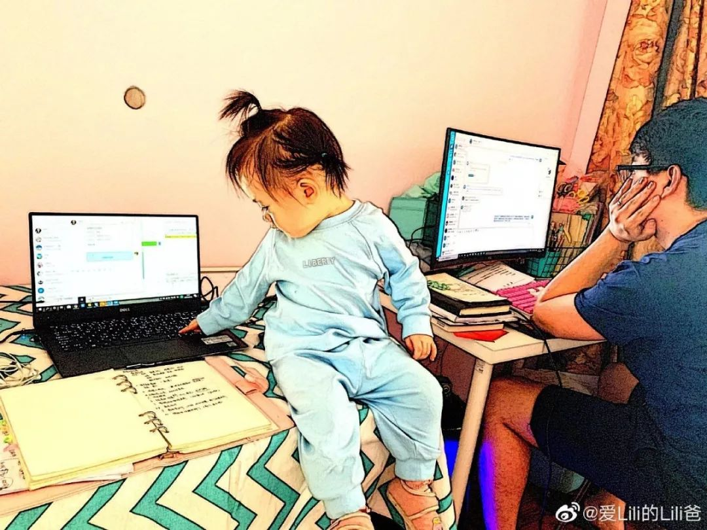
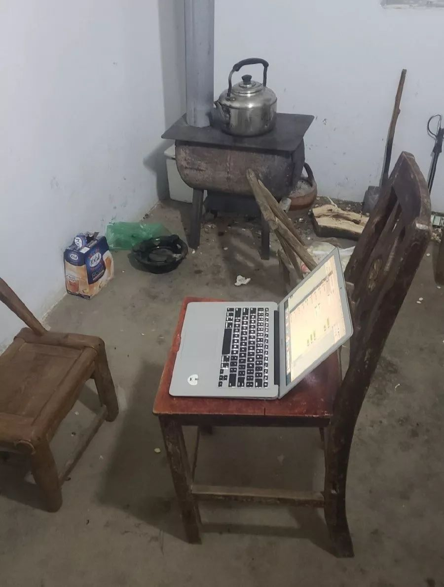

# 在家办公避免“翻车”初级指南

<copyright :meta="$frontmatter.meta" />

话说现在每天全国2亿人在家远程办公，从开始的“在家办公一时爽，一直在家一直爽”，一周过去了，之前从未有过远程办公经验的人，开始体会到一些效率方面的问题。

比如：

在家办公挺好，要是不用带娃、做饭就更好了……

黏人的"主子”们

魔幻的网络环境……

来自家庭的羁绊——“有一种饿叫你妈觉得你饿……”

还有来自队友们的直击……

总之各种“翻车”，详见[在家办公第四天，职场人大型翻车现场，囧态百出……](https://mp.weixin.qq.com/s?__biz=MzAwMTExMzUzMg==&mid=2651670291&idx=1&sn=1be87ce0aa4f604aaa9003d44b4858bb&chksm=81274bc0b650c2d628ef4c15bbfaa2beb7a98d212f8eb17243ab380d36566a95155b76b9e41d&mpshare=1&scene=21&srcid=&sharer_sharetime=1580959972207&sharer_shareid=94d99edf5fa00c5408421ff5f1de8d40&exportkey=ASEMAiSGmaw6w48cN0T8NHI=&pass_ticket=LGXXRxYf%20nXhVK%20cnWGBlJZkCkOyHQ4FoM6aPjQweF3/1f8NpqUfsjAeLJQQ1xyO#wechat_redirect)

这样一天下来可能比上班还累，还不见成效，可咋办呢？

小编整理了一些资深远程工作者们总结的保证在家办公效率的方法，供大家参考。这里特别强调，以下是一些**普适而基本**的方法——因为对很多第一次在家办公的人来说，还远没到应用工具的时候。

## 了解你的能量水平

明确自己在一天之内哪些时段工作效率最高，哪些时候兴奋但容易分心，哪些时候能量低迷……这是作为远程工作者保持专注的第一步。如果可能的话，尽量以自己的能量高低时段来合理安排工作内容。

如果你的能量高峰时段在早晨或上午，那就把最重要的或最难啃的工作安排在这时候，集中精力解决；在你精力尚可但容易分心的时候正好安排电话会议，或集中跟同事（客户）线上沟通协调事情；在能量低迷的时候休息一会儿，哄哄娃、逗逗猫猫狗狗、做做家务也是极好的。
   
## 明确时间界线

这里指的是调适好自己和家人物理和心理的界线，虽然是在家办公，但工作时间内是要免打扰的。

首先是和家人沟通好，先做心理疏导，帮他们在你工作的时候安排别的活动，不到万不得已不可以打搅你，甚至可以制定一些奖惩措施；

其次，可以做一些物理的警示标志，打个“结界”。如在门上挂“请勿打扰”的牌子，在“临时办公区”周围划线或设置“障碍物”等；

第三就是坚决执行！只要坚持，无论是家人、宝宝还是猫主子，都会习惯成自然的。

## 开始工作前回顾优先事项

最好在一天开始的时候就把当天的工作明确到小时——把你每天要完成的工作按照轻重缓急列出来，再根据自己的能量水平安排时间表（没条件参考能量水平可忽略）。

任务优先级应该围绕你要实现的最终目标，然后逐级分解成可具体操作的每一小步。即便你是搬砖的，心里也要清楚，你搬的这块砖属于未来建筑物的哪个房间的哪部分，始终做到心中有数，即使被打断或干扰，你也能更快地回到正轨，而不会看似忙碌，实则被淹没于无足轻重的繁琐工作中。

虽然每天进行这样的梳理需要投入一定的时间，但这是一个值得养成的习惯。你会因此变得更加以目标为导向，更有战略眼光，也更有效率。

建议：一旦你完成了你每天最重要的任务，考虑奖励自己半小时的时间来做自己喜欢的事。你会爱上那种一条条划掉当日待办事项的成就感，无论是用专业的时间管理工具还是用便利贴。

## 一次只做一件事
  
当你一次只做一件事，就会倾向于做重要的事。全神专注于一项任务被证明是完成待办事项清单的最有效方法，同时也会减轻压力和挫折感，增加成就感。

专注于单任务的关键就是在工作中切断尽可能多的干扰。一旦工作被打断，平均需要23分15秒才能恢复原来的效率。如果干扰不可避免怎么办？往下看。

**刻意拖延干扰事件**

研究表明，人们会立即处理73%的突发干扰事件，无论它是否紧急。虽然一些干扰不可避免，但可以通过把它添加到待办事项列表中 “晾一晾”，来降低它对工作效率的影响。 

**复杂问题简单化**

还有的时候，我们会宁愿被“干扰”，而不去专注解决最重要（最困难）的任务，这就是所谓的“用战术上的勤奋掩盖战略上的懒惰（畏难）”，这也许是下意识的。一旦你意识到这种情况，分析一下原因，可以试着把最重要的工作进一步拆解成更容易执行的小任务，以降低难度系数，增加可操作性。再不行就求助“场外观众”……

**以退为进，保持战斗力**

另外，每天定时休息，适时给自己“充充电”。你有没有发现，当你不间断地从事一项工作任务时，很容易变得不集中（当你每隔5分钟就去刷一下手机时，就要警惕了）。因为我们的大脑无法长时间集中在一件事上。连续工作时间越长，就越容易被干扰。因此，每天安排定时的短暂休整，再重新回到手头的工作中，会更有干劲，获得更多的灵感。

当然，那些一直“充电”不干活儿的，请自觉去墙角反省

**沟通！沟通！沟通！**

在团队中养成“日工作沟通”的习惯。沟通的目的，是明确当天团队的工作目标是什么？每个人为此都会做什么？有什么问题？怎么解决……然后各自推进。下班前最好再把当日工作成果在团队内部进行反馈，这样便于信息共享、同步工作进度。

除了团队会议，个人之间的工作沟通要特别注意简洁、明了和建设性，无论用什么工具：

一、请尽可能用最简单的语言把事情说清楚；

二、说明你为此做了哪些尝试、努力或选项，而不是做“伸手党”或“甩锅侠”；

三、需要对方做什么？

四、如果需要占用别人较长时间讨论事情，最好提前预约一下对方的时间，“己所不欲，勿施于人”。

因为是远程办公，很多事不是一个眼神、吱一声或喊一嗓子能解决的。因此，“事事有回应”的快速反馈就显得更重要了。即便你想用上述“延迟满足”的方法让“子弹先飞一会儿”，那形式上的快速反馈也是必要的。这是性价比最高的反馈策略，一方面显得你“靠谱”，另一方面也能缓解对方当下的焦虑。
 

最后，凡事有度，如果来自“沟通”的干扰过多，特别是影响你完成自己的重要任务时，也要学会适当地回避和阻断干扰。因为当你抽出时间专注于你共享的日程表上最重要的任务时，也是在公开展示你对工作的承诺。