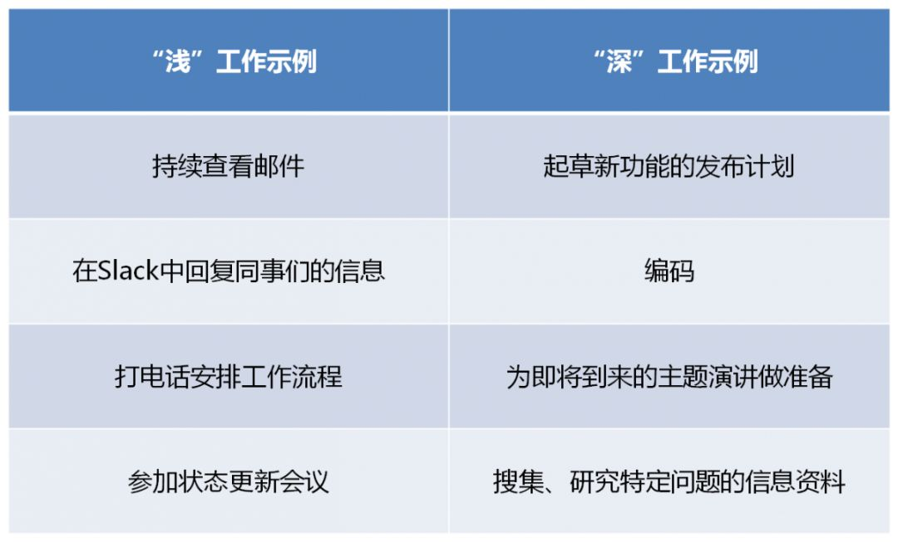

# 异步通信：提升远程团队生产力的关键（上）

<copyright :meta="$frontmatter.meta" />

许多公司的管理者正在考虑是否应该接受远程办公。但很少有人问自己是否应该采用更加异步的工作方式。尽管我认为远程工作是未来，但我认为异步通信（或简称为异步）是提升团队生产力的一个更为重要的因素，无论你的团队是否处于远程状态。异步不仅可以产生最佳的工作结果，而且还可以使人们进行更有意义的工作，并享有更自由、更充实的生活。

本文将利用我自己在Doist公司（工作方式基本上是远程且异步的）的经验，解释什么是异步通信，异步通信如何提高团队生产力以及采取怎样的具体步骤来建立一个更加异步的工作场所。

什么是异步通信？

> **简而言之，异步通信是指你在不期望立即响应的情况下发送消息**。例如，你发送一封电子邮件给我，几个小时后，我打开并回复了该邮件。
> 
> 相反，同步通信是指你发送一条消息，对方收到就立刻处理该信息或在短时间内就做出响应。像会议一样的面对面交流是纯同步交流的示例，即发信人与收信人之间的沟通是即时的，几乎没有延迟。
> 
> 现在流行的数字形式的通信（例如即时聊天应用）也可以是同步的。你发送一条消息，我收到通知，打开Slack来阅读消息并几乎立即回复给你。甚至电子邮件在很大程度上也被视为同步的通信形式。Yahoo Labs在2015年进行的一项研究发现，最常见的电子邮件回复时间仅为2分钟。

在探究采用更异步的团队合作方法的好处之前，让我们先看一下为什么要质疑当前我们惯常使用的同步的工作和沟通方式。

## 即时通讯的问题

根据《哈佛商业评论》上的一篇文章《合作超载》，在过去的20年里，员工花在合作上的时间增加了50%。研究人员发现，员工每天80%的工作时间都是通过电子邮件与同事交流的(员工平均每天花在电子邮件上的时间为6个小时)；会议(平均占公司时间的15%)；而最近的即时通讯应用更甚(Slack用户平均每天发送200条信息，而1000条消息的高级用户“也并不罕见”)。

这种持续交流的趋势意味着，一般的知识型员工必须围绕多个会议来安排他们的工作日，其间的时间一半盯着手头的工作，一半盯着电子邮件和Slack。

更糟糕的是，移动技术的兴起意味着工作场所的交流不再局限于实际的工作场所或工作时间。我们可以，也确实做到了，24小时不分昼夜都可以检查电子邮件和回复信息。因此，我们永远不会完全下班。**正如一位上班族告诉《纽约杂志》的：“曾经我醒来第一件事是关闭闹钟，然后检查Tinder。现在，我醒来先检查Slack。”**
 

Slack宣称，用户每个工作日花费9个小时以上的时间来连接该应用。90分钟的活跃使用时间分散在9个小时中，这难道不会造成很多中断和干扰么？

> 这种高度同步的工作方式如果能产生效果，也就罢了，但越来越多的证据表明，所有的即时通信会让人难以集中注意力，耗尽员工的精神资源，而且通常会拖工作效率的后腿。

我以前写过关于为什么我赌即时团队消息应用会失败的文章，下面总结一下核心问题——也适用于大多数形式的同步通信:

**这会导致不断的干扰。**

干扰分散了人们的注意力，使工作更难取得有意义的进展。高价值、高认知的活动——如编码、写作、设计、战略制定和解决问题——需要长时间深入、专注的工作。而同步通信使得在工作日“长时间深入、专注地工作”几乎不可能。

 “深工作”一词是由乔治敦大学计算机科学教授和作家Cal Newport创造的。

**优先考虑连接而不是生产力。**

在实时环境中，人们总是会保持连接状态并且随时待命。如果你切断了连接，讨论并不会中断，因此，为了避免错过重要的决策和讨论，人们试图始终保持在线状态，并参加尽可能多的会议，而他们的健康和生产力就在这不知不觉中被损害了。

**制造不必要的压力。**

随时待命意味着员工无法控制自己的工作时间。他们每天的工作是对请求做出反应，而不是主动设定自己的日程。一项研究发现，人们会试图加快工作速度来弥补因工作场所的干扰而损失的时间，而这造成了“更大的压力、更大的挫败感、时间压力和工作量”。这种同步文化可能会迅速导致工作倦怠。

**导致低质量的讨论和次优的解决方案。**

当你必须立即回复时，根本没有时间彻底思考关键问题并提供深思熟虑的回复。你对任何情况的第一反应往往不是最好的反应。

## 异步工作场所的好处

大多数人认为分心和干扰只是工作的一部分，但有些公司——如Doist、Gitlab、Zapier、Automattic和Buffer——正在拥抱一种更异步的协作方式。以下是让员工在与团队沟通时拥有更多控制权的一些好处：

**控制工作时间=更快乐、更高效的员工。**

在异步环境中，没有设定的工作时间。员工几乎可以完全掌控他们的工作时间如何安排，以适应他们的生活方式、生物节律和职责（例如育儿！）。一些Doist的员工在夜间工作，因为这样最适合他们。而我每天早上和儿子一起度过一个小时，但公司里没人注意到这一点。

**高质量的沟通与下意识的反应。**

异步通信虽然速度较慢，但沟通质量也较高。人们学会了更清晰和彻底地交流，以避免不必要的反复。他们有时间思考一个特定的问题或想法，并提供更深思熟虑的回答。人们可以在准备好的时候回复，而不是条件反射式地回复。(另一个好处是，当人们有时间思考他们的回应时，往往会减少意外的情绪爆发。在过去的8年里，我们没有发生过任何严重的人力资源问题。)

**更好的计划会带来更少的压力。**

在没有人催促和干扰的时候，人们学会更仔细地规划自己的工作量和协作任务，给同事足够的时间来查看和响应他们的请求。这就减少了合作的压力，最终提高了工作的质量。

**深度工作成为默认。**

因为员工不必对每条信息都了如指掌，所以他们可以留出大量不受打扰的时间来做那些能为你的组织创造最大价值的工作。他们可以每天1-3次来处理他们的信息，而不是在工作和信息或会议之间来回切换。

**自动记录和更高的透明度。**

由于大多数交流都是以书面形式进行的，因此会自动记录关键讨论和重要信息，特别是当你使用比电子邮件更公开的工具时。以后共享和引用这些对话更加容易。例如，在Doist，我们可以搜索或链接到相关的Twist线程，而不需要询问或解释为什么要做某个决定或某个项目的状态。

**时区平等。**

时区之间的交流变得顺畅，没有人因为他们工作的时区而处于信息劣势。这意味着你不必将招聘范围限制在特定的时区，可以在世界任何地方建立一个一流的、真正多样化的团队。

尽管员工保留率是一个虚荣的指标，但我们认为，异步文化是过去5年里Doist聘用的大多数员工留下来的核心原因之一。我们的员工保留率超过90％，远远高于整个科技行业。例如，即使像Google这样的传奇公司——人类企业福利楷模，其平均任期也仅为1.1年。随时随地自由工作，每天都会带来很多乐趣——我们公司为此支付0元。

## 关于作者

Amir Salihefendic，Doist - makers of Todoist and Twist的创始人兼首席执行官。