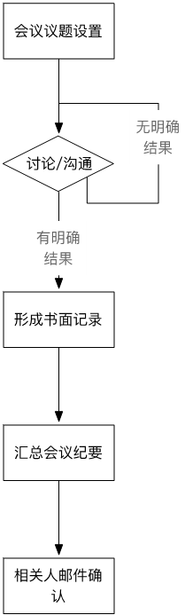
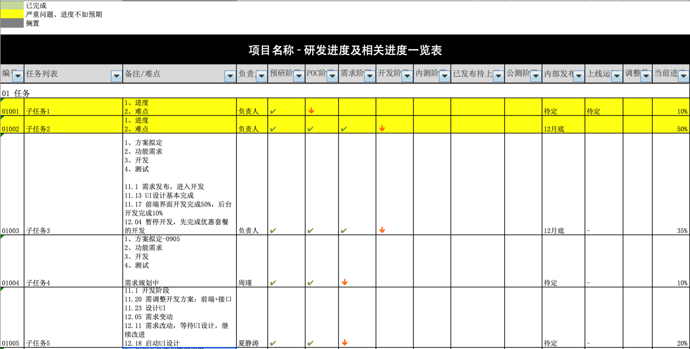

# 无关“风口”，我的个人云办公体验

<copyright :meta="$frontmatter.meta" />

2020 年，世界陷入了新冠状病毒的危机，疫情的发展，使得云办公成为了多数公司主流办公方式。
事实上，云办公或者说远程办公，并不是 2020 年才开始的新生事物。1979 年，IBM 就为了解决总部主机的拥堵问题，安排几个员工在家远程办公。此后，随着互联网的发展和城市现代化进程，远程办公成为并不新奇的一种办公方式或者说一种文化。

对于企业来说，传统的集中办公优点非常明显：协同效率高，沟通成本低，决策受到的干扰小，甚至企业的隐私数据安全也能在局域网中得到更好的保护。

既然这样，为什么云办公变成了 2020 年的主流，甚至有资本认为这是下一个“风口”？主要原因看起来是因为不可抗力——疫情的快速发展和防疫的需要，但这并不是唯一的原因，在疫情发展之前，云办公逐渐成为趋势，还因为这些原因：

- 城市的高速发展，使得通勤困难增加
- 社会文明的进步，使得很多人自由选择居住城市，不再局限于工作地
- 国际合作增多，以及人才分布原因，合作者之间地域跨度可能比较大
- 对于一些小型的创业者，集中办公的成本过高

综合以上来看，集中办公和云办公各有自己的优势，我个人从 2018 年底到现在，持续了近两年云办公方式，这期间，我的个人生活发生了一些变化，但我一直在努力平衡工作和生活的关系，并尽可能的在云办公中，与我的团队保持一个良好的工作氛围，迄今为止，我所带领研发的项目已经迭代过数不清的版本了，我的工作效率并没有因为云办公而出现大幅度下降，后文我将详细描述我个人关于云办公的一些心得体验。

## 云办公，真的没有问题吗

云办公并非没有问题，相反，问题还很明显：

### 需要区分生活角色和工作角色

一个人的生活角色和工作角色很容易互相影响，导致工作总被打断，相信每一个在家办公或试图办公的人都有体会。

### 沟通成本高，需要花很多时间和精力沟通

我所从事的是基于互联网的研发工作，需要和产品团队沟通产品需求，和测试团队沟通测试问题，和市场团队沟通产品运营相关问题。。。这些沟通，当发生在面对面时，可以用手势、白板等辅助来进行沟通，但如果放到云办公场景中，大家甚至都不知道是不是在对同一行文字进行解释，必须高度沉浸其中才行。

### 执行力的降低

过于宽松的办公环境，会令人比较放松，导致执行力下降。

### 文档共享和维护

团队内部的文档，尤其是代码之外的产品文档，很容易出现版本冲突。

相信每个人结合自己的体验对云办公会提出更多问题，就我个人经验和了解，以上几个是比较共性的问题。

## 提出问题，接下来就是要解决问题

### 生活角色和工作角色的区分

一个成年人在家庭中的生活角色是比较重要的，家庭成员，家庭宠物，等等生活化场景导致干扰要素会非常多，如果要区分自己在生活和工作中的角色，首选需要有规划自己工作的能力，规划工作的轻重缓急，并区分日常研发和突发事件。日常研发一般需要一个完整专注的时间段，与家人沟通好后，预留此类时间。

解决角色区分的问题，一定需要家庭的配合，不然的话，可能还是去办公室工作更合适。

### 解决团队沟通问题

团队的沟通非常重要，在这个问题上，工具和沟通过程都很重要，沟通工具市面有很多，各有优劣，大家可以对比使用。

沟通过程有两个点需要把控：每次沟通的结果书面记录，邮件确认沟通结果。

沟通本身就是一个很繁琐的事情，不管是否远程的沟通，都会有各种问题，因此有一个明确的书面结果，以及最终相关人对此结果的确认，非常重要，确保大家在同一件事上的理解不出现偏差，是最终任务执行的重要前提。

### 执行力的下降

对于团队管理，执行力提升是一个没有尽头的课题，尤其是远程办公，执行力就更加重要。
对于个人来说，有很多提升工作效率的辅助工具，番茄钟是一个不错的选择。
对于团队来说，执行力的提升前提是必须有一个明确清晰的任务规划，需要做的事情很多，这里建议至少做到两件事：

#### 管理者带领团队将任务拆解为每个人可执行的子任务，并使用 Excel 表格跟踪任务及子任务状态、遇到的问题、解决期限等，我把这个表格命名为《研发进度及相关进度一览表》

#### 团队每 1-2 天进行任务例会，每个成员应能做到

- 回顾自己的任务完成情况
- 总结任务难点，提出需要外部协助的点
- 能够规划按 0.5 天甚至颗粒度更小的下一阶段任务计划

这部分工作对于不太成熟的成员，可以由团队管理者协助并引导进行。另外，这种例会当然也应该有一个记录，并由团队管理者将需要关注的点更新到《研发进度及相关进度一览表》中。

### 文档共享

这个问题就比较好解决了，市面上文档共享的工具非常多，选择适合自己团队使用的即可，此处不再赘述。

最后，由于外界的不可抗力也好，出于公司自身的需要也好，基于社会的快速发展也好，总之，目前云办公已经成为非常重要的一种办公文化，对于这种办公文化，其实有很多可以讨论的，比如除了执行力，团队凝聚力也是一个很重要的点，云办公又该如何凝聚团队？
本文只是结合我自己的实践经验，管中窥豹，提出了一点点小小的见解，希望本文能够抛砖引玉，看到更多人的好经验分享，那我也算尽到了一点微薄之力。
