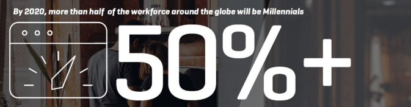
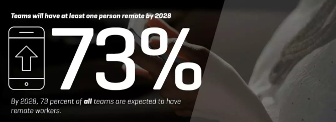
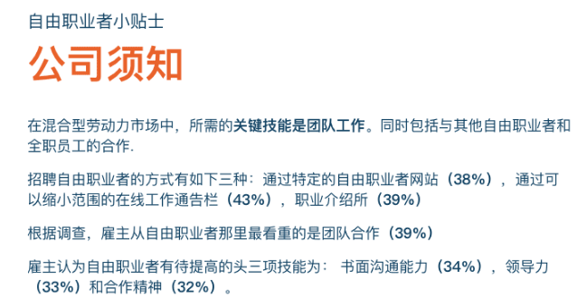
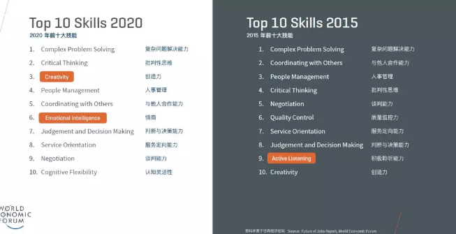

# 远程办公会是未来设计团队的大趋势吗？

<copyright :meta="$frontmatter.meta" />

## 前言

针对近期正在发生的疫情，有不少公司采用了远程工作方式继续开展工作，实属无奈之举。但换个思路想，这其实让远程工作在国内有了普及的机会，同时也面临了新的挑战。目前看，远程工作在沟通效率上确有降低，但如果通过此次实践远程工作模式，优化远程工作流程，产出了好用的工具，某种意义上也算是一种进步？畅想一下，如果未来的工作模式，大部分都是远程，偶尔需要面对面的话，我们可能就不必背井离乡，不必为在大城市高生活压力而烦恼了。（Ps:不过，也有朋友说在家办公等于7*24小时，好像变得更累了，你喜欢在家办公吗？）

为此，国外设计师预测了下未来设计团队的工作模式，一起来展望下吧。

## 未来几年的巨大变革

在未来几年，公司必定会为员工队伍的巨大变革而做准备，这也将改变设计团队的工作方式。

这个变革之所以如此巨大，是因为它涉及到诸多方面：
1、不断变化的人口结构和多达四代人的劳动力
2、不断变化的工作地点和开发环境
3、员工队伍的改革和混合型员工的使用
4、公司内部对待设计态度上的基本转变
5、技术和未来所需技能上的变革

同时，全社会都有一个调控劳动力的宏观趋势。用户体验设计在这方面也不例外，尤其这是个在发展趋势上来说相对较新兴的职业领域。

单挑其中一个因素来看，这就需要对业务运作方式进行重大调整。整体上看，这可能是自个人电脑发明以来雇主们面临的最大挑战。

在设计领域中，不断增长的设计需求让这个行业发生着翻天覆地的变化。体验设计的业务环境产生了巨大的需求，这些包括：改善端到端体验的业务优先级;数字生态系统的优势和复杂性;负责整个组织经验的人员的出现;以及更好的经验可以获得市场份额的知识。

## 人才分布的改变：千禧一代将成后起之秀

多年来，大多数劳动力都是出生在1946年至1964年之间的婴儿潮一代。他们主宰了世界各地各个行业、各个层次的公司的员工基础。

步入2020年，这一切将会改变。根据Fundera报道，世界上过半的劳动力将由千禧一代组成。千禧一代可以广泛定义为出生于1981年至1990年代晚期的一代人，他们是人才市场的新生力量。

从婴儿潮一代到千禧一代的交接棒转移不仅庞大， 并且由四辈人组成的现阶段大众劳动力也使其分为了两个截然不同的心态。婴儿潮和X世代（出生于60年代中期到80年代早期）为一组，千禧一代（尤其是较年轻）和Z世代（出生于90年代中后期）又另为一组。

Upwork（自由工作招聘网站）和研究公司Inavero的一项调查非常清晰地概括了这种思维分歧。研究表明，当新技术进入市场时，只有10% 的婴儿潮和X世代出生的人认为自己应该进行技能再培训。相反，这样认为的千禧一代和Z世代超过三成。

因此，公司必须面临领导职位新旧交替的事实。同时要适应这些新的领导者与他们所替代的一批截然不同的观念。

这在设计团队中尤为明显。随着新技术的出现，如何指导设计、如何沟通交流、如何完成任务，整个工作团队可能正经历着最大的改革。

## 工作场所的转换：更多员工将远程工作

曾经设计团队间的交流是旋转他们的办公椅到临近的同事旁边，或者透过办公小隔间望向对方，又或者聚集在会议室勾画奇思妙想。

但那些已渐渐成为往事。悄悄兴起的是办公场所从办公室转移到家里或者是旅途中。许多公司为一些员工或者团队提供在办公室之外工作的机会，一些所谓最适合员工的“非高峰时间”。

这个趋势在未来几年中将持续增长。Upwork和Inavero的研究发现，到2028年，73%的设计团队将会有远程员工参与。

对于员工来说这是个积极的举动，他们能在最理想的场所（当然是在合理范围内）事倍功半。

许多显著的研究表明，幸福指数越高的员工工作效率也越高。沃里克大学全球经济竞争优势中心和社会市场基金会的一项研究发现，当员工“满意”自己的工作时，他们的效率从12%提高到20%。

在看到创造远程工作环境和其带来的好处的同时，公司也面临着一个巨大的挑战：如何让设计团队在不同地点进行有效地沟通？

诚然，许多科技提供了便捷。其中包括很多推动设计概念、项目管理进程和沟通的软件。但是，运用凝聚力并结合所有这些技术来创造一个有效成果对于设计团队来说并非易事。这和设计团队过去的运作方式相比是个巨大转变。

## 员工队伍构成的改变：混合型劳动力已成趋势

在人才分布和工作场所转换之上，设计团队还面临另外一个挑战：团队构成的变化。员工将不再限于只有全职和兼职两种类型。

迄今，零工经济改变了团队的构成模式。临时员工、自由职业和专业承包人与公司的正式员工进行整合，组成了混合型劳动力。

由Field Nation在2016完成的一份零工经济研究显示，93%的公司了解并使用混合型劳动力。他们会让自由职业者和全职员工在重要项目上并肩作战。这样做的理由很多：从公司需要支付越来越高的员工医疗保险，到更多人愿意从事自由职业等等。

Field Nation的董事长Mynul Khan表示“在竞争需求更倾向于灵活组织的刺激下，全世界正在向混合型劳动力转型”。各种辅助软件、社会态度、流动性增加、不满情绪高涨以及人才之争，这些因素交织在一起，正在颠覆着传统的雇主与雇员模式。业绩顶尖的公司正在引领潮流，有接近40%的顶尖公司，他们签约/自由职业者的比例已超过30%。

牛津经济学院对2020年劳动力的研究进一步强调了这一趋势。根据研究，2700名接受调查的高管中，有83%的人表示他们计划在未来三年中增加对“临时雇员、不定期雇员或顾问雇员”的聘用。

这不仅会给人力资源部门带来很大的责任来监管这些不同的员工类别，而且还会导致设计团队的全面重组。

现在，设计团队的管理者不仅要负责公司员工的表现，还要兼顾通常有着不同时间表并同时有多个项目的签约员工和自由职业者的工作。这些管理者如何应对考验，以及应对考验时的决策将会对项目成果方面起着决定性因素。

## 基本原则上的改变：设计不再只是视觉

设计曾经被看做是商业上的配角。在其他部门的工程师和聪明人想出一个新产品、新服务或其他突破性的概念后，他们会向设计团队描述这个新概念并让其为之做一份视觉呈现。可以说设计的价值并不如生产、销售或客服那么高。

那些观念在过去的几年中被迅速改变，预计未来几年设计团队将在员工队伍中发挥关键作用。

这个观念成为了旧金山2019年六月举办的设计周的最大话题之一。它由InVision的产品设计师Dennis Field提出。Dennis Field与来自Asana、Wealthfront、Slack和Designer Fund的其他设计师是五位小组成员之一。

在“工作的未来”板块对话主题中，根据Field的说法，设计师和工程师的工作将更紧密结合。在任何组织中，挡在这两个部门之间的“隔离墙”将被推翻。

“产品设计师将在组织中扮演更重要的角色，这个领导者的角色将通过设计帮助公司达成关键业务目标”，Field说道，“设计不仅被视为视觉效果--它将是公司的共同主题。产品设计师将传播这个讯息到组织里的各个部门，甚至包括那些传统上并非以设计为重点的部门。”

这对于设计团队，更具体地说对设计师自身意味着什么呢？首先，独立工作或只与其他设计师工作将成为过去式。设计师不仅要适应和公司的多个部门合作，还需要成为许多项目的负责人。

## 变化的技术：未来的技能树

好消息是用户体验设计行业有着良好的机会来应对即将到来的人工智能变革。麻省理工学院-IBM 沃森 AI实验室报告称，依靠直觉和创造力的工作领域将最少受到来自未来人工智能的干扰。

工作场所对创造力的需求持续增加。据世界经济论坛称，创造力在2020年技能员工所需中排名第三。而在2015年同样的报告中，创造力只排名第十。

情商被排在第六位。情绪智力包含一套心理技能，使人能够了解和控制自己的情绪，并认知且有效应对他人的情绪状态。

这项技能也直接与设计界对应。以同理心为用户的复杂问题给出创造性的解决方案是设计团队工作的关键。

## 设计团队的未来就在这里

毫无疑问，设计团队的组成与其在全球组织中的重要性已在我们眼前发生变革。包括人才分布的改变、远程工作的出现、混合型劳动力的形成以及设计重要性的提升等诸多因素促成了这一角色的变化。

公司必须为这一重大变革制定计划和对策。从沟通工具的增加，到机器人和其他由人工智能辅助工具的一体化等等。即使距今一年之后，设计团队的面貌也可能与今天的样子大相径庭。而作为公司的领导者，他们也需要做好准备。