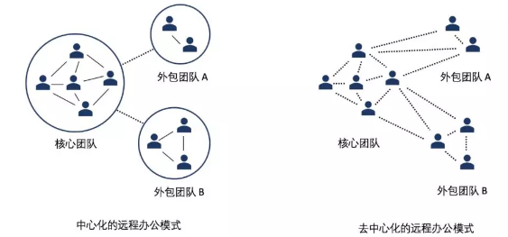
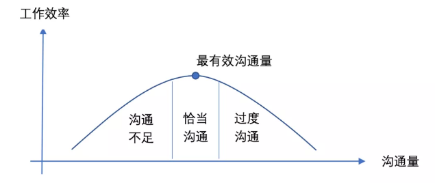
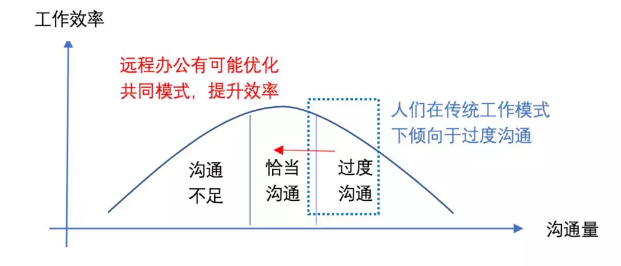
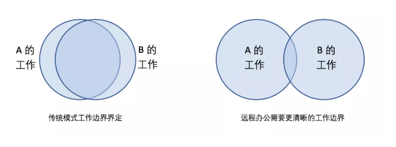
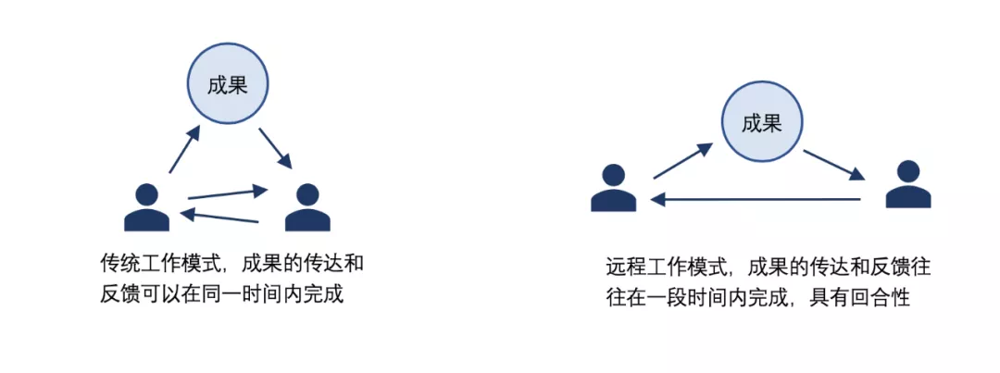
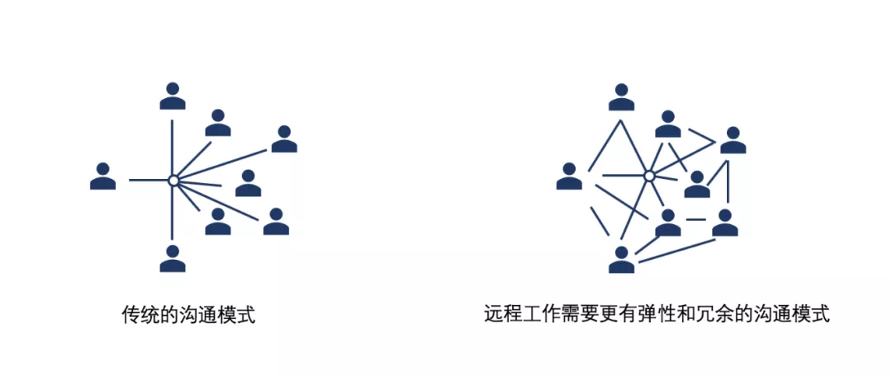

# 疫情洗礼之下，设计行业远程办公到底行不行？

<copyright :meta="$frontmatter.meta" />

## 前言

这次疫情之后，各行各业都进行了一次远程办公的洗礼。在可以预见的未来，远程办公也似乎会越来越和我们的生活融为一体。其实，远程办公对我们每个人来说既熟悉又陌生，如何更好的认识、理解并实践远程办公也是每一个个人和企业应该面对的话题。

规划设计行业对于远程办公尤其有一些抵触，很多同行觉得远程办公肯定做不好项目。作为一个在成立之初就落实远程办公的设计公司，我们的核心团队成员不仅分散在各个城市，还分散在各个时区。在这样的情况下，我们仍然完成了出色的项目，并在国际一线公司的竞争中胜出。在过去的设计实践中，我们简单总结了关于远程办公的几条经验，借此机会和同行们讨论。

## 从认知上理解远程办公

**不止是突发事件的临时策略，更是未来不可或缺的一部分**

极度去中心化的居家办公可以说对于每个人和团队来说，都是一种挑战。从前抬头一句话就可以吩咐的，或是一个问题就可以回答的，到现在都需要微信电话两三轮才说清楚——或者说以为说清楚了的事情，其实根本没说清楚。很多人或许会觉得，远程办公只是在疫情状况下的临时策略。但事实上，远程办公，或者更准确的说，“去中心化的办公”，不仅在疫情出现之前就早已有之，在未来也将会成为每一个团队和个体不可分割的一部分。

在疫情来袭之前，远程办公已经普及——其本质原因并不是疫情或是突发公共事件，而是技术的进步与革新。以WeWork为代表的新兴办公模式和办公空间，如雨后春笋在全世界各地成长。

远程办公的优势在于，让企业和团队可以更低的时间成本和经济成本，让不在一个物理空间的个人或团队仍旧可以无障碍的交流。 **对于设计行业来说，有一些外包的工作，已经早就实现了“远程办公”，比如效果图、多媒体和模型的制作。** 中国北上广深的效果图公司早已服务于全球的建筑规划公司，并以高超的质量和实惠的价格傲视同侪。

当然，**这次新冠疫情带来的远程协作模式远不同于过去“外包”式的远程，在外包模式下，工作是有清晰边界和成果的，而作为设计规划主体的核心团队，还是保持每天面对面的沟通。** 而新冠疫情导致的“居家办公”，使得所有团队几乎一下全部被打散，之前天天见面的同事变成需要通过微信或者视频会议沟通，这也就出现了各种效率低下的不适应的情况。然而，与此同时，也有一些团队意识到，本来以为一定要见面才能说清楚的事情或完成的任务，其实通过远程的沟通也可以圆满的解决和完成。

在未来长久的一段时间里，集中的、面对面的中心化办公，必然会和分散的、远程的去中心化办公长期共存。而每个人和企业，也应当积极地去适应、去理解远程办公，达到效益的最大化。

## 从心态上拥抱远程办公

**不一定就是低效办公，更有可能提高团队工作效率**

说起远程办公，我们最需要战胜的是对他的恐惧。很多人先入为主的认为远程办公就是一种解决成本却也低效率的办公。这样一来，从心态上就垮了。

远程办公可以降低成本企业成本，这是一个非常容易理解的命题——一方面，企业可以节省办公室的租金，员工可以节约通勤的费用和时间；另一方面，员工可以选择更远的地方居住从而降低了居住的成本，企业也可以选择在劳动力成本的地区雇佣或聘请顾问。可天上没有免费的馅饼，在成本降低的同时，工作的效率也一定会降低，因为沟通的成本大大的提高了。

这是一种很自然的思维方式。但是，实际上真的是这样么？远程办公一定会降低工作效率么？或许我们应该更系统地思考这个问题。

在协作日益重要的今天，沟通对于完成任何一项任务都是非常重要的。然而，沟通并不应该是无休止的，有效沟通事半功倍，但过度沟通也会导致效率变得低下。有的企业或政府机关，白天永远在开会，逼得大家只能晚上加班干活——这就是过度沟通导致工作效率下降的例子。

如果通过一个简单的数学模型来理解沟通与工作效率的关系，应该存在一个“最有效沟通量”的拐点。在拐点之前，沟通量的增加会让效益率更高；之后，沟通的增加反而会使效率降低。

这张图就是沟通量和团队工作效率的一个简单表达——在其他条件均等的情况下，最有效的沟通量应该是在一个适中的区间中的，过多和过少的沟通，都会导致团队的工作效率下降。

那么问题来了：如果说远程办公导致效率下降，是否意味着远程办公的模式，使得团队从上图原本的恰当沟通区间下降为沟通不足的区间？

这个问题如果展开，大概可以完成一本关于企业管理的博士论文。而笔者认为，目前行业内的大多数企业，可能都处于一个“过度沟通”状态。原因也很简单，大家在同一个屋檐下，沟通成本很低，接近于零，沟通的体验也更好——人们会自然而然地倾向于多沟通，这样则很容易造成沟通的过量，以及对沟通过量的依赖。

从这个角度思考，远程办公增加了我们的沟通成本，这是否是一个机会，让我们更加重视每一次沟通的机会，以及减少不必要的沟通，从而实现团队的工作效率不降反升？——从理论上看，这是完全可能的。所以，我们一定要对远程工作有信心，从而避免一种先入为主的想法，认为远程工作一定会效率低下，这是实现高效远程办公的基础。

## 在实践中学习远程办公

**并不是正常办公+远程沟通，而需要更成熟的协作机制**

所谓从战略上要藐视敌人，从战术上要重视敌人。从认知和心态上解决了对远程办公的恐惧之后，在实践中我们更需要把它当成一种新的协作模式去适应和学习。首先我们要相信远程办公不但不一定降低、反而可能提高工作效率。但与此同时，我们也需要承认远程办公带来的挑战是多维度的，并不简单是“成本提高”这么简单，对于整个团队体验、效率和文化都是一个挑战。如果真的希望在远程办公不降低效率，并且有比较好的合作体验，这需要团队的每一个人以一种全新的心态和程序去应对。

远程沟通的本质是，团队的沟通模式从对话时沟通，转化为对话和阅读并行式的沟通。在传统的办公模式下，坐在一间屋里同事之间，沟通内容的90%是通过对话实现的；而在远程办公模式下，同事之间的沟通除了电话、视频会议之外，更多则将通过微信、邮件的方式完成。和正常办公相比，远程办公对团队提出了更高的要求，这里简要总结三条：

### 1）更清晰的工作边界和任务

不管是两人协作还是多人协作，不论是平级还是上下级，每个人所负责和发布工作内容和边界都需要被定义得更加清楚，才能保证双方或多方对于期待的一致，从而减少冗余的沟通，增加沟通的效率准确度。在传统面对面的协作中，工作边界和任务的不清晰很容易通过实时沟通得到纠正。但在远程工作的模式下，团队往往是半天、一天才进行一次业务沟通，如果不将工作边界和任务明确，A做的内容和B认为和A商量好的内容不一致，则很影响效率和协作关系。

### 2）更高完成度的阶段性成果

有了更清晰的工作边界后，接下来就是工作成果。在远程协作的过程中，更为完善的工作成果可以让工作进程得到更有效的推进。这里的高完成度包括但不限于：成果的逻辑性、细节和图像质量。

举个例子，A将一个设计的阶段性成果提交给B，在传统模式下，AB两人会立即当面讨论此成果，从而达到一个有效沟通。但在远程模式下，往往是A先把成果发送给B，B对成果进行短暂的消化，再和A进行讨论。如果此时A的成果不够完善，则B消化理解此成果的就会比较困难，两个人再沟通时，A可能要花很长一部分时间来对B的疑惑进行澄清和解释，这样一来，就大大的降低的效率，甚至会拖慢进度。相反，如果AB之前相互提交的每一个阶段性成果都完成度较高，不但会增进两人的协作效率，同时还能增进其信任关系。

### 3）更有弹性和冗余的沟通模式

上两条都是讲工作内容方面的，那么这一条就专门聊一聊沟通本身。多人远程协作的最大挑战之一就在于难以实现沟通节奏的完全一致。微信群聊中聊天内容刷得很快，很容易遗漏重要信息；视频会议时，某个人的网络延迟，会影响整个会议的进程。这些都需要我们以一种更有弹性的沟通模式来对待，比如，重要信息的发布要增加冗余性，一个消息一遍不够，要在微信群中发多次，还要再邮件中发。再比如，产生一种机制让多人参加的视频或电话会议，不会因为一两个人的迟到和掉线被打断，掉线的同事要自觉索要错过的信息。这样一来，可以极大的弥补远程协作的缺失。

总结起来：在认知上理解，在心态上拥抱以及在实践中学习，这就是我们对于远程办公三个层次的策略。其实可以看出来，上面这三条不止适用于设计行业，在任何一个行业，如果能很好的贯彻落实，对传统的办公模式，也是一个很好的提升。

关于远程办公的工作机制，也远远不止上面这三条内容。同时我们意识到，实践远程办公可贵的地方在于，它也让我们对传统的办公模式进行一次反思，让我们进一步的了解最有效的协作、沟通机制是怎么样的。或许，疫情结束之后，当大家回到一个屋檐下，会实现一种更加默契的关系。

最后，祝大家工作愉快！享受在家办公的愉快与自由！

