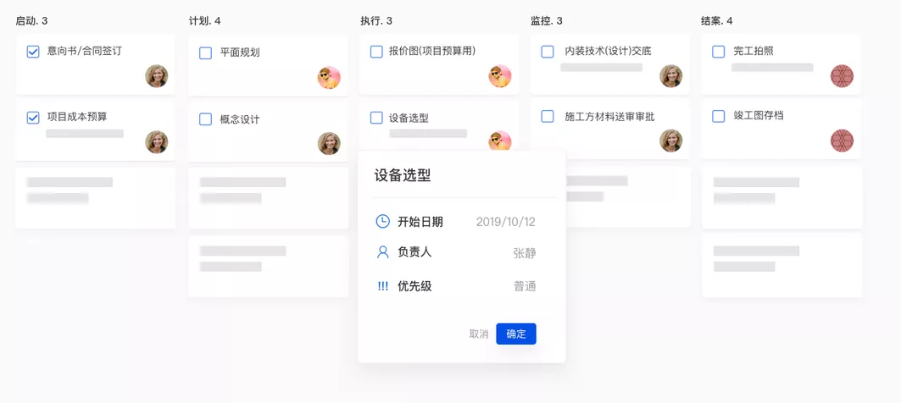
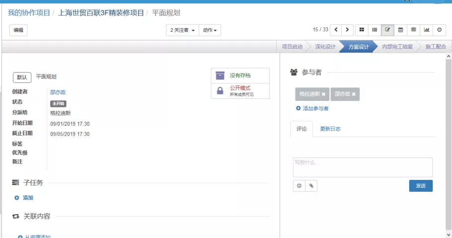
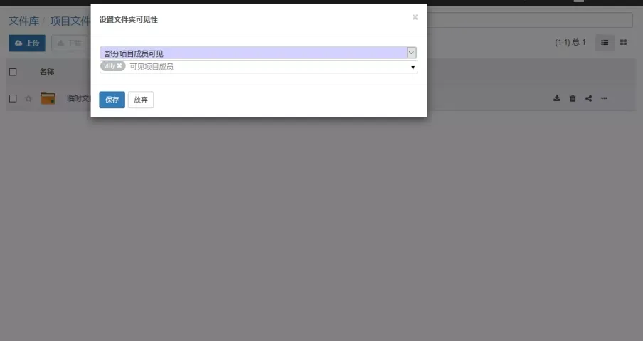
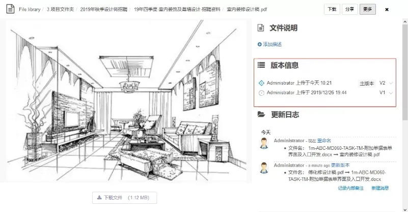
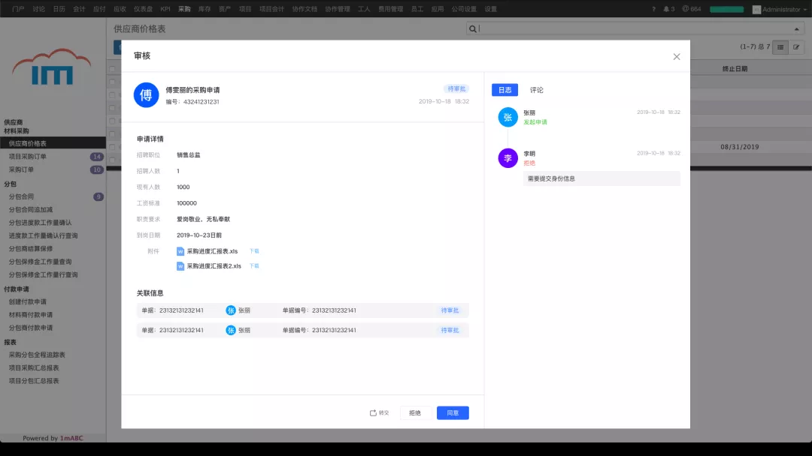
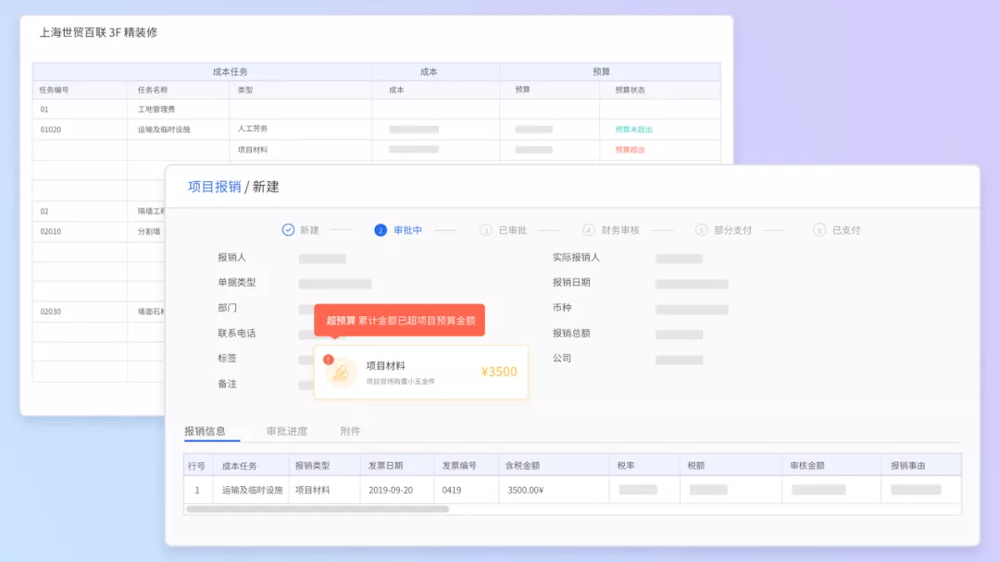

# 设计工程行业的远程办公真的靠谱嘛？

<copyright :meta="$frontmatter.meta" />

## 疫情之下

过去的二月、三月，在新冠疫情之下，众多企业无法正常开工。相较于工厂、零售这样的传统行业，作为设计工程行业的我们，相信大多数团队都开始尝试起远程办公。根据小编汇总的各种数据显示，疫情期间有超过1800万家企业、逾2亿人次开始了远程办公的尝试。

如此巨量的增长直接导致钉钉2天扩容了2万台云服务器；企业微信、腾讯会议也同时几十倍到几百倍的扩容；年前才刚刚开放的华为云WeLink，新增企业数便达到数十万，新增日活超百万……

不过，相比于海外早已十分成熟的work from home（在家办公），在此次疫情之前，大家心目中的远程办公应该都是这个样子的：

### 1） 终于可以实现窝在床上也能办公的梦想！是的，床就是最好的工位！！

### 2）上半身举止端庄，下半身睡裤拖鞋，反正你也看不到，哈哈哈！！！

### 3）“×××，马上把这个弄好给我！！！”“哎呀，老板，抱歉我网不好，没听见……您要不再说一遍……”

### 4）终于可以一边看剧一边工作了，还有可以从中午12点睡到下午3点的午休！！

### 5）上班不打卡，到点就下班，远程上班，快乐无边！

可惜真到了远程办公的时候，才发现远程办公哪有那么美好啊。实际情况基本上就是：

**远程在家办公=有数不清的消息需要回复**

**远程在家办公=24小时永远在工作**

**远程在家办公=我不知道团队成员们都在干嘛**

**远程在家办公=项目工作不能前后衔接，最后项目直接delay**

简而言之，设计工程行业的远程办公，其实真的不靠谱呀……

但事实上之所以会遇到这些问题，本质是因为即时通讯工具（如钉钉、微信、WeLink）和在线会议工具（如腾讯会议、Zoom）这样的软件并不足以管好项目为管理单元的团队远程工作。毕竟，对于设计工程行业而言，我们是有项目管理和项目进度管理概念的。而钉钉、企业微信由于并非设计工程行业的专用管理工具，自然会有一些功能缺失。

疫情期间，如果设计工程行业的团队一旦愿意尝试一米筑造的团队协作管理工具“筑协易”，应该可以发现在这样的问题，在筑协易中并不存在。

## 筑协易是怎么做到的呢？

### 一、基于看板，让项目中的工作事项不仅事事有跟进，而且一目了然

筑协易中的工作事项，不仅有清单样式的展示，让所有的工作都有对应的责任人。同时，筑协易还提供了看板视图，在看板视图中，所有项目参与人员可以清晰看到需要自己负责的工作内容和所处阶段。

同时，每一个可以点击打开的任务卡片上，都可填写任务相关的信息、上传任务的成果输出文件、完成针对某一任务的项目成员之间的交流。远比在钉钉的项目群聊中“刷屏”要更有效率。

对于项目管理者来说，在看板上就可以关注所有任务卡片的关键信息，从而轻松获知整个项目的进展情况。无疑比对照钉钉中的任务清单，再去更新自己手里的Project文件要高效的多。

### 二、云文件夹与任务卡片相结合，不仅在线上管理项目文件，更能与工作事项相结合

筑协易中的项目所有文档，不仅仅可以做到线上共享和线上管理，同时还可以把任务与文档进行关联，这让文档管理和任务管理完全结合起来。

无论是过程文件、参考文件、成果文件（设计图纸等）或是公司的规章规范文件，都可以轻松管理起来。无论是上级检查工作的成果，还是与同事交接任务材料，从此无比轻松便捷。

同时，筑协易还可以实现文件权限管理、附件版本管理和分享管理。

### 三、更针对设计工程行业，提供专业而又简洁的流程管理功能

除了以看板模式管理项目的任务事项，基于对设计工程行业业务的深入理解，一米筑造深知还需要流程管理功能来解决采购申请、质量检查验收、安全检查整改、施工日志审查、企业资质证书借用申请等等这样的工作流程管理需求。

筑协易中的“附加单据”功能，将通过支持自定义表单样式和审批流，可以轻松满足以上这些场景的使用需求。同时，涉及到财务核算记账的项目报销、采购付款申请、采购接收入库等工作流程，则可以通过一米筑造的
费用管理工具、采购全流程管理工具得到轻松解决。

总之，使用筑协易进行远程办公，真香！
