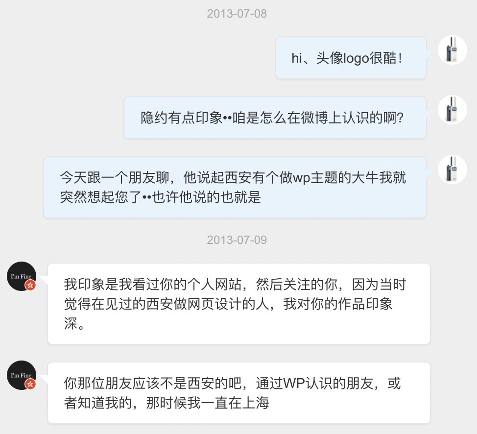
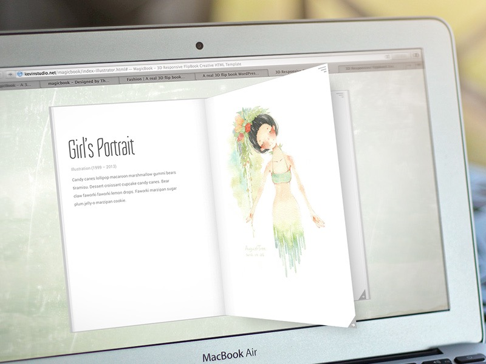
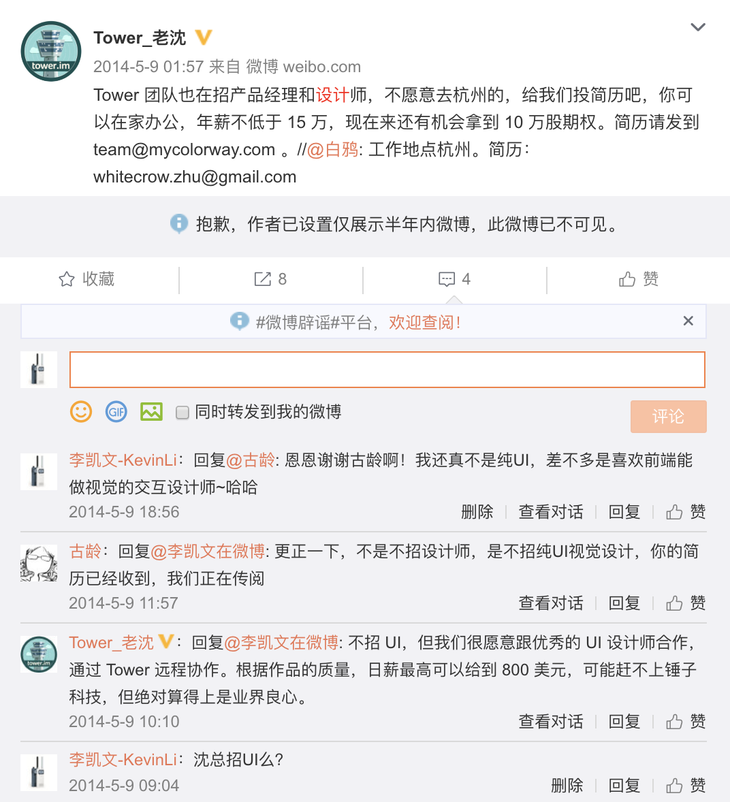
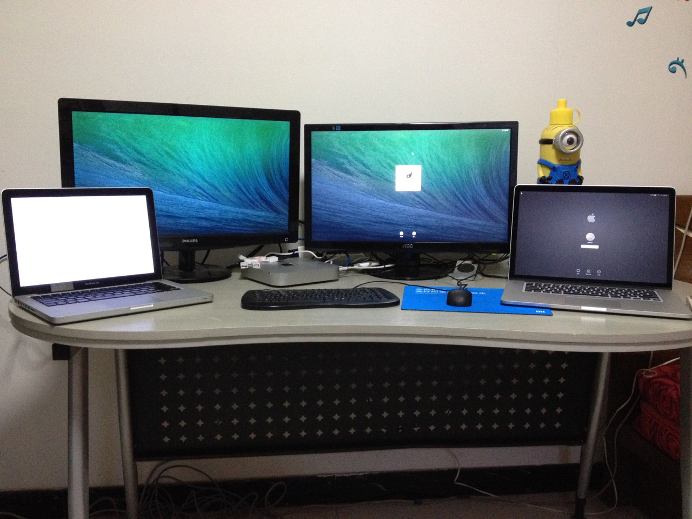
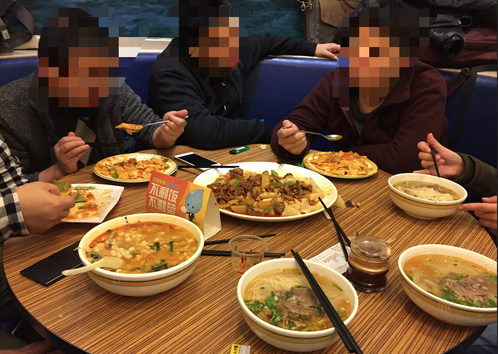
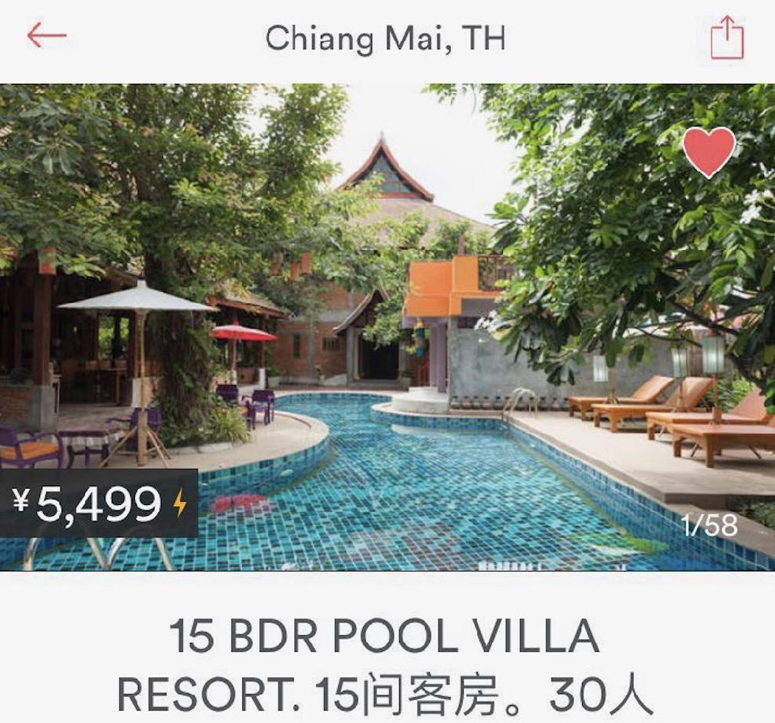
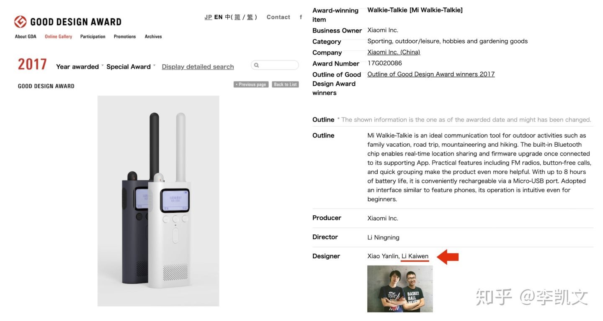
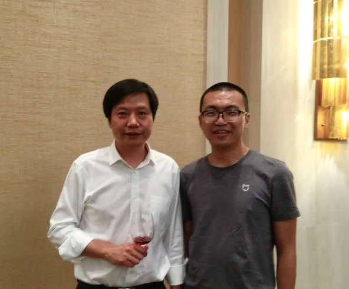

# 远程 2 年、小米对讲机产品负责人 4 年 → 重启自由探索

<copyright :meta="$frontmatter.meta" />

做了 4 年智能硬件，前不久重启对自由工作的探索。

其实更早之前就有几种不太一样的远程工作经历：

- **http://Tower.im**: 红杉投资的线上协同应用，可能是国内最早实践远程办公、并坚持最久、实践最好的团队之一。
- **云币网**：当时好几位核心成员是 Intridea 公司在中国远程工作的工程师，也是国内程序界特别是 Ruby 圈的知名开发者，如 Terry, Daniel 等，他们之前坚持录制多年的播客 teahour.fm 里有多集和远程工作相关。
- **FellowLab & DeepDevelop**：其实也是电鸭前身“一早一晚”背后的团队。
- **ThemeForest** 主题独立设计开发：期间了解了不少国外远程工作者生态相关信息。

用三个关键词对应三个阶段，稍微展开介绍下我的相关经历：

1. SOLO —— 独立开发开启远程尝试
2. 微博 —— 连续靠微博找到远程工作
3. 重启 —— 告别小米体系，开启新的探索

## 1. SOLO —— 独立开发开启远程尝试

我大学是自己本就感兴趣的工业设计专业，除了学习相对传统的实体产品设计，软件设计的学习也在范畴之内。

以实习经历为例，大二暑假去腾讯做互联网产品交互设计，大三就又跑到广东工业设计城做实体产品。

这样左右尝试之后，到要毕业时就有点纠结了，设想两个方向：

- 往软硬结合的智能硬件产品设计方向发展：但当时觉得理想的机会还太少；
- 找机会尝试互联网创业：但觉得自己独立作战能力还差点，特别是程序技术方面，毕竟这才是互联网世界的基石。

之后就先考了本校研究生，准备给自己多一点时间。

那段时间给我留下较深印象的两个内容：

- “一席”演讲《[创业八年](https://yixi.tv/speech/538)》：主讲人舒义一上大学就开始创业，小有成绩之后开始尝试互联网创业，开始也做各种网站试图照搬美国模式，但都颗粒无收。直到索性转变思维，成为了腾讯网四川站的代理，赚取了人生第一桶金。
- 一篇当时小火的博文《[降级轮](https://meditic.com/degrading-for-success)》：主旨是建议 IT 精英可以放弃相互死磕，去传统行业的广阔天地大有所为。（几年后做设计工作室，拜访博主，还有幸合作一小段时间）

这两个内容，基本都在说明，那时的互联网创业看似光鲜，但大多不易盈利，对于普通创业者其实很难。

这让我也开始思考，有没什么机会做点小产品，不求爆发、融资，但能较快就有盈利，哪怕很少也是良性的开始。

---

直到有一天，一个学长跟我提到他听说西安有个人，做网站的主题向海外销售还卖的不错。我一听就来了兴趣，因为这方面设计开发我做个人网站时尝试过一点，有些基础。但我没想到，网站主题还可以像产品一样，向海外销售。

同时，我想起来之前在微博上关注过一个在西安的设计师，从发的一些内容来看很像是做这块的，会不会是同一个人呢。我就在微博上找出此人，并且直接给他发了私信留言。

翻了一下当年的聊天记录，没想到竟是这么尬的搭讪方式：

后来发现，果然是同一个人。

他确实做了几个网站模板在一个平台上向全球售卖，而且不久之前靠一个爆款作品的收入，把买房买车都解决了。那段时间他作品源源不断的销售，自己只需每天花小半天时间回复一下世界各地各种客户的售后问题，剩下时间都是自由的。

我就觉得到这个事情实在太酷了，足不出户就可以服务全世界的用户，而且还可能有不错的收入，所需的设计和技术能力又是我能够摸得着的。就决心也要自己试试。

但不久之后研究生就开学了，开学后越来越忙，很快自己的时间就寥寥无几。但做主题尝试创业的想法依旧强烈，实在心痒难耐，最终开学两三个之后我就决定正式休学，专注尝试下。

那时我还“赖在”学校住着，在一个朋友的工作室借了个工位，开始每天两点一线的（SOLO）独立设计开发。

后来才知道 Indie Hacker 这个专指这类人的词。

经过两个简单的作品铺垫，几个月的打磨，我后来有一款主打作品通过审核上线了。是一款主打创意特效和极简设计的网站模板，可以在屏幕上模拟一本有 3D 立体翻页效果的书，附带各种自然又有一点酷的动画效果。（当然下图这种能翻出屏幕的效果是为了宣传后期制作的）

没记错的话，这个主题首月给我带来了五六千元的收入。其实在当时看也还不错，但是一般靠自然流量首月就是销售高峰，接下来只会越来越少，除非能一举冲上排行榜。

另外我也发现，这个市场竞争已经很激烈，我是靠这种非常小众特别的形式通过了审核，但也意味着这款作品很难一下取得很大的销量。想要在市场中获得更好的成绩，需要持续投入，尝试抓住一次设计潮流变革的趋势。

是否要再接再励，成为一个真正能养活自己的独立开发者？

- 一方面当时的收入还没起来，而做下一款主题还需要至少两三个月时间，相对当时已经进入快速上升阶段的互联网行业薪资，有点勇气和决心不足。
- **还没进入社会就要脱离社会么**？对于自由来的太早，有点心里发虚了。

就这样，我决定还是先去互联网领域工作。

今天回头来看这段“半途而废”的经历，其实我的看法已经不一样了。

看你如何理解“创业”，如果一定是干惊天动地的事，更多积累可能是必要的；

如果是想**能自己主导命运活下来**，很多时候积累反而成为负担。

我当时起点虽然不高，但也已经开始有了收入，如果继续坚持做下去，大概率也能活下来，或发现其他的机会。

咬咬牙也就做下去了，不一样的路而已，人生选择无法证明对错。

实际上，这一个主题现在每个月还能给我挣几百块的零花钱，当初真正加起来，其实也就三个月左右的全职时间投入，至今已经累计给我带来约 15 万的被动收入。

简单总结一下这段经历带给我的体会和收获：

- **自己 solo 的时候个人效率是最高的**：一下完全没有人管你了，起初经常倏忽一下，一周就过去了，却发现一点进展都没有，整天坐在电脑前也不知时间跑到哪里去了，这在开始让我颇为恐慌。逼着自己赶紧想办法研究时间管理、任务管理，直到逐渐进入状态。回首来看，当时每天集中注意力学习做事的效率，后来再也没达到过。
- **亲身体验了一下被动收入的力量**：应该是我后来的一位老板笑来老师，提出了 “睡后收入” 这个网络流行概念，也就是被动收入。这次尝试，三个月的投入，后来五年多的时间基本啥也没干收入 15 万左右，如今还在继续。
- **给自己的眼界打开了一片不一样的天地**：我的主题在全球有上千付费用户，有少量遇到问题会联系我们咨询，千奇百怪，有北欧和日本的漫画家、有巴拿马的酒店、以色列的美容院，甚至印度总统府。这实在是一种神奇的体验，从小电视上就说地球村，第一次借助互联网和说不一样语言的其它村民产生了联系。同时，**我开始关注海外的互联网和独立开发者生态，看到了各种各样的、更加自由的生活方式，这也算是我和远程工作的缘起**。

## 2. 微博 —— 连续靠微博找到远程工作
回到我当时的情况，决定找工作，但那个时候时间有点尴尬，是年中四五月份，大互联网公司的春季招聘已经过去，秋招要九月份才开始，正常入职得到下一年。我只能尝试先应聘暑期实习生，再看能否直接留下来工作。

因为之前已去过腾讯做交互，就想这次尝试一下阿里；并且我是理工科的，想试试自己的审美补的怎样了，那次就申请了视觉设计的岗位。

结果第一轮群面全组就刷的只剩我一个，又面了两轮，最后也确实拿到了实习的 offer。

就要这样去加入马爸爸的大部队么？又一条微博引起了我的注意。

我特意去翻了一下，没想到最初的对话都还在微博上公开晒着：

对~这就是我后来的老板，彩程的老沈。和徐小平一样，曾经是一位大学老师。

我为什么会关注他呢？

首先 tower.im 当时本身就在用。

彩程设计又是国内鼻祖级体验设计论坛 UCDChina 在成都的分舵。

之前在微博上一看到，我就关注了。

但没想到当时彩程已经进化成了一个完全远程办公的团队。

可能因为本身就是做协同工具的，至今也是我了解过的，国内将远程办公践行、坚持的最好的团队，可能没有之一。

毕竟已经是做过独立设计开发，心有点野的人。

看到待遇水平和当时去腾讯阿里也差不多，又能尝试真正创业团队的远程办公。而且虽然是只有十几人的小团队，也已经拿到了红杉资本的千万级融资。

那就它吧！

tower.im 就此成了我的第一份正式工作。我也实现了每天早上一翻身坐起来，迈半步做到桌前，No 通勤、no 刷牙、no 洗脸，就可以开始上班的生活方式。下图是我当年简陋但多屏的办公桌，右边就是床：

起初给我家里人说，他们都不相信，甚至有人觉得我肯定是被骗了。

但其实这已经是事实，还就是因为我看到一条微博实现的……

第一份工作绝对是人生关键选择之一，当时如果刷微博错过了这一条，我的人生肯定整个都不一样。

虽然放弃了去阿里的机会，但我至今没有任何后悔，彩程的核心团队是一帮已经一起走了十几年的老伙计，有很清晰的团队文化内核，对我有知遇之恩，我也从中学到了重要的职业第一课，永远感谢他们。

---

我后来还有两次工作也是因为网上的一次勾搭，或一条信息。

例如直接给微博上关注的 teahour 主播，在远程工作的 Terry 发私信，后来就误打误撞加入云币，进入了币圈。

那时候比特币价格还在千元人民币左右徘徊，可惜我后来完美错过暴涨，并没有像我当年的老同事们一样纷纷财务自由。

当年聚到北京开会，深夜出去吃宵夜的照片，这一桌除了我如今全都是币圈大佬，也有的已经退休了。

参与过的另一个远程团队，就是电鸭前身“一早一晚”的创办团队 DeepDevelop 了，虽然我当时的职务和主要工作并非在 DeepDevelop，但也参加了他们[几十号人集体去清迈的超大泳池别墅旅行办公一个月](https://3cwork.com/discussions/644)的行动，确实难忘的经历：

## 3. 重启 —— 告别小米体系，开启新的探索

再后来，因一个一面之缘的朋友介绍，我加入了一家小米生态链初创公司，有机会去实现最初做智能硬件的设想。

一晃 4 年，我从最早的唯一产品设计背景人员，成为总的产品负责人。

首款产品一次拿下了全球 4 大工业设计奖项中的 3 个，我的名字也出现在了国际设计大奖的官网上。

有次在武汉参会，和雷总的合影，看上去雷总比我年轻不少……

关于这段经历始末我在知乎这篇文章里也简单写了下 [《你是如何走上硬件产品经理道路的？》](https://www.zhihu.com/question/22602924/answer/1018003779) ，这里就不在赘述。

---

虽然也取得了一些成绩，但对组织或平台的依赖，会让我感觉越来越不安，可能是尝试过自由工作的后遗症吧。

19 年底我从公司出来，觉得是时候自己做些尝试了。

现在主线摸索自己公司的业务，同时也帮一个海外的公司远程做一点事。

当然，我做硬件这几年是没有远程的，我家离公司单程就要将近 20 公里，幸好基本高速直达，但高峰期也可能要四五十分钟。

我后来甚至也惊讶，这样的状态我能坚持这么久。

经历这些之后，对我来说，是否远程已不是最重要的。

关键还是：

- 是不是在做你想做的事？
- 状态如何，可否将工作、生活、家庭等平衡好。

自由没有止境，且永远都是相对的。

---

不过这次疫情，激发我再次思考，自己应该寻求怎样的状态，毕竟是体验过那种“自由”的。

全部有可能远程的公司，都被往这个方向硬推了一下，经济和就业也会受到很大影响，接下来会怎样呢？

确定的是，围绕“远程工作”这件事，应该会有更多需要做的了。

电鸭加油！也欢迎有相关思考，有兴趣做相关尝试的朋友通过 [联系TA](https://eleduck.com/users/akAhv2) 与我联系交流.