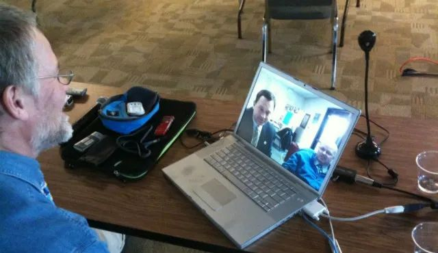

# 微软高效远程工作心得

<copyright :meta="$frontmatter.meta" />

离我们发布“[疫情催生，2020或为中国远程办公‘元年’](/viewpoint/2020/telework-china-year-one)”一文刚过一个月，眼下，整个地球都已经进入了“远程办公”状态……事事难料啊，原来今年是地球远程办公“元年”呀。

今天给大家引荐的是地球上最强企业之二：微软和Google的远程办公经验，下文作者为微软365公司副总裁Jared Spataro， 他以Microsoft Teams为例，介绍了微软的远程办公心得。Google的经验请参考文末“阅读原文”。对比之下，不难发现，共同的关键点就是：

**沟通，沟通，保持联络！没有条件，创造条件也要保质保量好好沟通！**
  
---

随着COVID-19在全球范围内的蔓延，上周三，我们发了一封电子邮件，邀请西雅图地区大约5万名微软员工尽可能在家办公。我们自己已经是Microsoft Teams重度用户了，但在微软美国员工使用完全远程办公的最初几天里，Teams使用量仍显著上升，到周四结束时，聊天量比上一周增加50%，会议增加37%。随着各地的员工适应了只在网上开会、聊天和协作，客户中的使用率也在上升。我们想帮助每个人迎接这个挑战。作为团队背后的团队，我们花了很多时间研究如何让在家工作更有效率的好办法。下面是我的分享。

当你转向远程工作时，一些关键习惯将使你事半功倍。

## 设置你的工作区

如果你没有家庭办公室，不要担心，在家高效工作并非不可能。实际上，我们将Teams设计为一个虚拟办公室，让你可以随身携带任何办公所需之物。

家里没有打印机、扫描仪或传真机，没关系！你可以直接在Teams中提取文档，将文件安全地存储在方便访问的地方；同时你也可以随时随地迅速加入电话会议。

你只要拥有一个专用的家庭工作区域就行了，早餐桌、卧室的安静角落、娱乐室中未充分使用的游戏桌……任何不被打扰的区域的都可以兼做工作区。这很重要，在这里你可以提高工作效率并向家人发出“工作中，免打扰”的信号。

你不必担心家里临时出现的混乱或干扰会影响你的“参会形象”，你可以在视频会议期间始终使用“背景模糊”功能，这样你的同事就只会看到你想让他们看到的样子。

## 沟通，沟通，沟通

虽然我们很多人以往至少有一部分时间在家工作，但我们习以为常的工作节奏仍然有可能依赖于在办公室建立的时间观念。当完全在家办公时，日常工作节奏可能会改变，对那些需要平衡工作和照顾孩子的人来说尤其如此。那么，请务必明确地告知你的同事和合作者你可用的工作时间，这样他们就知道什么时候方便联系你。你还可以在Teams中设置一个状态，主动告之大家你的动态。

同时，要养成经常向你的队友分享工作进展的习惯。完全远程办公的公司比较强调使用文档，因为这是在异地工作时保持联系的关键方式。我们则建议你在 Teams 频道中发布你的更新、见解和有用的资源，这样即使没有面对面聊天的机会，你的队友们也可以在需要的时候在频道中搜索这些想法和内容。

## 保持健康的作息

如果没有了平时工作间歇的信号（比如步行去吃午饭，跟同事喝咖啡，或者乘车上下班），远程工作者有时会发现自己工作时间很长，没有休息时间去锻炼、社交或吃顿饭。这将很快导致压力和倦怠。请记住:你的健康是第一位的。腾出时间吃饭，喝水，适当运动，并提醒自己在一天结束时从远程工作中“打卡”出来。这些行为不仅能让你保持健康，从长远来看还能让你更有效率。

## 公开有效的会议

### 01 拥抱在线会议

在没有实体会议室的情况下，让所有人聚在一起，可能是所有远程工作中最大的挑战。如果你使用Teams召集线上会议，请确保所有会议都有一个虚拟的“加入”选项来创建一个在线会议室。此外，我们建议所有的与会者都打开视频（如果他们愿意的话）。面对面的交流对每个人都大有帮助。Teams有广泛的认证相机可供选择，以及像耳机和免提这样的设备，以确保会议的通话质量。

### 02 关注和包容

转到在线会议，因为无法实时观察同事们参会的表情和状态，有时候可能会让一些人的发言机会和意愿被忽略。会议组织者应经常停下来邀请与会者提问，并提醒与会人员也可以使用会议聊天窗口分享他们的想法。 

### 03 记录你的会议

为了弥补面对面时间的不足，一些远程工作者会安排额外的会议，以便与客户、合作伙伴和同事保持联系。重复预订在所难免。如果你的组织允许的话，请把会议记录在Teams中，这样你的队友们就可以在晚些时候“补课”了。如果你不能亲自出席，提醒组织者在你缺席时记录会议。如果你想记住参加过的会议信息，自动生成的文字记录也非常有用。

## 保持联络，维系职场社交

### 01 弥补错过的走廊谈话
  
很多远程办公的员工发现，他们最怀念办公室里的闲聊。在饮水机旁或茶水间的聊天不仅能让人们保持联系，还常常能激发和交换以前想不到的灵感或见解。远程工作时，请特意与你的同事保持联络。把聊天信息当成你的虚拟饮水机，给自己设置一个提醒，让自己定期与他人联系。多使用表情符号、动图和贴纸是让聊天变得轻松有趣的方式。
  
### 02 让团队团结起来

远程工作让人感到孤立。作为一个领导者，为整个团队创造虚拟聚会的机会是很重要的。定期组织团队会议或活动，只不过是在网上进行。

在Teams中使用“通用”通道来讨论每个人都感兴趣的问题。对于大型的头脑风暴，你可以使用微软的白板应用，它为与会者提供了一个无限的数字画布，让他们可以直接在团队中构思和协作。

我们还建议团队领导下载危机沟通能力应用程序——这个可定制的应用程序可以用来通知你和你的团队在整个疫情期间需要了解的一切。

### 03 玩得开心！

随着远程办公“常态”化，培养和保持团队士气是很重要的。在Teams中，你可以做很多事情让大家保持积极性和参与感。例如，在你的Teams聊天中分享新闻和故事，或者举办一个照片比赛。我们在中国的一个教育客户为学生举办了一个烹饪挑战赛，结果证明这个活动特别受欢迎。

我知道每个人和每个团队的工作方式都不一样。但是，我希望我们的建议能帮助你在适应新的工作方式时保持日常的工作状态和效率。

远程工作清单：

- 设置您的工作区
- 经常交流
- 保持健康作息
- 拥抱在线会议
- 关注和包容
- 记录你的会议
- 弥补错过的走廊谈话
- 让团队团结起来
- 玩得开心！
