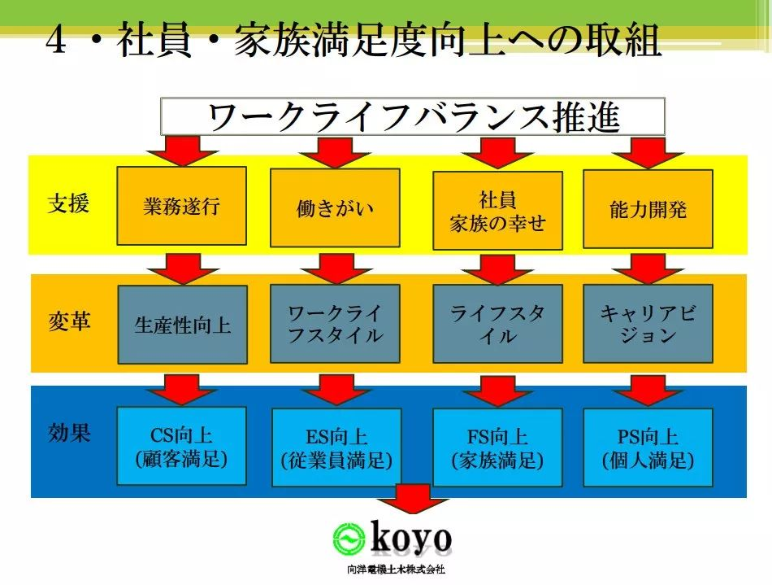
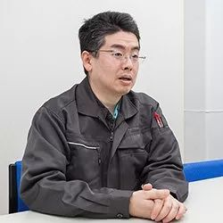
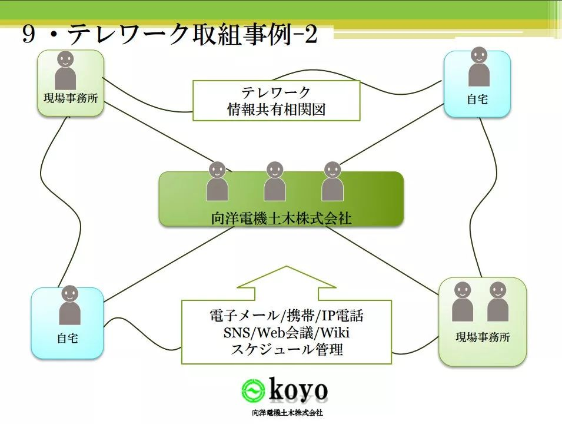

# 远程办公并非IT企业专利

<copyright :meta="$frontmatter.meta" />

虽然IT企业在远程办公方面有着得天独厚的优势，但其他行业也并非不适用，需要具体问题具体分析。今天介绍一家日本电气设备工程公司的实践经验，希望对您有所启发。

位于横滨市南区，以公共电力相关的电气设备工程项目为主要业务的向洋电机土木株式会社，其业绩和员工人数逐年稳步增长。

这家名不见经传的日本公司因为在远程办公方面卓有成效的改革和实践，使其整体的“CS(顾客满意度)、ES(员工满意度)和FS(家人满意度)、PS(个人满意度)大幅提高。重视生活平衡、减少不必要的加班、使员工的压力得到缓解，从而提高生产效率；同时，员工也有更多可自行支配的时间用来学习和提高自我技能。这样一个平衡了员工及其家人的人性化政策在工作与生活之间形成了良性循环。 

**【引进远程办公的目的】**

为需要承担家庭责任的员工推进工作方式改革，以消除往复办公点与施工现场的时间成本。
  
**【引进远程办公的效果】**

通过远程办公提高生产效率，使员工的个人成长和公司发展融为一体。

远程办公也成为了解决员工困难以及招人难的有效手段。

该公司的电气设备工程项目的施工现场分布各地，员工仅在家、办公室、工地之间来回奔波就会花费很多时间。尤其对家里有需要看护的老人或孩子等实际情况的员工，更是很大的负担。
  
该公司认为改善这类现实问题能更好地保持团队平衡，提高人才的学习积极性与留任率。从2008年开始，由宣传部部长兼人事负责人横泽牵头，开始讨论引进远程办公模式。即：员工可以不去办公室，直接到现场，需要处理的工作可以在现场或自己家里完成，同时，为了让有家庭责任的员工能兼顾好看护和育儿，没有后顾之忧，也将与远程办公配套的制度一起考虑在内。

宣传部部长兼人事负责人 横泽昌典

横泽说：“其实，我也有过因为照顾父母的问题而离职的经历。考虑到员工和他们家人的幸福，我和支持改革工作方式的仓泽社长商量了一下，他说‘按你的想法去做吧’，于是，就开始行动了。”
  

## 明确个人技能与分工，使用便捷安全的流程体系

横泽首先着手做了调查：谁拥有怎样的技能，用多长时间来处理什么样的工作。他表示自己并不是IT专家，也和大家用一样的软件和服务器，但会根据每个职务的工作内容和权限，来规定文件处理的安全等级。同时，把保存在云端上的文件和放在本社服务器内的所有文件做了严格区分。

为避免信息泄露，公司给每位员工统一发了同型号且安装了相同软件的智能手机和笔记本电脑，对在自家或现场办公的工作场景做了相应规定，并禁用了SNS等。

远程办公实现了在家直接把说明书等发送给现场负责人

在制度上设定每位员工的标准工作时间后，还会通过确认其实际花费的工作时间来进行劳务管理。在家或是施工现场用智能手机连Wi-Fi上网的同时，可以从固定分配的IP地址来监督工作状态。这些前期准备进一步明确了员工的职责范围和内容，在现场或自己家里都能完成设计图、工程报告等工作。

横泽说：“我们不想花费太多成本，所以直接使用了可以信赖的免费软件，并自制监督程序。”

他们使用的免费软件有三类：

- 首先，是可视网络电话（如SKYPE），使用场景通常是针对设计图纸或说明书的视频会议，能实现当面的交流。
- 其次，在公司内部会用类似SNS这样的聊天工具，但信息的发送和共享需要被设定相应的权限才能进行。
- 然后是像维基百科一样，可以把自己的业务知识和经验积累做实时记录编辑的软件，为远程员工之间共同参与完成的工作提供方便。

“以目前的移动连接情况，共享时网速还不太行；我想先换成迷你WI-FI路由器，只是它的成本需要远程办公推进中所节省的部分来做分摊。”

该公司的想法是，通过远程办公模式的有效运用所产生的效果进行量化，在省下的成本中将一部分用于系统建设的投资。例如，由于减少了公司用车的总时间，保险费也省了70%。分发给员工们的电脑等设备的成本就是这样挤出来的。

## 与员工保持沟通，将每个人的成长与公司的发展相融合

在推进政策过程中公司非常重视把提高生产效率和工作方式改革联系起来，并将员工的个人成长和公司发展相统一。**远程办公的普及只是手段，其本身并不是目的。**
  
横泽表示：我们并不强制要求所有员工使用远程办公系统，并且为了提高生产效率，我经常与远程办公的员工们反复交流讨论，如果发现“不能做到的”，那么就一起思考怎样可以更好更高效地做到，共同努力解决。

其结果就是我自己常常在公司办公室里完成设计图、ISO审核资料等工作。

另外，我建议将远程办公中省下来的业余时间用来学习和资格考试。公司对通过资格考试的员工有额外的补贴，这类员工的增加也能促进公司成为更好的工程承包企业。现在的工作模式和制度更好地平衡了员工们的生活，听到他们“有了第二个孩子”、“下定了购买公寓的决心”等这样的话，真的让我欣慰。
  
**该公司包括远程办公在内的一系列工作方式改革的结果：**

> 2016年度与2008年度相比，尽管员工人数增加了9人，但汽油使用量减少至83%，总公司用电量也减少到了75%，平均工作时间从2,100小时削减到了1,800小时。然而，在这期间的销售额却倍增。值得一提的是，了解该公司在工作模式改革方面的积极实践后，有数百名来自全国各地的求职者希望加入该公司。

## 努力解决工作方式改革过程中新问题和新挑战

现在，这家企业因为实践远程办公等工作方式改革而成为行业内的先进企业，横泽先生还受邀多次做过“女性进入社会”、“家庭/工作两不误”等主题的公开演讲，而该公司的工作方式改革仍在持续完善中。
  
横泽说道：“谁都希望有一个‘理想的工作岗位’，这份‘理想的工作’往往会随着每个人生活的变化而改变。面对今后可能会遇到的新挑战，我们会继续努力。这样的持续性改革，不仅是我本人，我家人的理解与配合也非常重要。”

信息来源：日本电信电话用户协会官网
