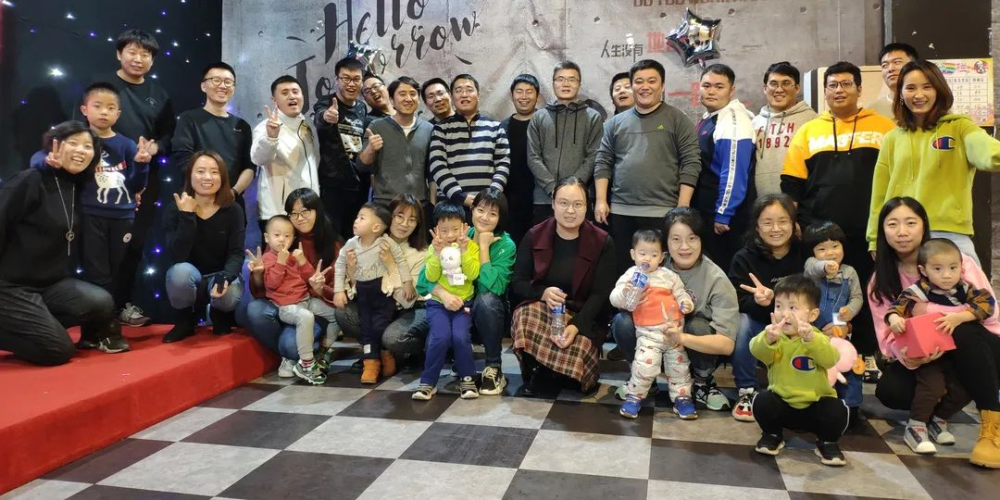

# 让远程办公成为提高工作和生活质量的有效方式

<copyright :meta="$frontmatter.meta" />

随着互联网、在线办公软件、在线沟通工具等配套设施的成熟，在某些工作领域，松散的、合作型的工作方式正在逐渐取代传统的在固定时间把人集中在固定场所的工作方式。远程办公就是目前正在流行的一种趋势。

就像传统的工作方式的形成，一定是顺应了社会发展的潮流一样，远程办公方式也一定是在某种意义上符合了知识和创造力时代的要求的。作为一名IT软件行业的普通员工，站在个人的角度，这种工作方式最直观地体现了人性化的一面，赋予了个人更大的自由度，自我创新和自我驱动的空间。

两种工作方式虽然形式不同，并且远程工作目前相对某些性质的工作更胜一筹，但二者都是**进行工作的方式或者是手段**，不是目的。选择某种方式进行工作，最终目的是能够更加高效率的工作，从而提高更加高质量的生活水平。

既然是方式或手段，那么一定会有利弊。就个人而言，传统的工作方式需要把人集中在固定场所办公，因此牺牲了员工个人的时间和部分自由，一定程度上也失去了一部分个人隐私，但这种方式保证了相对高效的产出。在知识和创新型时代，个人的能力和价值更加凸显，远程办公方式给了个人更大的尊重和自由，比传统的工作方式更加符合大环境的要求，但在一些方面也存在着一定的风险，最主要的应该是能否保证和在公司办公达到同等或者更高的办公效率。

如果远程办公方式是一种不可逆转的社会趋势，那么我们能做的只有扬长避短，尽量发挥远程办公的最大优势，尽量减少它的劣势出现，让远程办公成为优势更加明显的工作方式。

作为一名普通员工，我已经进行远程办公大概半年的时间，相对比较喜欢这种办公方式，这不仅减少了交通时间，也在工作和生活上都给了我相对的自由，可以自己进行合理的安排时间。结合网上关于远程办公方式的讨论，和自己半年的远程工作体会，感觉有几点非常重要：

> **一是自我驱动力。** 没有了固定的环境和外界的监督等外力驱动，自己对自己的内在要求和激励就变得非常重要。应该要明确知道自己每天需要做什么，并去完成。
>
> **二是个人学习能力。** 远程办公使得寻求他人帮助相对繁琐和困难，间接增加了时间和人力成本，只有个人有较强的学习能力，通过主动学习解决工作过程中遇到的问题，才能相对快速地推进工作。
>
> **三是自控力。** 能解决相对自由宽松的工作环境中的诱惑和干扰。
>
> **四是及时有效的沟通和协作能力。** 由于远程办公中的每个人都是分散在各处的，及时有效的沟通就变得更加重要，每个成员又要明确各自承担的任务范围，避免工作重复或遗漏，需要加强协作。
>
> **五是理性制定合理灵活的时间计划表。** 计划表制定的合理，能够使工作稳步推进，灵活能及时应对工作过程中的不确定因素。

在这半年的远程工作经历中，我是一点点地体会到上面几点的重要性，并在这过程中对自己逐渐制定了一些工作要求和方法。

关于自控力，我对自己的要求就是能坐住板凳。我规定自己每天上午和下午必须坐在电脑前达到规定的小时数（根据工作量每天变动），这段时间内只做和工作相关的事情（不看手机，不浏览网页），效率高的话工作提前做完就进行学习，效率低就算规定时间内没有完成工作，也会立马结束留到第二天再做，即便某一天效率非常低，使得工作没有进展，也会一直坐到电脑前，直到达到规定小时数。久而久之，固定时间内做规定的事，就会从强迫自己变成一种习惯，被大脑接纳，当形成一种习惯后，工作效率也会随着提高。

关于增强学习能力，我认为学习包括系统学习扩展知识体系和即时碎片化学习，解决当前问题。系统学习方面，我会根据当前项目所用到的知识和技术选择几本电子书，在工作的间隙比如系统启动、运行等，等待过程中每天学习一部分，或者是工作提前做完，还有工作时间时，利用这段时间学习。碎片化学习，我一般是在工作过程中遇到问题时，去从网上找相关的知识或解决方法，解决问题后，通过笔记方式记住这些零碎的知识点，等以后再遇到同样或类似的问题时，方便查找。关于学习方面，我觉得记住“好记性不如烂笔头”这句话非常非常重要。

关于制定时间计划表，我做得非常简单。基本上就是前一天把第二天要做的工作分一二三像写日记一样（注明日期），列到笔记本上，并标明大概耗时。第二天开完会，如果计划有变，我就把必须要当天做完的事情替换掉计划表中最不重要的工作，然后合理调整时间。下班之前，把当天计划完成的工作打勾，未完成或未开始的工作分析下原因，并挪到第二天的计划中。如果有相当长一段时间每天工作都一样，比如改bug，那就不用再列出每日的工作。

关于沟通和协作。我目前与项目组同事的沟通方式是确保我要传达的信息已经告诉相关同事或已经在共享系统中写明了。但是我发现光这么做还不够，前几天在一本书中看到说 **“有效的沟通要以对方的确认为准，不要以为话说出去了，别人就一定接收了你传达的信息”** 。这说明我的沟通只完成了一半，还有需要改进的地方。

关于提高自我驱动力，我觉得是一个非常个人化的事情，应该每个人有每个人的方法。我自己是通过看各种书籍来提升自我驱动力的。

通过上面这些具体方法，我发现只要坚持做下去，远程办公也可以达到或者超出在公司办公的效率。**我有更多的私人时间做自己喜欢的事情。**

作为一名普通员工，我已经进行远程办公大概半年的时间，相对比较喜欢这种办公方式，这不仅减少了交通时间，也在工作和生活上都给了我相对的自由，可以自己进行合理的安排时间。结合网上关于远程办公方式的讨论，和自己半年的远程工作体会，感觉有几点非常重要：

关于远程办公，网上也可以找到很多具体可分步量化执行的方法，和一些配套的工具，有些方法应该也是因人而异的。如果能做好上面这几点，我觉得提高工作效率，缩短工作时间，以进行更好的生活都会变得相对简单和容易，也就能充分利用好远程办公这种工作方式。