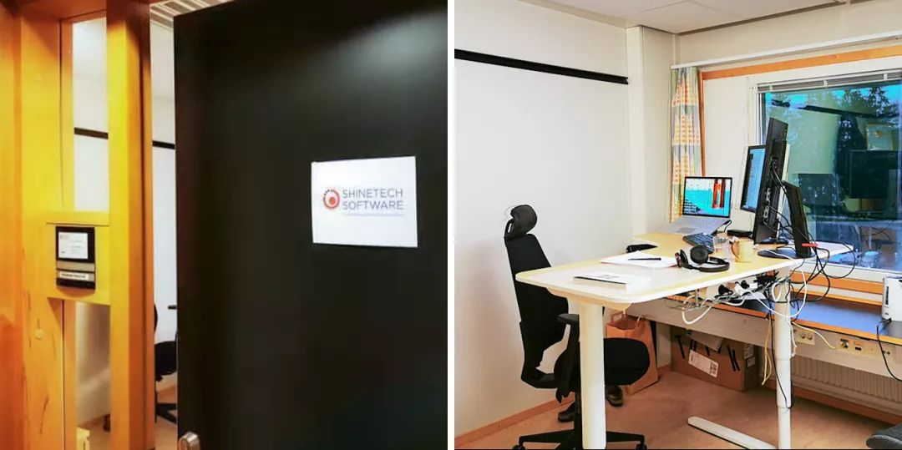

# 北欧程序员的远程工作方式

<copyright :meta="$frontmatter.meta" />

WHO宣布新型冠状病毒已被列为PHEIC（国际公共卫生紧急事件）。全国各省的节后复工时间也是变了又变。疫情当前，节后怎么上班，在一个什么样环境下工作？作为一个普通上班族的我们，是一件不得不考虑的现实问题。相信节后会有大批的公司开启远程办公的模式。如果你对远程工作还比较陌生，可以通过这篇文章看看北欧工程师是如何远程办公的。

我来瑞典工作已经有8年的时间了。同时，也积累了8年的远程办公经验。远程办公在瑞典和北欧非常流行，也很受欢迎。这跟当地人的文化背景、生活习惯、社会状况和地理资源状况都有关系。

北欧大多数国家地广人稀，想把人才聚集到一起是比较困难的。大多数年轻人会选择去大城市打拼，这跟中国的状况类似。但是当他们有了家庭和第一个孩子以后，会选择回到他们出生的小城市。同时，大多数人也会把工作带回家来。

这样的事情不单独只发生在远程方便工作的IT、管理和金融等行业，同时，也会发生在一些传统制造业。一些需要手工制作的零件，都可以由技术工人在家制作。然后，再集体邮寄，组装在一起。比如鼎鼎大名的ABB制造的机器手臂，就有很多组件是远程工程师在自家“车库”完成的。

瑞典跟大多数西方国家的习惯一样。爷爷奶奶退休后，并不全职帮忙带孙子孙女。北欧平均家庭有2.5个孩子，虽然社会福利在生育部分的保障非常全面，但也还是需要面对在家照顾生病的孩子，或者陪伴孩子过暑假、寒假的情况发生。所以会经常有同事远程在家工作。

**在家工作是远程工作的一种，但不是全部。**我有两个孩子，所以也会经常在家远程工作。在家工作，我认为最重要的就是先有一个非常好的网络环境。我家是独立光纤入户，500/500 Mb的上下行带宽。上行带宽我都需要考虑，因为经常视频会议，我需要很大的上传数据量。这样你的工作效率不会因为你在家的硬件环境而降低，也不会因为网络环境不好，远程跟团队沟通不顺畅浪费时间。

**当你的工作效率、沟通效率都不受在家的影响，那么团队成员自然就不介意你到底是在哪工作。**反过来，我在跟一些远程工作者合作的时候，如果每次开会都要花费半小时来调试网络问题。我就会担忧，对方是不是应该来办公室一趟。

我住的这个城市，被当地华人戏称为“卡村”，只有8万人口。但是IT行业还是十分发达的，有上百家IT和IT咨询公司。北欧第一大的IT业务供应商的总部也在这个城市，没有远程工作环境，8万人口是很难支持这么多家公司的。

我每天几乎都要去办公室工作。但是去办公室，也是远程工作，因为其他团队成员都不在一个城市，而最近几年都是跟国内团队合作。**之所以选择去办公室，我是希望寻找一个让我更专心的工作环境。**

我在一个共享办公的地方租有一个工位，**进入工作环境，就像是一个仪式。告诉自己的身体和思想，现在应该进入工作状态了。**这样可以避免一个人长期独处而容易产生“颓废”的状态。同时，在共享办公区域，我可以跟其他人交流，拓展社交圈，参与各种活动和团队建设，这样可以抵消到由于远程办公带来的很多负面因素和不真实感。

另外，我几乎每周都会坐火车去另外一个城市，跟团队的其他成员面对面工作一天。这样对团队内部的沟通和信任非常有帮助！

大家都知道**共赢，非零和游戏的基础是信任。**北欧各国的政府通过提高社会福利，提升社会平均工资，并制订严厉到近似苛刻的欺诈惩罚手段，再加上几代人的努力，让人与人的信任成为了自然的习惯。所以**每个人在工作的时候，不会去横向地对比是不是其他人没有付出，而是更多的纵向地自我对比产出是不是一直都有价值。**

信任和透明在远程工作中有多重要，我这里有一个反例。在一次Ruby的活动中，听到一个纽约远程工作者的故事。她们有一个团队，一些人在纽约远程工作，一些人在加州硅谷地区的办公室工作。一直以来，这种分布式的工作方式非常有成效。直到有一天，团队开视频会议，远程办公的每个人都在摄像头前，在办公室工作的人也都在会议室的大摄像头前。会议开始跟往常一样，气氛不错。突然，一个没在屏幕里出现的Manager说了一句话，让整个会议的气氛变得凝重。远程工作的所有人都以为这个Manager没有参加会议，但实际上，这个Manager是故意躲在会议室摄像头看不到的角落里面。会议结束后，大家不禁怀疑他到底参加了多少次这样的会议，自己是不是说了什么不该说的话或者玩笑。团队信任关系一下子瓦解了。之后没过多久，这个团队的远程办公方式就中止了。

**在选择远程工作的时候，尽力让自己的工作透明，尝试可以增加别人信任感的实践，同时，也尝试相信别人。**一旦做了让别人不相信的事情，那么远程工作就很难再继续下去了。

在国内，远程工作虽然并不算全新的工作方式。但如何结合国内的实际情况，文化、环境和社会保障制度等开展远程工作，是一个很有意义的话题。欢迎加入盛安德远程工作社区，一起讨论远程工作和远程团队管理上的问题。

