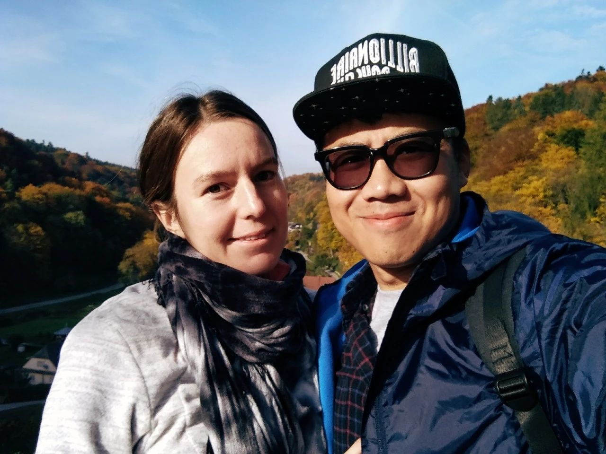
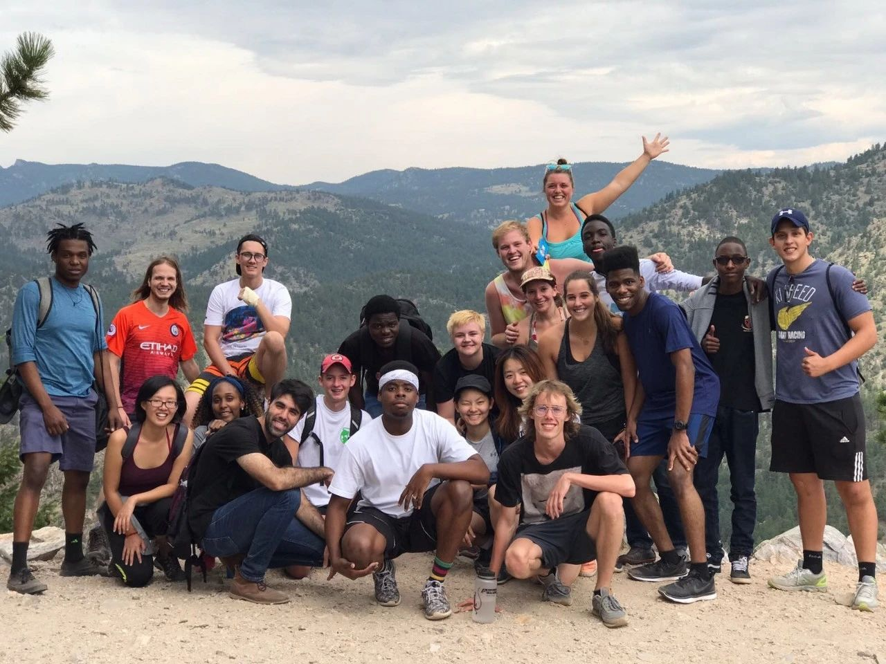
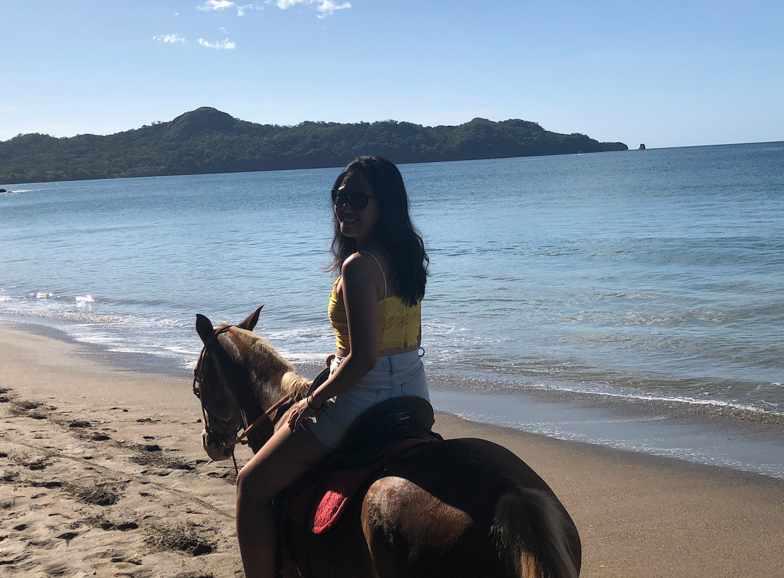
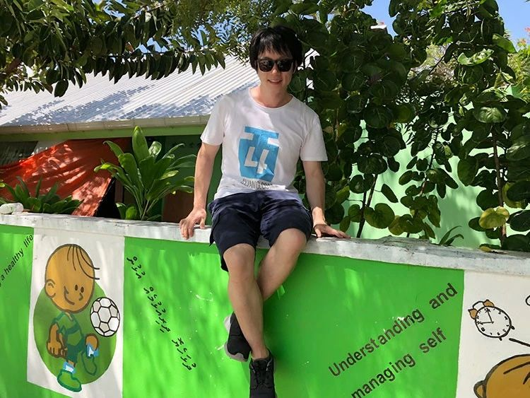
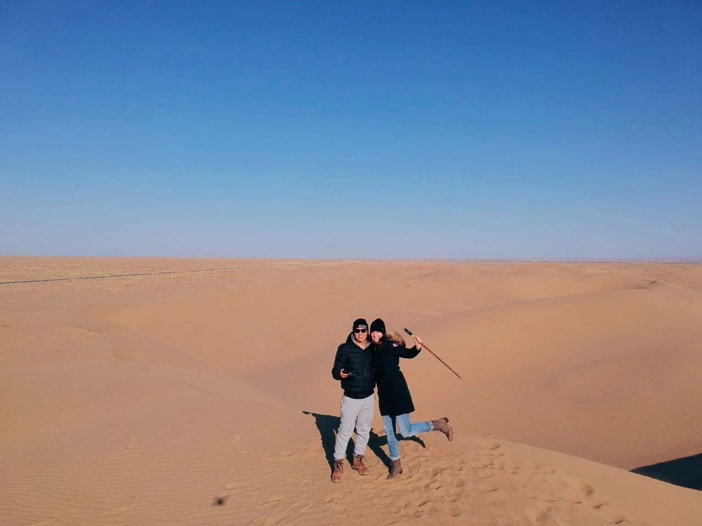

# 第一代互联网远程上班的人，已经躺赢12年

<copyright :meta="$frontmatter.meta" />

有人预言，2020年将成为中国远程办公的元年。

其实早早就有一批人在这样实践了，他们称呼自己为“数字游民”，不限于居家办公，只要有电脑和网络，他们甚至一边环游世界，一边工作。

上：Jarod，Natália

下：Lallas，方勇

我们采访了4位来自中国的数字游民：

- Jarod建立了“数字游民部落”的付费社区，一边产出内容，一边走遍了30个国家；
- Natália开了一家“云公司”，提供远程资产配置咨询，同时雇佣坐标在世界各地的员工，利用地理套利，赚着美元花马币。
- Lallas辞去了高薪工作，一边在线给学生培训英语，一边走遍了美国和拉美；
- 方勇居家办公12年，却丝毫不感到孤独，练就一身沟通技巧，正在努力创造“睡后收入”。

如何利用互联网赚钱？

边旅游边工作，真的可能吗？

如何确保通过网络建立的关系是靠谱的？

这种生活方式的抗击打能力强吗？

如果我也不想上班了，第一步该怎么做？

自述: Jarod、Natália、Lallas、方勇
编辑: 倪楚娇

## 4个数字游民的真实案例

> “拥有100万，和活得像有100万，是完全两码事” 

Jarod，35岁，男，内容创业，已游民5年

看我的生活，很多人会以为我巨有钱，全年都在旅游，去了30多个国家，每天花80%的时间在阅读上，似乎从不工作。但其实我现在赚得比之前有工作时都少。

拥有100万美元和活得像一个百万富翁，这是完全不同的两件事情。很多人赚得多，但时间完全不自由。我认为，时间也是一种衡量财富的标准。

我的第一份工作比较特别，在非洲乍得和喀麦隆接壤的一片广袤的热带草原上，做石油勘探工程师。连续工作28天，然后休假28天。

每到休假，都可以跟公司申请买到全世界任意一个地方机票，积累了不少旅行经验，也打开了我的国际视野。

我的第二份工作就职于国内一家上市民营企业，被外派到迪拜做市场推广的工作。每天和上司生活在同一屋檐下，只要他提出要求，哪怕是半夜我也要继续工作。

想到即便我升职到他的位置，他的生活也并非我想要的，而他上司的生活我也见过，也没什么可羡慕的。

那是2015年，我30岁，感觉已经看透了职场，就决心辞职。

Jarod在墨西哥卡门海滩

其实我大学刚毕业的时候，就看到了一本书《每周工作4小时》，这是所有数字游民的圣经。但当时没有资历，也没有存款，就只能先去上班。

30岁那年，我攒够了至少三年不用工作的钱（别用一线城市的花费水平来估算，其实让自己活着并不费钱），回到内蒙古老家开始内容创业。

从零开始学，包括怎么做网站、平面设计、写文章等等。第一笔收入来自知乎的一个高赞回答，我分享了“雅思口语获得8.5分”的经验，就有很多人付费来找我咨询。所以我现在一部分的内容创作，是关于英语学习的。

另外一部分是记录下我如何成为“数字游民”的过程。我应该是中国最早开始推行这种生活方式的人，所以只要搜索“数字游民”，就会找到我的网站和社群，已经成为了我的一种品牌。

现在收入一共来自三方面。一个是付费的社群，现在差不多有1000个付费的会员，我会为他们提供数字游民或者英语学习的相关咨询。二是做产品推广的佣金分成。另外是一些投资的收益。

Jarod和妻子在波兰

我妻子是波兰人，我们是在内蒙古认识的。她完全是受我的影响，现在也开始做内容，还有一个电商网站。

现在的生活更像是很多人梦想中退休的状态，真的没有考虑太多“奋斗”。每天反正可以睡到自然醒，花80%的时间在阅读上，抽1小时整理笔记，因为我需要大量的输入，才能输出好的内容。积累几天，就会写一篇文章。

当你已经有一定的内容储备，就像你前一天已经下好了多处渔网一样，所有的网都没有鱼的概率是非常低的。所以不用去担心，我今天没有工作，就没有收入了。 

绝大部分数字游民的热点城市，一个人一个月有1000美元就可以生活得很好，大概6000~7000块人民币的样子。

现在我们正在哥伦比亚旅居，英语也不是特别好用，所以在学西班牙语，每周去健身房三次。刚到一个完全陌生的城市，会留出1~2天的时间去打卡一些景点，或者去周边一日游。

有时候就是漫无目的地在大街小巷走一走，看当地人聚集在一起吃什么，然后自己坐下来也尝一尝。 

在城市的选择上，首先网速、基础设施不能太差，其次就是物价要合理、气候要好。东南亚特别受欢迎，有海、有山。

保加利亚有一个地方叫班思科，冬天是滑雪胜地，夏天几乎没有人，所以数字游民就会在夏天去当地，以非常低的价格生活。要让自己赚回来的钱，真正帮你实现自己想要的生活。

 > “我开了家‘云公司’，学会地理套利，让钱更值钱” 

Natália，27岁，女，金融咨询，已游民2年

我从小成绩很好，是别人家的孩子。大学毕业后，就在香港的一家咨询公司工作，高薪又体面。可是我就是不太开心，好像没有很自由。

有一次在新加坡旅游，遇到一个来自德国的博主，他说他这7年来，从来没有工作过，完全依靠网络赚钱。他提到了“数字游民（digital nomad）”这个词，我回家就开始搜，原来已经有很多人在这么做，而且也不乏中国人。

为了测试可行性，我先尝试了一下远程办公。当我发现，即便在柬埔寨旅游，依然能和国内的客户无障碍沟通时，我觉得这条路应该走得通。于是我辞职，跟一个朋友合伙开了一家做海外资产规划的公司，为客户提供线上咨询服务。

刚创业的前三个月，其实收入挺少，差点有想过放弃，但又实在不想回到办公室的无聊生活。当时选择了去越南住一段时间，思考该怎么解决，却误打误撞开始了地理套利之旅。

相比深圳、香港，越南生活性价比非常高，一杯咖啡只要10块钱，原来换个国家生活可以更省钱。或许很多人认为呆在家最省钱，但思维很难被打开。

Natália的日常

我觉得做“数字游民”最大的好处就是可以实现“地理套利”。

1. 货币套利：我赚的钱有人民币、美金、港币、欧元，可是我现在在马来西亚花的是马币，就很爽！住上了市中心一个两层的别墅，还有小花园！租金只有人民币4000多元。
2. 薪水套利：我们的公司是一种很松散的存在，它不再是一个办公室和一群日日见面的同事组成的。我们聘请了一些东南亚和外高加索国家的人，他们的工资可能是国内人的一半甚至1/3。

招聘神器UpWork可以一键接触全球的人才库，还可以设置大概的价钱和国家。

我曾经踩过的坑就是不要请印度或者巴基斯坦的人（略有地图炮之嫌，但我的体验确实不佳）。虽然便宜，但效率基本是不存在的。没有面对面的沟通过，就需要挑人技巧，比如可以看过往雇主对他们的评价，或者给简单的任务测对方水平。

也完全不用担心给了钱就跑路的现象，全程在网站上操作，还可以选择先支付定金（比例自定义），然后按完成不同的任务进行分步“确定付款”。

Natália在格鲁吉亚

3. 美元定存的套利。因为我个人对数字特别敏感，之前在越南我就去遍了全部银行，看他们银行利率。
目前我发现利率最高的是在亚美尼亚，美元1年的定存利息大概在3.1~3.4%，格鲁吉亚大概是3.25%。但国内基本只有1点多，在某些欧洲国家甚至是负数。这种最简单的地理套利投资方式，我也常在网站上与大家分享。
4. 人种套利。在亚美尼亚的时候，即使没有化妆，都有很多人想找我聊天，因为那边太少亚洲脸了。
在游民的社群里，亚洲人很少，中国人就更少了，所以挺容易突围而出的。当其他国家的游民，想在亚洲或者中国找些什么东西，他们会第一时间来问我。一来是一种交友，背后也是商机。

Natália在亚美尼亚的住处

给客户做资产配置，真的需要他们充分信任我们，但又是远程服务见不到面，这确实是一个问题。

但问题注定得被解决的，我自建了一个网站记录我的个人成长和在各国的见闻，包括各种不为人知的投资机会。目前写了有2年时间，慢慢就塑造了我独有的个人品牌：常年在地理套利的文艺金融女。

另外，我会格外注重服务的细节和品质，例如老客人曾经提及到某个国家，但我们暂时在那边没有具体业务的话，我会主动分享靠谱的资源给客人，感觉就是日常一些小细节，所以老客人一直会介绍给身边的朋友。在这行，口碑还是最重要的。

Natália的日常

这2年我走遍了整个东南亚、以及外高加索区的一些小国家。很刺激，也很想知道自己的能力到底能去到哪儿。

初到某个国家的时候，我一般第一时间入住民宿，去附近超市买日用品，购入手机卡，其实就差不多了，再逛逛附近有没有咖啡馆（我喜欢在咖啡馆工作），这对我来说基本就“安定”下来了。

当数字游民最大的挑战是，真的要学会享受孤独。当整个世界都在朝九晚五，你一个游民，还是创业游民，是很孤独。

选择伴侣也很难，你要找到一个时间那么自由的，又喜欢的，兴趣爱好一样的，外貌也要可以的，真的超难。而且数字游民都比较专注投资自己，不太想妥协的，要在这个群体中寻找，也是挺困难的。

> “游民的生活，让我逐步走进自己的内心” 

Lallas，27岁，女，线上教育，已游民3年

我的“游民”状态是从2017年前开始的。当时我辞去了国内高薪的工作，走遍了美国和拉美。所有的生活费，都依靠“线上教学”获得。说简单点，就是通过视频，1对1辅导国内学生英语，主要教授托福雅思。 

“数字游民”中的“游民”两个字可能会被误解为——一种逃避的、不负责任的、漫不经心的、放弃人生意义的生活方式。 

我认为恰恰相反，我们其实是最常思考人生意义的一群人。 

我曾经为了患有乳腺癌晚期的母亲，过了4年“标准人生”，那段日子就像快进，就特别想让妈妈看到我毕业、工作、结婚，看到我发光发热，见证我人生的每一个重要节点……

所以大学毕业后，我就在上海教托福，成为一个拿着高薪的教师，就是为了让母亲骄傲。 

可是渐渐我却没有办法让自己骄傲了，我觉得自己成了一个只有输出没有输入，沦为了一个资本和教书的工具。

Lallas和短期项目的同学们

于是我辞去了工作，申请了美国一个短期教育项目，和来自全世界的20多个学生一起学习。

每一个人都是带着自己的项目和改变世界的愿景来的。比如一个乌干达的同学，他的一个好朋友因为在家里整夜熬豆子，简陋的炊具产生许多有毒气体，朋友一家吸入了一氧化碳后全部去世了。于是，他就想做一个室内空气净化器，让非洲人民免于这样的苦难。 

这段经历其实再一次坚定了我对工作的意义、人生的意义的认知，就是要在有限的生命里努力创造一些价值，对社会和他人产生一些积极的影响。

项目结束以后，我又去拉美做了几个月背包调研，想要探索一下旅游和教育相结合的可能性。

这期间的生活费、路费，都是靠远程英语辅导。我从来没有打过广告，生源都是亲戚朋友主动介绍的。惭愧地说，也从来没有认真做过财务上面的规划，饿不死就好了。

我一般一段时间只接一两个学生，工作并不是我生活的中心，纯粹是为了支撑我的生活方式所必须要做的投入。而且我真的物欲超低，可以过极简的生活，并不需要很多钱。那时候可能每周工作不超过10小时。

Lallas在哥斯达黎加

有的人会问我，我的这段游民的经历，是不是“gap year（间隔年）”，最终我依然要回国，找一个正经的工作，维持生活？

我认为它的意义是，让我在探索世界的同时能真正专注在自己身上，看到了全新的生活可能吧。

这种方式，可以是过渡的，也可以是长期的。我在美国的导师，他做了整整7年游民，一直在环球旅行而且打的都是零工，到处做服务生、潜水教练之类的。

“数字游民”是在有限的时间里把生活过到极致的人，而不是说，等我退休了，我再好好生活、好好体验。

虽然我喜欢地理上的流浪，但内心还是很渴望家庭带来的稳定和舒适，所以现在早早完婚了，丈夫也陪我天涯海角东奔西走。

因为疫情，我刚刚从东南亚逃回杭州了。现在的这份工作是远程办公，团队都在美国，我负责前文提到的项目在中国的招生和推广。

我不会说“数字游民”的生活方式是更轻松的。它不是适合所有人的，它需要你突破舒适区，更重要的是，你已经明白了你真正想要的是什么，或者至少你知道你不要什么。

> “数字游民也有高下之分，创造被动收入，才是王道” 

方勇，38岁，男，网站开发，已游民12年

我和大部分人想象的“数字游民”不一样，但却是个100%的游民。我比较稳定地生活在昆明，而不是浪迹在世界各地。我从事网站的设计与开发，已经远程办公有12年了。

我和老婆是丁克，她有一份坐班的工作，时间上没有很自由，所以我们每年出国旅行2次，每次2星期左右。

从2008年开始，我远程为一家美国企业工作，主要开发大型企业级的网站。

我是一个比较喜欢独处的人，没有太多社交的需求，所以居家办公也不会很难受。对我来说，和远在美国的同事线上见见面，就够了。

每天早上7：30，喝完2杯意式浓缩咖啡以后，我就会在书房开始工作。工作到中午，然后自己吃饭，下午再工作两三个小时，基本就停了，就可以做一些自己喜欢的事情，运动一下，或者是看书。

方勇最爱去海岛度假

在沟通方面，其实我觉得远程的音频、或者视频沟通和面对面沟通没有太大差别。但在用非即时的沟通方式上，比如发邮件，再加上有12小时的时差，需要特别注意。

总结下来，就是要周到、“啰嗦”一点。比如今天我发一封邮件给我美国的团队，是给他一个网站的链接，但是打开链接需要有密码的。我不能“以为”他知道密码，一定要把密码写上，然后再告诉他，如果这个密码用不了的话，你再试一下另外一个。 

如果我不这样子做的话，我发完邮件，就去睡觉了。他那边醒了，发现打不开，他就做不了事情，就会浪费一整天的时间。

另外远程办公，也是推荐要定期见面的。有时候我也会去美国，和他们见见，不能永远远程。

方勇在新西兰

这样的状态持续了8年后，我觉得不能再这样卖自己的时间了。这份工作虽然地理上的限制被打破了，但时间上依然不够自由。

所以现在除了继续为他们做一些活之外，我还在开发自己的网站，其中一个就是帮助那些想去海岛旅行的人，在众多的海岛中选择最适合他们的那一个，并能轻松找到代理或其它途径完成酒店预订。

当网站成熟以后，需要我运营的时间就很少了，但收入却会源源不断地来。这样的收入我们称之为“被动收入”。 

我个人是希望被动收入的比重会越来越大。

其实数字游民也是有等级之分的。自由职业者、远程办公都属于初级的，偏高级点的数字游民的话，他们是卖自己的知识、内容、代码、软件，这些是可复制的，都是被动收入。

## Q & A

Jarod在泰国北碧府

作为最早践行和推广“数字游民”的中国人，Jarod有点像这群人的队长。对于这种生活方式所带来的种种问题，他做出了一一解答。

Q：一条

A：Jarod

Q：什么是数字游民？

A：第一，你的收入是完全不受地理位置限制的，是线上的收入。第二，你能够真正地去享受不受地理限制所带来的红利，你可以自由移动。不需要在特定的某个时间、在特定的某个地点出现。能达到这两点，就可以称之为数字游民了。
中国互联网发展特别快，这次新冠病毒其实也让大家看到了，很多人已经具备了第一点。但因为种种原因，可能没有勇气、外语不好、很难走出舒适圈、被房贷绑住了……而没有去实现第二点。我就是想帮人们开启第二点。

Q：数字游民都是怎样的一群人？

A：以80后、90后为主力，男性会多于女性，有一大部分人是程序员转型而来的。绝大部分人的英语都很好，受过良好的教育，对生活质量的要求也很高。很多人其实是放弃了高薪职业，甚至是来自华尔街和硅谷的。就是一群不只有眼前的苟且，还有诗和远方，还有故事的人。

Jarod在内蒙古乌兰布和沙漠

Q：在国外长时间旅居，如何解决签证问题？

A: 其实南美这边的国家，还都比较宽松。像墨西哥，直接入境就给半年的时间，而且你出境待一个礼拜，然后再回去，又会给你6个月的时间。
像泰国的话，你可以去办泰语、泰拳的教育签证。巴厘岛可以通过落地签，然后再续签的策略，一次也可以在半年的时间。

Q：这是一种长期的生活方式吗？如果有了孩子，还能继续吗？

A: 我们也见过一些带着孩子的数字游民。我有一个朋友，他有两个女儿，他会在全世界选2~3个固定的点，他对这些地方非常熟悉，比如哪儿去租房，孩子去哪上学，都已经打理好了，所以可以很快地进行切换。 
他们家现在半年的时间在夏威夷，半年的时间在澳洲。这两个国家的公立学校都可以免费插班，包括外国人也可以。他的孩子就半年在这边上学，半年到那边上学。
这次我出来，其实也带了一个这样的目的，就是去帮自己选未来的固定的2~3个点，也可以进行这样的一个轮动。

Jarod在参与墨西哥亡灵节

Q：这样的“游荡”，对你的意义是？

A：这是一种体验啊，我就是想要感受不同的风土人情，吃从来没吃过的东西。另外季节对我来说也非常重要，可以365天享受自己最爱的气候。

Q：作为“数字游民”，你都面临哪些质疑？

A: 很多人认为这只适合西方人，因为西方的福利待遇好，他们就算最后什么都不干，也可以吃饱饭。
这是一种误区，但凡是想要成为数字游民的这帮人，都是有能力有追求的人。就像我，就算这件事没有干成，最差还可以去学校教别人雅思口语。
很多人就会说这样做是不负责的，父母都没有人管。但是现在在异地上班那些人，他们每年只有几次机会可以看父母。但是我可以随时去看我的父母。

Jarod和妻子在巴厘岛

Q：如何保证这种生活方式的抗击打能力，有交任何社保、购买保险之类的吗？

A：自己买商业保险。退休金的话，我自己专门开一个小的账号，然后以基金定投的方式把这部分钱放在这里面，至少会产生非常稳定的回报。

Q：做游民，需要具备什么能力？

A：自学能力最重要。现在你想要学任何技能，都可以在网上找到免费的教程，一点不比付费的质量差。

英语很重要，因为互联网上超过50%的内容都是英文的，中文的内容只占2%左右，这就已经决定了你能接触到资料的丰富程度。  

我认为“数字游民”的门槛还是挺高的。光学习能力、英语能力，至少可以砍掉99%的人了。

Q：既然99%的人无法成为数字游民，那这样的生活方式可以带给我们哪些启发？ 

A：大部分人都可以从远程办公开始，至少解放自己的通勤时间。很多人每年的通勤时间加起来比自己的年假还要长，而通勤带来的焦虑已经被权威医学研究证明是会让人减寿的。

很多人容易陷入一个循环：我去一线城市是为了赚更多的钱，但生活在一线城市本身就要花更多钱，这就陷入了一个死循环。如果还买了房，就更是跳不出来了。

想象一下如果可以远程办公， 即便离开了一线城市去别的地方生活，依然可以拥有高薪，还能带动其他城市的经济，而那些无法远程、不得不留在大城市的人，也能过得更好。我认为这是一件双赢的事情。

Jarod在墨西哥

Q：如果我也不想上班了，怎么办？

A：先从裸奔资金入手，这是给你决定权的第1步。当你有债，你就不是一个自由的人，至少给自己预留1年的生活费吧。

后面要怎么做，选择太多。我推荐所有人去看《每周工作4小时》这本书，会给很多人特别大的启发。 

Q：哪些职业是适合“数字游民”的？给大家一些启发吧！

A：我非常尊敬的一个硅谷投资人Naval曾有过一个推测：旧时代，创造财富的杠杆是劳动力和资本，新时代的杠杆是内容和代码。

你可以通过写代码，创造一款帮助人们解决问题的付费软件/服务。也可以创造一个持续为受众提供某种正面价值的自媒体，然后通过带货或者广告的方式赚钱。

这两个是我比较推崇的，最终把你带到被动收入的一个方向。