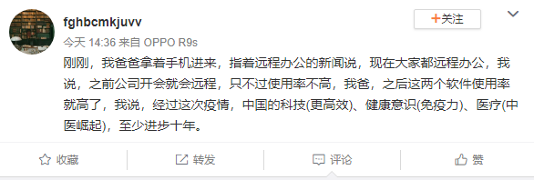

# 疫情催生，2020或为中国远程办公“元年”

<copyright :meta="$frontmatter.meta" />

疫情的蔓延和官宣延长的假期，让很多人提前实现了“远程办公”的梦想（很多企业都选择了远程办公作为节后安全复工的手段）。IT、互联网公司更是首当其冲，最长的将远程办公期限定到了2月底，如果情势需要，也许还会继续后延。

这也许是互联网史上，甚至人类有史以来最大规模的远程办公场域了。无论喜欢还是排斥，无论主动还是被动，这次疫情对远程办公的催化作用是必然的。

瞧，一位普通老爹都有这个觉悟！

然而，远程办公并不适合所有人和所有企业，它有一定的适用范围和门槛，大致如下（摘自[1024 VS 996，远程工作离我们有多远？](http://mp.weixin.qq.com/s?__biz=MzIzNTkzNjA5Mg==&mid=2247484012&idx=1&sn=a029cde0fd4c25463e4efc6d1618815c&chksm=e8dec25fdfa94b4954a4b4c13318211020b9cd8cd5cee94110f31b60ca9067dff6614db2f422&scene=21#wechat_redirect)）：

1. 对生产协作要求不高的行业领域：互联网、设计、软件、写作、部分非窗口性服务业等。
2. 员工——自律性、责任心和熟练的技能。远程办公要求员工自律性和责任心较强，而且对所从事的工作比较熟悉，技能完备，能独立担当完成任务。 
3. 企业——信任的文化。企业不以工时来衡量员工付出的心力与价值，重视产出的质量而非投入的时间，给予足够的信任及主导权，能提升远程工作者更好的工作绩效。 
4. 技术工具。远程办公成为新趋势，适用的软件工具是最大助力。远程视讯操作、云端软件、共享协作平台这些软件工具的发展大大打破了时间、空间的限制，才造就了移动办公室时代的来临。

第1条可以自检，第4条几乎已经不是问题，关键是第2、3条不易满足。

据统计，美国已有3000万人使用远程办公，占美国工作人口的16%-19%，随着互联网应用技术的普及和云视讯技术的完善，远程办公发展迅速。国内的远程办公起步相对较晚，远没达到发达国家的普及程度，究其原因，一言难尽。也许，完整地引用一位有代表性的实践者的感受能生动地说明问题。

以下为“知乎”上昵称为“孙知行”的作者，对“为什么国内公司远程办公发展滞后？”主题的回复：

> 说说我的切身体会。
>
> 我做自由职业者已经有两年，主要跟国外公司合作，而且是跟多家。远程办公对我对公司，都没有什么不好的，唯一的不好是跟同事见不了面，不能建立感情，但这主要是影响我的心理健康，可以通过其他方式来弥补。除此以外我们合作很愉快，互相特别信任尊重。
> 
> 但当我试着跟国内公司合作，远程办公的各种弊端就立马显现出来。比如去年跟上海一家公司合作，对方要求必须保持QQ在线，还要积极在QQ群里进行沟通，然后沟通的结果是同一个项目的几个远程办公人员会在群里互怼，要不就是闲聊，要不就是问项目经理一些对我个人毫无价值的问题。
>
> 在此之前我还跟国内某个自称第一家实现“云办公”的公司合作过，对方对我的不信任与日俱增，让我很崩溃，而且同样荒唐地要求我必须时刻关注QQ群聊天，而其中的聊天内容大部分是扯淡，跟我本人的工作无关。
> 
> 此外我也跟国内其他公司有过沟通，普遍的情况是国内人员不善于使用电子邮件沟通，不能用简洁的语言把一件事尽量在一封邮件中说清楚，沟通中普遍没有闭环，而且普遍缺少礼貌。我这才发觉，原来人家国外公司在这方面做得有多好。
> 
> 最近的合作再次印证了我的看法。国内的项目经理等人员一开始都还能保持职业精神，但随着时间推移，各种怠慢和猜忌往往就冒出来了，还喜欢耍小聪明。比如觉得你很闲，就不断要求你增加花在他们项目上的时间，却对是否增加相应的费用闭口不谈。
> 
> ……
  
可见，文化与观念的制约和差异是最难跨越的鸿沟。而这位孙先生应该属于有经验、有实力的远程工作者，还有很多人并不具备他的条件。

**那么，面对难得的历史机遇，我们该怎么办？**

从企业主的角度，想让自己的组织能够通过远程办公实现更高的工作效率和员工创造力，先积累“敏捷化”的内功是必须的。可以说，敏捷的企业不一定都拥有优秀的远程团队，但拥有高效远程团队的企业一定是敏捷的。下面这些特征有助于企业自查是否具有敏捷特性，或以此为目标向敏捷转型（摘自[组织走向卓越的“敏捷密码”](http://mp.weixin.qq.com/s?__biz=MzIzNTkzNjA5Mg==&mid=2247483881&idx=1&sn=00c53709a48491ca4705c5dec6758eca&chksm=e8dec1dadfa948cc5b78ab47cfc306d9970c4b37b52f748ed12bc982a1ba25133567b2d81c95&scene=21#wechat_redirect))：

- 跨职能团队。
- 赋予团队成员权力——专注于业务成果，团队有权采取自己的方针和决策。
- 业务一致性——业务需要为开发团队定义优先级和价值。
- 共同责任——每个人都对业务结果负责。
- 仆人式领导。
- 持续的价值流——确保组织以规律的周期交付价值。
- 价值优于活动——每项活动都应该能够为组织带来一些附加值。
- 注重技术卓越——应该时刻关注最大限度地减少随着时间推移而带来的技术债务数量。质量、可靠性和可扩展性从一开始就应内置其中。
- 早期反馈和适应。
- 完全开放和透明——在一个真正的敏捷组织中，没有任何东西可以隐藏。人们无法掩饰，进展无法隐藏，指标无法隐藏，劣质无法隐藏，风险无法隐藏，障碍无法隐藏……
- 信任——相互信任的环境和文化。

对于已经制定远程办公策略或拥有远程团队的企业，提高自身管理能力可以借鉴以下几条（摘自[管理远程团队5招指南](http://mp.weixin.qq.com/s?__biz=MzIzNTkzNjA5Mg==&mid=2247484090&idx=1&sn=d60b56df15292b4dc11aad34ecbd07f1&chksm=e8dec289dfa94b9f4573bcfe2762cac8045e38ee82462b2d283e88e790a89c9eee1aff8820df&scene=21#wechat_redirect)）：

1. 定期沟通。 
2. 设定目标，制定基本原则和工作方式。 
3. 公开的认可和动机。 
4. 跟踪进度。 
5. 熟悉每个员工的工作习惯。

而远程工作者的自我修养，可参考[远程工作者必须知道的5件事](http://mp.weixin.qq.com/s?__biz=MzIzNTkzNjA5Mg==&mid=2247484082&idx=1&sn=b9068e31347930e8d08071b06b9cfbad&chksm=e8dec281dfa94b9767bd4abd5bb6e75f40f251ee5b96930c3e49e97edb7d3db49e5a78ecc7f4&scene=21#wechat_redirect)。

总之，远程办公不是不得已而为之的权宜之计，而是代表未来的工作模式。人类的经济组织方式正在改变，资本经济时代那种在固定时间把人集中在固定场所的传统工作方式将逐渐被松散的、合作式的方式所取代。因为在知识和创造力经济时代，人只有在自主和自我驱动的状态下才能拥有最大的创造力。

危机，危机，危险永远与机遇并存。危机和压力带来的变异，不仅是生物进化的内在动因，通常也是商业模式和组织变革的最佳机遇。2003年的非典促进了电子商务的发展，这次疫情必将催生很多新的改革、新的业态，远程办公无疑是其中之一。

风会吹熄蜡烛，却会助长山火。一切终将过去，有的人依然停留在原地，有的人在迭代升级……

**附：推荐一些主流的远程办公工具软件，供大家参考：**

免费远程桌面产品

- ezTalks Cloud Meeting
- Chrome Remote Desktop
- Splashtop
- Windows Remote Desktop
- Ammy Admin

远程办公文档协作产品

- 腾讯文档（抗疫期间远程办公免费）
- 石墨文档（抗疫期间提供免费高级版服务）
- WPS Office
- 幕布
- 有道云笔记
- 巴别鸟

远程团队沟通协作产品

- 飞书（抗疫期间免费）
- 企业微信（抗疫期间免费）
- 钉钉
- Slack
- Zoom
- 腾讯会议（开放300人不限时会议功能）
- 华为Welink（视频会议，有限免费）

任务管理/项目管理/研发管理类产品

- Trello
- Teambition（企业版免费开放）
- Tower
- Workflowy
- ProcessOn
- ONES（开放SaaS免费账号）