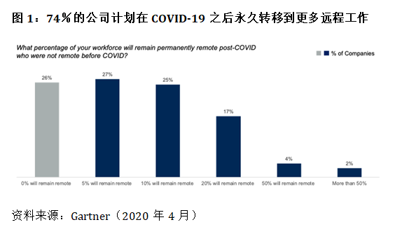

# Gartner CFO调查： 74％企业将部分岗位永久转为远程

<copyright :meta="$frontmatter.meta" />

Gartner对317位首席财务官和财务负责人的最新调查显示，在新冠疫情之后，74%的公司将把至少5%的原来在现场工作的员工永久转为远程岗。

Gartner Finance Practice研究副总裁Alexander Bant表示：“这些数据是当前冠状病毒危机将对公司开展业务的方式产生持久影响的一个例子。” “首席财务官已经承受着严格管理成本的压力，他们显然意识到远程劳动力所带来的成本优势。实际上，将近四分之一的受访者表示，他们将把至少20%的现场员工调到长期的远程岗位。” 

                                          
81％的CFO告诉Gartner他们计划将合同义务扩展到临时工，因此远程工作是高级财务负责人寻求创造性成本节约的一个示例，以避免更严重的削减或损失，并且可以将对运营的不利影响降到最低。

数据显示，CFO们正在采取其他步骤，通过调整工作计划以适应更灵活的工作时间表并向远程员工提供公司配发的办公设备。财务负责人的这些举动有助于最大程度地减少疫情对员工的影响。

Bant先生说：“大多数CFO认识到技术和社会的发展使远程工作比以往任何时候都更具可行性。” “就财务职能本身而言，有90％的CFO向我们报告说，他们预计会计结算流程将受到最小程度的破坏，因为几乎所有环节都可以在办公室以外执行。”

随着企业继续努力应对疫情导致的业务影响，永久性的远程工作可以作为CFO削减成本的措施之一。在Gartner的最新调查中，有20％的受访者表示他们已经延缓或缩减内部的技术支出，另有12％的人正计划这样做。有13％的受访者表示，他们已经降低了房地产支出的成本，另有9％的受访者计划在未来几个月内在这一领域采取行动。