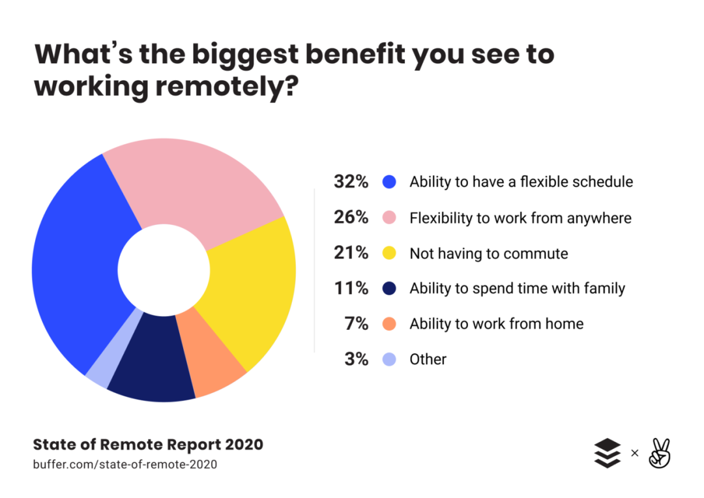
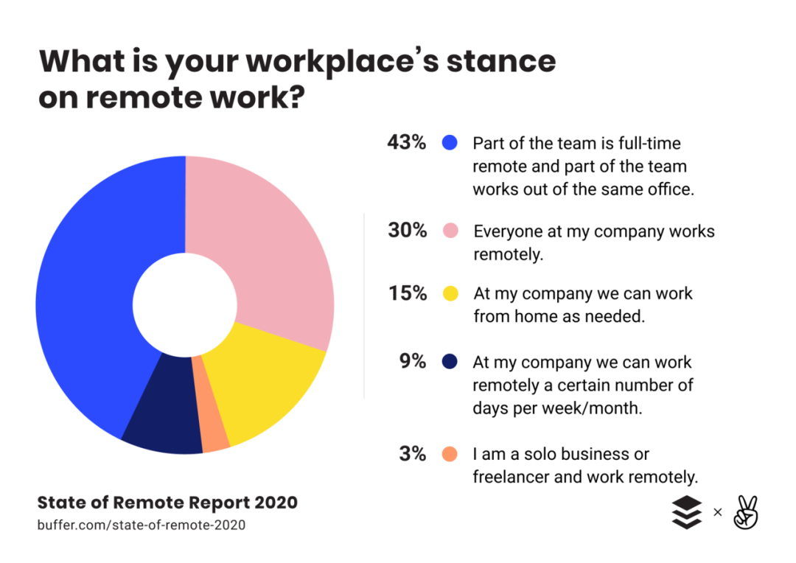
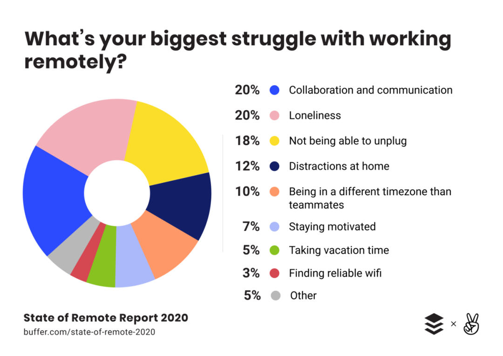

# 2020年远程工作现状报告

<copyright :meta="$frontmatter.meta" />

Buffer和AngelList最近发布了《2020年远程工作现状报告》 （以下称报告），该报告对来自世界各地的3500多名远程工作者进行了调查，以“汇总远程工作的现状以及2020年的发展方向”。

 
报告指出远程工作将在全球范围内成为新常态。未来的工作是“人们可以自由地与分散在全世界的同事在家进行远程工作”。
 
《华尔街日报》报道称，与报告所述趋势相应，中国科技公司的远程办公人数激增，目的是应对新冠肺炎疫情的影响，保障业务连续性。

英国《金融时报》最近报道称，远程工作已从科技行业的“边缘实验”，发展到大型领先企业的常态。
 
以下为报告摘要：
 
## 满意度

在连续三年的调查数据中，远程工作人员几乎一致希望在剩余的职业生涯中继续进行远程工作（至少在某些时候）。今年，有98％的受访者同意这一说法。而且，97％的人表示，他们会将远程工作推荐给其他人。
 
70％的人表示对当前的远程工作时间感到满意，其中19％的人希望远程工作的频率更高，而11％的人希望远程工作的频率降低。

RemoteYear的首席执行官Greg Caplan（该公司允许远程工作者在世界各地旅行时工作）对于希望增加远程工作时间的建议： 

> 当需要更多的远程工作时间时，“获得许可的关键是周密而成熟地展示你提出的方案。最好的演示包括你为如何做好工作制定清晰的计划，以及为保持同步而制定的清晰的沟通计划。在远程环境中，进行过度交流以确保每个人的信息同步非常重要。”
 
## 好处

过去三年来，远程工作的主要益处一直保持不变：灵活性！
 
远程工作不但让人在工作地点和工作时间方面具有更大的灵活性，而且能免去通勤之苦，还能更多地陪伴家人。

分布式咨询公司（Distribute Consulting ）首席执行官兼远程工作协会（Remote Work Association）创始人Laurel Farrer认为，不通勤仅仅是远程工作可能产生的影响的开端，她说，远程工作的好处“远远大于便利和更好地平衡工作与生活。当我们消除通勤并赋予专业人员选择工作场所的权利时，整个世界都会受到影响。碳排放量和能源使用量显著减少，交通基础设施更少拥挤，使用寿命更长，家庭和谐和心理健康，团队更加多样化和具包容性，城乡差距缩小，消费者债务减少……这一切还在继续。远程工作不仅在改变工作的未来，还在改变我们全球社会的未来。” 
 
## 模式

远程办公与传统办公混合团队仍占首位。
 
在所有受访者中，有30％的人已经在完全远程的企业中工作，而43％的人在“远程团队与传统办公室团队混合的企业”中工作。其他的企业则为员工提供一定量的“在家工作”天数（占9％），或根据需要灵活地在家工作（占15％）。
 
## 困难

远程工作的挑战：58％的远程工作负面经历归结为协作困难，孤独感和没有明确的工作时限。
 
协作和沟通难20%；孤独感20%；没有明确的工作时限18%……

在远程协作数字产品和通信工具泛滥的今天，为什么我们仍在协作和沟通中挣扎？
 
尽管我们拥有无穷无尽的工具来优化协作和交流，但这些工具可能主要用于支持全职的远程团队。正如我们在调查结果中发现的那样，许多人仍在半远程半传统的“混合”团队中，以“混合”的方式开展远程工作。那么，如果团队中的每个人都难以相同的方式进行交流，那么挑战仍然存在。
 

AmirSalihefendić是Doist的首席执行官，Doist是一家研发工具的公司，旨在促进人们工作和生活的和谐。他说：“沟通和协作仍然是影响每个团队的核心挑战，即使对于非远程团队也是如此。并且我们尚未完全弄清楚原因所在。”
 
他说：“更糟糕的是，许多远程团队仍在采用所有成员在同一时空一起工作时有效的做法（例如，使用实时聊天工具）。” “在接下来的几年里，我相信我们会看到用更先进的思维方式创造的应对现状的工具，我们会看到为远程优先的团队高度优化的工具。”
 
Doist的工具Twist（一个异步通信应用程序）是远离实时对话的一个很好的例子。
 

另外，值得强调的是，尽管孤独总被视为远程工作的一大挑战，但我们并不认为这意味着远程工作是导致孤独的主要原因。这也许是当今社会普遍存在的大规模孤独感的一部分。在美国，寂寞被称为流行病。在英国，近五分之一的人口报告说他们“总是或经常感到孤独”。在亚洲各国，这一现象也并非罕见。 
 
## 工作地点

远程工作者80％在家办公。
 
同时，有27％的人以咖啡店为第二工作地点。咖啡厅、办公室、共享空间为远程工作提供了移动办公的多样性。

**“第三空间”的兴起**
 
远程工作的流行正在引起“第三空间”的兴起。
 
“第三空间”的概念是由AngelList的远程主管Andreas Klinger提出的 ，意指远程工作者住在家里，在指定的工作场所工作（在家或任何他们喜欢的地方），然后有了第三个空间，他们可以在那里度过美好的时光。
 
安德烈亚斯（Andreas）解释说：“你有自己的工作场所，也有自己的家……如果这两个地方最终合二为一，那么你会在哪里减压？咖啡厅、社区空间或“第三空间”可能是答案所在。下一个重要的星巴克竞争对手将不会试图回避远程工作者，而是以迎合性商业模式尝试吸引他们。”

 
**那么共享办公空间呢？**
 
我们报告中的另一个一致性是，对于远程工作者来说，共享工作空间可能并不像它们看起来那样受欢迎。
 
在过去的三年里，我们看到不超过9%的受访者声称共享办公空间是他们工作的主要地点。今年则只有7%的受访者选择共享办公空间作为他们的主要工作地点。这令人惊讶，因为一些报道称，在未来两年内，全球将有近26000个共享办公空间。仅在2018年，就有2000多个新的共享工作空间开放。
 
Christelle Rohaut是Codi公司的首席执行官，这家公司将远程工作者与其住所附近可利用的社区共享工作区连接起来。她认为，选择共享办公空间的远程工作人数下降，是因为“这些共享空间大都聚集在市中心，对远程工作者并不便利。”她认为，“共享办公的未来是在家中，因为这是最方便、最可靠的选择。”
 
通过Codi，她试图将社区与便利结合起来。“我们的成员可以在他们的社区内找到合适的共享空间，既改变了风景，又有离家近的便利。”她说。“我们希望让远程和分布式工作成为一种更可持续、更令人愉快的模式，对所有人——对雇员和雇主都是如此。”

报告正文可参看[原文](https://lp.buffer.com/state-of-remote-work-2020)。