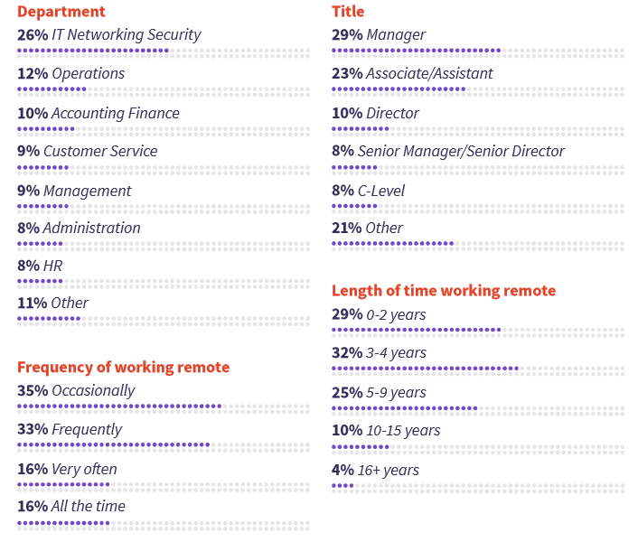
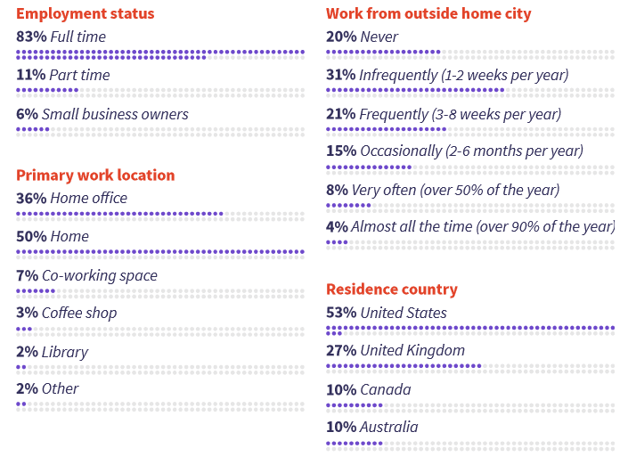
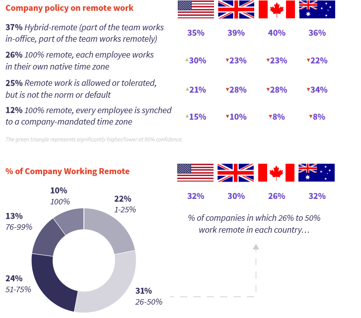
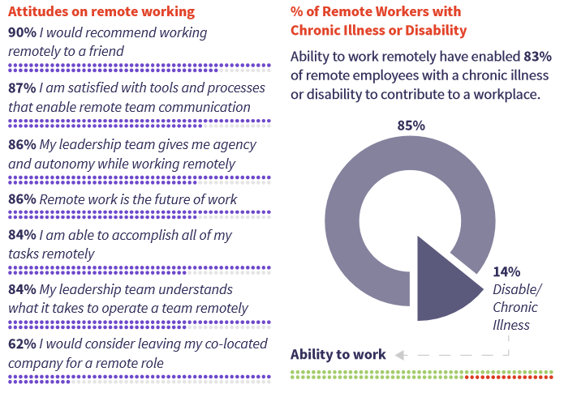
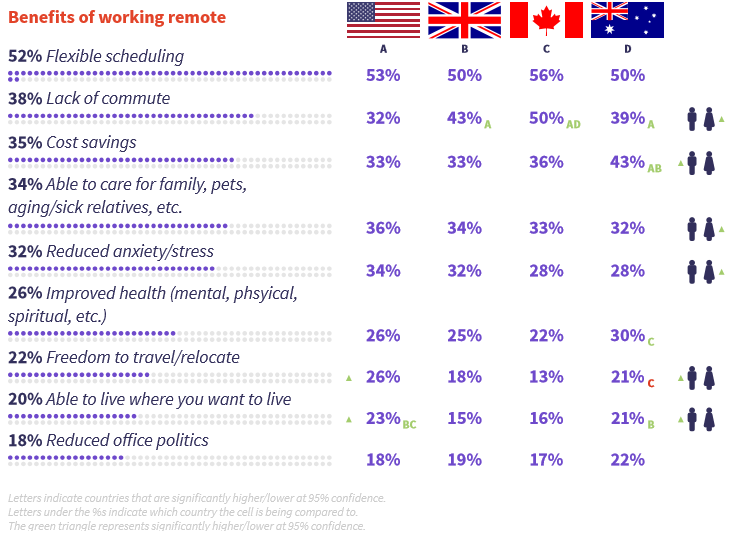
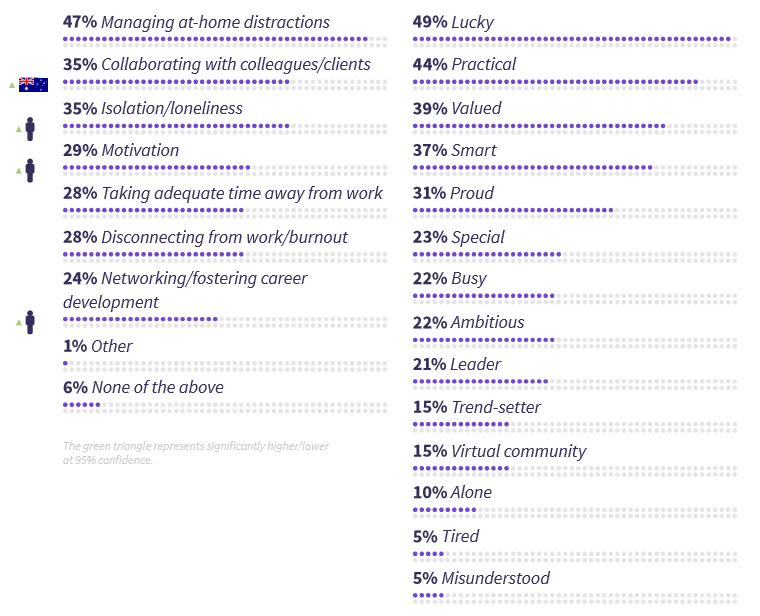
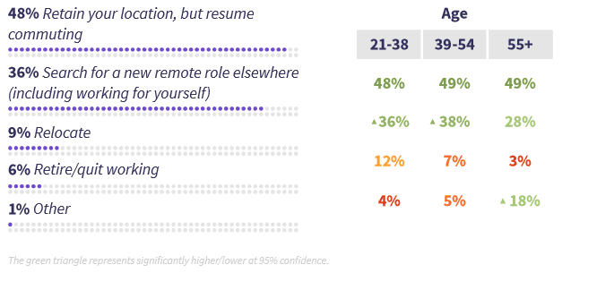
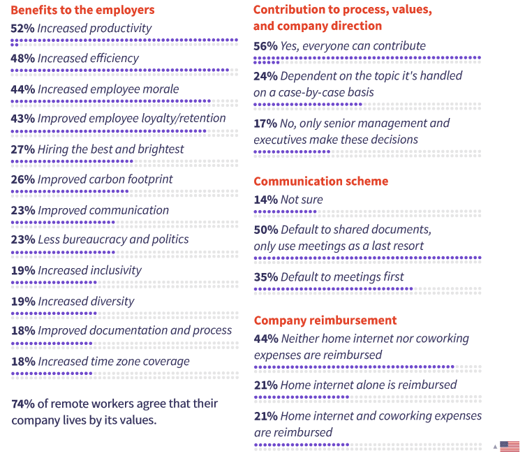
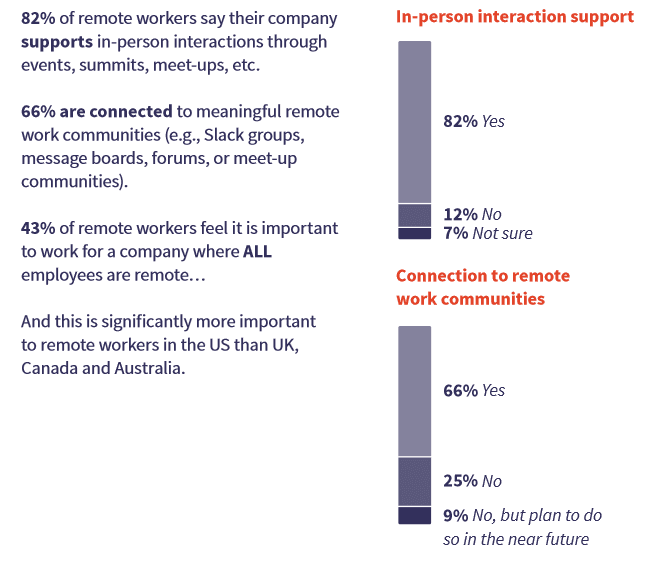
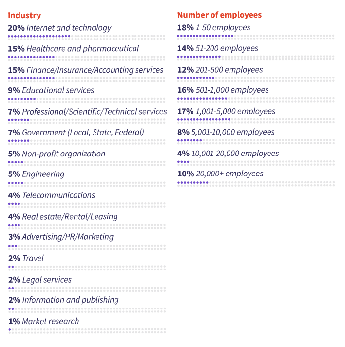

# Gitlab远程办公报告：办公的未来是远程

<copyright :meta="$frontmatter.meta" />

> 文章翻译自Gitlab于2020年3月发表的 The Remote Work Report by GitLab: The Future of Work is Remote（[https://about.gitlab.com/remote-work-report/](https://about.gitlab.com/remote-work-report/)）

## 1 介绍

**本文旨在促进未来工作中的协作，创新和发展。《 2020年全球远程工作报告》剖析了分布式工作的状态，并揭示了员工和雇主的主要动机。**

今年，来自不同行业，职位和地域的3,000多名受访者坦诚地分享了他们的经验，为理解远程正在如何改变合会，以及职业与个人之间的相互关系而构建了一个平台。

通过揭示最佳的实践案例和未满足的需求，《远程报告》综合上千名职业者的宝贵贡献，使管理者消除障碍，并帮助团队在当前情况下谋求发展。

### 1.1 项目背景

#### 目的

探索远程工作的未来，以便为GitLab提供未来的营销和思想领导力内容。

#### 方法

GitLab对3,000名21岁及以上的成人专业人员进行了调查，这些受访者在2020年1月30日至2020年2月10日期间都可远程办公或者有机会选择远程办公，并且其工作产出主要以数字产品为主。

#### 样本

-> 21岁以上成年人  
-> 远程工作或可以选择远程工作（无外包）  
-> 工作产出以数字产品为主  
-> 报告中的字母以及绿/红三角形表示高/低于95%置信度  
-> Savanta进行的研究  

### 1.2 要点

#### 风起云涌的全远程

全远程是远程办公的最纯粹形式，每个团队成员都在一个公平的竞争环境中。43％的远程工作者认为在公司中所有员工都以远程形式工作很重要的。当前，有超过四分之一的受访者来自于一个完全远程的办公组织，这些办公组织都没有办公室。这些工作者都工作在自己的时区当中，所以采用了异步工作流的方式。而要同步到办公地区的时区，则需要增加12%的远程工作。

#### 每一个人都可以做出贡献

当每个人都有权推动组织向前发展时，远程团队的真正力量就会释放出来。56％的远程工作者表示，公司中的每个人都可以为公司的流程，价值和方向做出贡献，其中50％以共享文档和会议作为最终手段。

#### 解密远程办公神话

远程办公者并不都是游牧民族。调查显示，38%远程办公者以通勤条件限制作为最大理由，相较之更多远程办公者愿意将时间花在家庭(43％），工作（35％），休息（36％）和锻炼（34％）。员工发现自己总体上具有更高的生产率（52％）和效率（48％），其中74％的远程工作者支持他们的公司以其价值观为生。此外，与传统想法不同的是，有52％的远程工作者的出行减少了。

#### 机会增长/以父母的身份继续职业生涯

调查发现，远程工作的好处使员工能够专注于家庭而不必放弃职业。34％的人认为能够照顾家人是远程工作的最大好处，此外53％的人认为日程安排更为灵活，还有38％的人说可以减少通勤。同样发现，通过减少通勤时间，43%的人可以与家人共度这些美好时光。——受访者当中有55%已有18岁以下的孩子。

#### 远程工作环境

受调查的远程工作者中有14％有残疾或慢性病，其中83％的工作者因远程工作而能够工作。远程工作为公平竞争提供了条件：它增强了工作/生活的和谐感，并为每个人在工作场所做出贡献提供了机会。

#### 远程即将成为第二天性

将近90％的受访者对支持远程团队沟通的现有工具和流程感到满意，并认为他们的领导团队在远程工作时具有自主权。

#### 远程工作就在这里

86％的受访者认为远程工作是未来。但即使是现在，有84％的受访者表示，他们现在也能够通过远程来完成所有任务。

#### 远程工作是招聘的最大优势

62%的受访者表示，愿意为一个远程工作而考虑离开固定办公场所的公司。为什么？每个人对远程福利的重视程度都不一样，从减少焦虑到改善健康状况到减少办公室“政治”。换句话说，由于多种多样的原因，远程自由具有普适的重要性。

#### 无所不在的工作

47％的人说，处理家庭分心是最大的挑战。现在该逐步淘汰“在家工作”这一短语了，使团队成员可以在他们生产力最高的任何地方工作。消解共同工作空间和外部办公室是一个不错的起点。

#### 总体感受

接近一半的受访者认为自己是“幸运者”，因为可以远程工作。“务实”，“有价值”，“聪明”和“骄傲”这些标签位列前五名。不到10％的人与“孤独”，“疲倦”和“被误解”相关。

#### 远程≠单独

当有意进行面对面的互动时（例如在远程环境中），它们的影响更大。82％的远程工作者表示，他们的公司通过活动，峰会，聚会等方式来支持现场聚会。同时，有66％的人已经连接到远程工作社区。

## 2 远程办公者

在允许远程工作的公司中，大多数公司采用混合方法，四分之一公司采用100％的远程策略，即员工在自己的本地时区工作。

美国的公司更可能允许员工100％进行远程工作，他们在自己的时区或公司指定的时区工作。

在家分散注意力是远程工作的最大挑战之一，这不足为奇。与同事/客户的协作和孤立是第二和第三大挑战。

几乎一半的远程工作者都愿意恢复通勤。但是，其中有36％的人不是，他们会在其他地方寻找新的远程角色。有趣的是，年龄小于55岁的人更有可能寻找新的远程角色。

## 3 迁置

## 4 公司和远程工作

## 5 人口统计

## 6 固件

