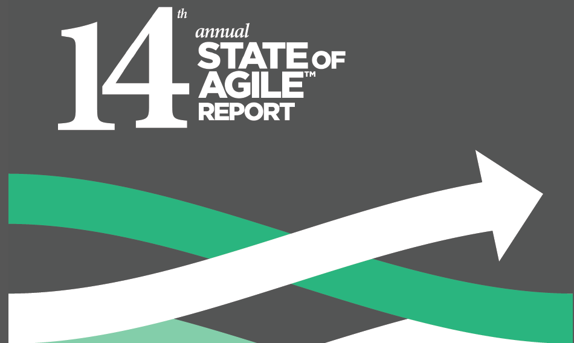
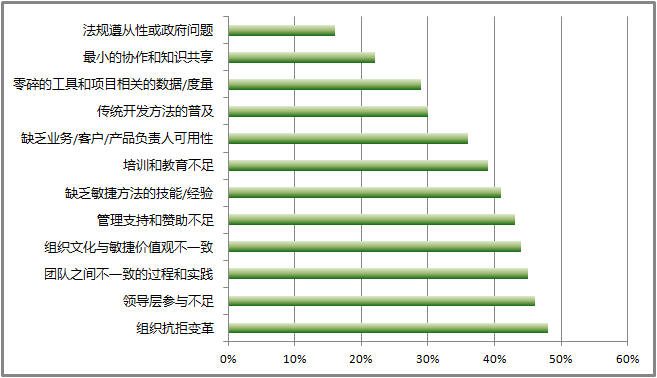
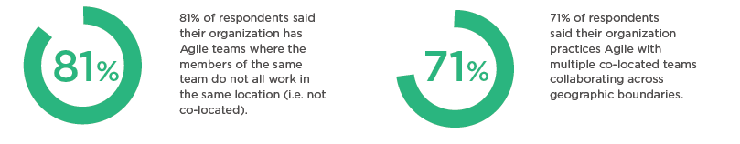
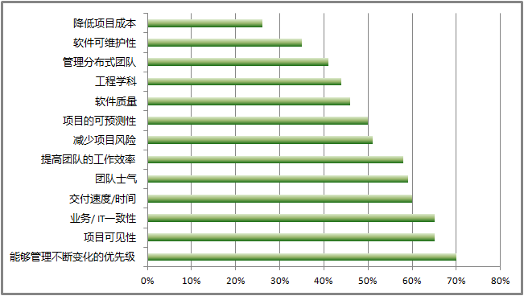
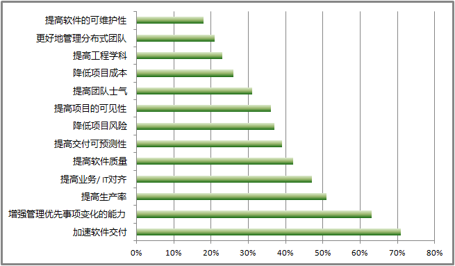

# 2020全球敏捷报告——分布团队将为新常态

<copyright :meta="$frontmatter.meta" />

2020全球敏捷报告由DIGITAL.AI团队发布，该团队自成立以来，全球共有超过40000名敏捷执行官、从业人员和顾问参与过调查，分享了他们的见解，今年已经是第14期。本次调查收集、分析了来自全球软件开发领域1121位专业人士的回复，报告向我们展示了敏捷的现状及最新发展趋势。

以下是报告摘要：

## 文化依然是最大的挑战

采用和扩展敏捷的最大挑战仍然与组织文化有关。总体上，组织对变革的抵制、管理支持和赞助不足以及与敏捷价值观不符的组织文化仍然是敏捷最大的阻力来源。今年，领导层参与不足的新选项也进入了挑战的前5名。

  
## 分布式敏捷团队——新常态

尽管面对面的工作对于敏捷实践来说是理想的，但越来越多的受访者表示他们的组织正日益支持和鼓励跨地理边界和时区的团队合作，再加上当前全球健康危机的推力，这将导致分布式的敏捷团队不仅有增无减，并将成为敏捷团队“新常态”。 

81%的受访者说他们的组织中存在分布式敏捷团队；71%的受访者表示，他们的组织在多个分布式团队中实践敏捷协作。

## 公司规模与敏捷应用

拥有20,000人以上的大型公司实践敏捷超过5年的比例更大，他们也更有可能使用工具。

如果公司规模小于1000人，那么其所有团队都是敏捷的比例更高。这种规模的公司更有可能将敏捷应用到开发、IT和运营之外的领域。 

公司实践敏捷的时间越长，报告的敏捷成熟度越高，上市时间越长，管理优先级变化的能力也越强。

## SCRUM和SAFe®仍是敏捷应用的王道

至少75%的受访者表示在实践Scrum或包含Scrum的混合应用。

有35%的受访者表示SAFe®为其首选的敏捷框架，这一数字比去年增长了5%。 

## 敏捷的好处：管理优先级、可见性和一致性

今年，管理优先级变化的能力和项目可见性再次成为实施敏捷而得到改善的前两项能力。其他排在前5名的改进能力是业务/IT一致性、团队士气、交付速度/上市时间，以及团队生产力。 
 

## 为了降低成本而实施敏捷的比例下降

加速软件交付和增强管理不断变化的优先级的能力仍然是采用敏捷的首要原因。受访者表示，今年采用敏捷的原因不是为了降低项目成本(从去年的41%降为26%)，而是为了降低项目风险(去年的28%升为今年的37%)。 
 

## DevOps非常重要

76%的受访者表示，他们的组织中目前有一个DevOps计划，或者计划在未来12个月内实施(去年为73%)。90%的受访者表示DevOps变革对他们的组织很重要。

## 未来会更加敏捷

超过一半的受访者报告说，他们的组织或者正在实施价值流管理(VSM)，或者正在计划这样做。

调查结果表明，敏捷性在很大程度上仍然局限于开发、IT和操作领域。而敏捷理念的普及大于操作层面的应用，比如，业务敏捷性需要跨组织的所有领域进行有效的校准和协调的理念正不断得到发展。那么未来会怎样呢?明年，我们希望看到敏捷性被扩展到与构建、部署和维护软件相关的更广泛的领域。

注：报告全文参见[这里](https://stateofagile.com/#ufh-c-7027494-state-of-agile)